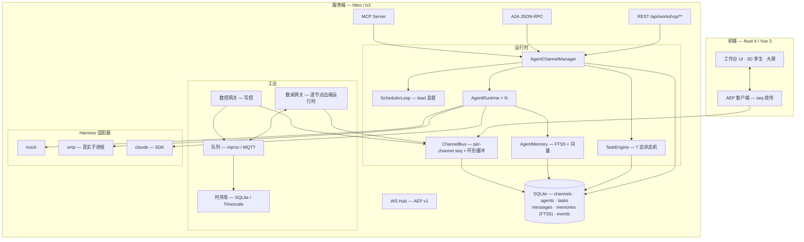

<div align="center">


# AgentWorkShop

**AI Agent 团队与产线在此交汇。**

[](https://nuxt.com)
[](https://vuejs.org)
[](https://www.typescriptlang.org)
[](https://nodejs.org)
[](https://nodejs.org/api/sqlite.html)
[](./LICENSE)

**[English →](./README.md)** · **[在线文档 →](https://kingdol666.github.io/AgentWorkShop/)**

*一个配置驱动的平台:**AI Agent 团队**与**工业数字孪生**共享同一运行时——Agent 查询真实遥测、经人工审批的写控回路下发监督设定值，每个事件实时推送到 3D 孪生。*

</div>

> ⚠️ **定位声明：监督层。** AgentWorkShop 是面向产线管理、数字孪生、数采与 Agent 编排的**监督层**（SCADA 同位）平台，运行在**秒级软实时**档位。它**不是**硬实时控制器：任何时序关键回路（**< 10 ms**、联锁、安全、伺服）**必须在 PLC 内实现**；本平台下发的值均为建议性设定值，产线侧逻辑可否决。

---

## 这是什么？

AgentWorkShop 起家于**多智能体软件工作坊**——Channel 内的编码 Agent 团队，配备 lead 调度器、7 状态任务机、持久记忆，以及四个互操作入口（WebSocket / MCP / A2A / REST）。

随后它长出了**工业半边**：完整的数采与写控栈（Modbus TCP / OPC UA）、带配方与批次运行的产线、3D 数字孪生小镇——以及让它独一无二的桥：**Agent 可以被授权绑定真实工业节点**，带着物理语义查询实时遥测，经由「联锁 → 人工审批 → 回读校验」管线驱动写操作。

最终效果：提交一个目标，比如「分析熔体温度趋势并优化设定值」——Agent 团队读取真实传感器历史、计算统计量、提议新设定值、在 HITL 面板等您批准、写入 PLC、校验回读、带着数值汇报。**端到端，自动化 E2E 已验证。**

<div align="center">

<br><sub><b>实时 3D 孪生。</b>产线设备、设备健康、数采通道与趋势分析——全部由实时遥测驱动。</sub>
</div>

---

## 特性总览

| 能力 | 为何重要 |
|---|---|
| **Agent 团队 × 工业作用域** | 把 Agent 绑定到数采/数控节点。Agent 看到的是语义卡（物理含义、单位、安全量程、配方窗口）——而不是裸寄存器。 |
| **人工审批的写控** | 数控下发经过「**安全量程 ∩ 活动配方窗口**」联锁 → 可选 **HITL 审批** → PLC 写入 → **回读校验** → 写历史记账。 |
| **真实现场总线** | Modbus TCP（连接级操作队列）；OPC UA（会话池）。每个节点带线性标定钩子（PLC 值 ↔ 工程量）。 |
| **多形态数采帧管线（v0.6）** | 测厚仪/扫描仪的多点轮廓与 CCD 图像经模板 sink 处理器加工后入库：向量与元数据入 Timescale（`daq_frames`），像素入对象存储（MinIO，不可达自动降级本地磁盘）；派生指标越限走既有告警链路。 |
| **插件扩展 API（v0.6）** | `ctx.daq.registerDriver / registerProcessor / registerTemplate` 自定义采集与下沉算法（放入 `plugins/` 即生效）；`ctx.omp.registerTool` 自定义 agent 工具，注册表变更运行时热注入全部在跑会话。 |
| **产线运营** | 产线 → 产品 → 配方 → 批次。配方窗口门控采集并联锁写入；每条样本打标 `product/recipe/run`，实现产品级数据隔离。 |
| **Lead 编排** | 每个 Channel 一名 lead：分解目标、派发空闲 worker、失败重派、判定目标满足度。LLM 决策 + 确定性规则引擎兜底——系统永不停滞。 |
| **三种执行模式** | `goal`（满意度判定）· `loop`（定间隔重放）· `pipeline`（顺序阶段）。7 状态任务机带进度、产物与完整历史。 |
| **四个入口** | 一个 manager 坐在每扇门后：**WS**（AEP v1 事件流，seq 续传）、**MCP**（进程内工具）、**A2A**（JSON-RPC 2.0 + AgentCard）、**REST**。 |
| **持久记忆** | 私有 + Channel 共享双域；FTS5 CJK 切分，可选向量混合检索，token 预算注入；会话压缩摘要自动入库、团队编年史与空闲反思持续沉淀（v0.6）。 |
| **Harness 无关** | 一个 `AgentInterface`：`mock`（进程内）、`omp`（真实 Agent 子进程经 RPC）、`claude`（SDK 适配器）。平台永远不知道跑的是哪个。 |
| **3D 数字孪生** | Three.js 小镇：放置产线设备与 Channel 领地，实时查看设备健康、告警与数值——由同一事件总线驱动。 |

---

## 界面一览

<div align="center">

| Agent 工作台 | 产线运营 |
|:---:|:---:|
|  |  |

| 数采中心 | 数字孪生小镇 |
|:---:|:---:|
|  |  |

</div>

---

## 设计架构



**Agent × 机器之桥**（值得读源码的部分）：

```
agent ──绑定──▶ 节点 (daq: auto / dcw: manual)
  │                    │
  │  my_industrial_nodes  ◀── 语义卡：物理含义 · 单位 · 安全量程 · 配方窗口
  │  daq_query             ◀── 时序库历史，统计 + 物理语义
  │  dcw_control           ──▶ 联锁（安全量程 ∩ 配方窗口）
  │                           ──▶ HITL 审批（manual 模式，180s 超时）
  │                           ──▶ PLC 写入 → 回读校验 → ACK + 写历史
  ◀── Agent 可引用数值的结果文本
```

---

## 快速开始

### 前置条件

```bash
node -v   # ≥ 23.4.0（需要内置 node:sqlite）
```

> `omp` harness（真实作业推荐）需要在 PATH 中安装 `omp` CLI。`mock` harness 开箱即用，适合演示与 CI。可选数采基础设施（MQTT broker + TimescaleDB）在 Docker 可达时自动拉起（`docker compose up -d`）。

### 方式 A —— 从 npm 安装（推荐）

```bash
npm install -g agentworkshop     # → `aw` / `agentworkshop` 进入 PATH
aw start                         # 首次运行构建一次（约 2-3 分钟）→ http://localhost:3001
```

至此即可——无需检出代码、无需构建工具。首次启动时一切初始化进配置根 **`~/.AgentWorkShop`**：默认 `config.yml`、自动生成含随机会话密钥的 `.env`、`runtime-settings.json`、docker-compose 种子与空的 `data/` 目录。全部运行数据（SQLite、JSON 仓库、备份、日志）也都落在配置根——配置与数据跟着安装走，与当前工作目录无关。

不想安装、只想跑一次？

```bash
npx agentworkshop start          # 拉取即运行，全局零残留
```

### 方式 B —— 源码运行

```bash
git clone https://github.com/kingdol666/AgentWorkShop.git && cd AgentWorkShop
pnpm install
pnpm dev          # → http://localhost:3000（端口取自 config.yml）
```

源码生产部署：

```bash
pnpm build        # nuxt build → .output/
pnpm start        # 端口取自 config.yml → server.prod.port
```

> 在源码检出内，配置根是项目里的 **`.AgentWorkShop/`** 文件夹（运行时覆盖、数据、项目级指令），而 `config.yml` / `.env` 留在检出根，作为版本化的工厂默认值。

### 版本更新

```bash
aw update                              # 检查 + 就地更新全局安装
aw update --check                      # 只报告,不安装
npm install -g agentworkshop@latest    # 手动等效
```

版本遵循 semver。每次 `aw start` 会校验配置根，并在新版变更目录结构时就地迁移——**升级永不丢数据**。

### 第一次「Agent × 产线」会话（约 2 分钟）

1. **登录** —— 侧边栏注册（或 `POST /api/users/register`）。
2. **搭产线** —— 「产线运营」→ 建产线，加数采节点（如 `daq-temp-tc`）与数控节点（如 `dcw-temp-sp`），建产品 + 配方，点**开跑**。实时值开始流动。
3. **建团队** —— 「Agent 工作台」→ 选 lead + workers，**deploy** 部署进 Channel。
4. **绑定节点** —— 打开 Agent 详情面板 → 绑定数采节点（*auto*）与数控节点（*manual* = 需您的批准）。
5. **提交目标** —— 「分析最近 5 分钟熔体温度；若与 182℃ 偏差超过 1℃，修正设定值（等我的批准）。」
6. **审批** —— Agent 读取真实历史、计算均值、发起写请求 → 在 HITL 面板批准 → 看设定值变化，goal 收口并给出数值报告。

---

## 配置与 CLI —— 真正的配置驱动

一个运行时，一个事实来源。**`config.yml`** 声明默认值；配置根内的 **`runtime-settings.json`** 承载运行时覆盖；环境变量与 CLI 参数在最上层。每个可编辑键在 `shared/config/schema.json` 中声明一次（类型、范围、枚举、实时/重启生效），**前端设置页与 CLI 消费同一份描述符**。

```
config.yml（默认值）  <  .AgentWorkShop/runtime-settings.json（运行时）  <  环境变量 / CLI 参数
```

配置根：全局安装（`npm i -g`）时为 **`~/.AgentWorkShop`**——无论在哪个目录运行 `aw`；源码检出时为项目内的 **`<repo>/.AgentWorkShop`**（`config.yml` / `.env` 留在检出根，作为版本化的工厂默认值）。`AW_HOME` 可重定向；`AW_MODE=home` 强制全局形态。

### 设置持久化与热重载

- **系统设置 → 运行配置**标签页按描述符渲染每个可编辑键——改服务端口、主题、API 超时、语言或高危复核闸门，点保存即可。
- `live` 键立即生效（主题、标题、超时、审批闸门……），经服务端事件流推送，**无需刷新、无需重启**。
- `restart` 键（端口、主机）落盘持久化，在下一次以对应模式启动时生效（`aw dev` / `aw start`）。
- 所有写入方共用一条通道：**设置页、CLI、服务端文件监听**最终都收敛到同一个设置文件——任何一端改，处处生效。

### `aw` CLI

| 指令 | 作用 |
|---|---|
| `aw start · aw dev · aw build` | 生产服务 / 开发服务器 / 构建——端口取自有效配置；首次 `start` 自动构建一次 |
| `aw config list · get · set · unset · reset` | 读写运行时设置（schema 校验 + 原子写盘） |
| `aw home` | 查看/初始化配置根 `.AgentWorkShop` |
| `aw init <dir>` | 脚手架一个可运行的新项目（含完整配置系统与 CLI） |
| `aw register <路径\|URL\|npm:包名>` | 注册一条新指令——项目级或 `--global` 用户级 |
| `aw update` | 对比 npm 远程最新版本,有新版就就地更新全局安装 |
| `aw doctor` | 环境 + 项目健康检查（node、配置、端口、密钥） |
| `aw status` | 运行态总览：模式、配置来源、运行中服务、指令表 |

全局参数：`--help/-h` · `--version/-v` · `--json`（机器可读） · `--root <dir>` · `--debug`。

### 指令注册

指令就是导出 `{ meta, run }` 的普通模块。把它放进扫描目录，下次调用即生效——无需任何登记清单，约定优于配置：

| 作用域（同名高者优先） | 目录 |
|---|---|
| 项目级 | `<检出>/.AgentWorkShop/commands/` |
| 用户级 | `~/.AgentWorkShop/commands/` |
| 内建 | 随 CLI 发布（`cli/commands/`） |

`aw register <file|url|npm:pkg>` 把指令复制进对应作用域（`--global` 进用户级）；`aw help` 列出全部已注册指令。

```js
// ~/.AgentWorkShop/commands/hello.mjs
export const meta = { name: 'hello', group: '自定义', summary: '问好', usage: 'aw hello [--name <n>]' }
export async function run(argv, ctx) {
  console.log(`你好 ${argv.flags.name ?? 'AW'} —— 模式: ${ctx.mode}`)
}
```

---

## 工业栈详解

### 数据采集（DAQ）

- **逐节点边缘运行时**：独立采样节拍、下发节拍、节点级在飞互斥——一个慢驱动绝不拖累邻居。
- **管线**：驱动 → 队列（进程内 / MQTT，断连离线缓冲）→ 消费泵乱序防御 → 三路分发：WS 实时直推（节拍门控）、TSDB 批量落库、设备孪生回写。
- **鲁棒性**：TSDB 单 in-flight 写 + 有界重试，缓冲背压带丢弃计数，真实丢失指标随 `daq.controller` 帧暴露。
- **报警**：配方级监控窗口，**2% 滞回 + 3 拍去抖**；alarm/offline 切换即时生效（安全优先）。

### 写控制（DCW）

- 工程量写入：`linear` 标定（scale/offset）PLC↔物理，**回读校验**（死区容差），ACK 状态 + 写历史。
- **联锁**：产线运行时，活动配方的参数窗口对该节点**替代**全局安全量程。
- **HITL**：`manual` 绑定挂起写入等用户批准（同 Agent+节点去重；批准时二次校验——权限在您点击批准那一刻重查）。

### 配方与批次

`产线 → 产品 → 配方 → 批次`。开跑逐节点应用配方参数（每次写都校验），逐线门控采集，每条样本打标 `line/product/recipe/run`——产品级数据隔离 + 五维查询（产线 × 产品 × 配方 × 时间 × 节点）。

---

## 使用说明

### 认证

邮箱 + 密码登录签发 **bearer token**（每用户多 token，可单独吊销）。

```bash
# 注册
curl -X POST http://localhost:3000/api/users/register \
  -H 'content-type: application/json' \
  -d '{"email":"you@example.com","password":"secret","name":"you"}'

# 所有 workshop 调用
curl http://localhost:3000/api/workshop/channels \
  -H 'authorization: Bearer <token>'
```

### 执行模式

在任务描述中使用模式前缀（或在 composer UI 中选择）：

| 模式 | 语义 | 配置 |
|---|---|---|
| `goal` | lead 分解 → worker 交付 → **lead 判定满意度**；不满足继续补发；满足收口父任务。 | `goalCriteria` |
| `loop` | 固定间隔循环重放同一任务。 | `intervalMs`（默认 60000）、`maxIterations`（默认 ∞） |
| `pipeline` | 有序阶段；阶段 N+1 消费阶段 N 产出。 | `stages: [{name, description, assigneeId?}]` |

### 四个入口

| 入口 | 端点 | 面向 |
|---|---|---|
| **WS** | `/api/workshop/ws?channelId=…` | 仪表盘 / UI——AEP v1 信封，per-channel 单调 `seq`，5000 事件环形缓冲，`lastSeq` 续传，快照兜底。 |
| **MCP** | 进程内服务，约 20 个工具 | Agent（omp host tools）——管理面 + 作业面工具，Channel 作用域。 |
| **A2A** | `POST /api/workshop/a2a/:agentId/rpc` | 外部 Agent——JSON-RPC 2.0，`AgentCard` 在 `/card`，`tasks/sendSubscribe` SSE。 |
| **REST** | `/api/workshop/**` | 人 / 脚本——完整管理面。 |

### 任务状态机

```
SUBMITTED ─▶ ASSIGNED ─▶ WORKING ─▶ WAITING ─▶ COMPLETED
    │            │           │           │
    └────────────┴───────────┴──▶ CANCELED / FAILED ─▶（重试 ≤ 3 或取消）
```

---

## 端到端验证

仓库自带 live E2E，对运行中的服务端跑通全链路——以下数值来自真实一次运行：

| 检查项 | 结果 |
|---|---|
| 产线开跑 → 配方下发设定值（180℃） | ✅ |
| 联锁：写 170（<176）与 200（>188）→ **400 拒绝** | ✅ |
| 团队部署 → goal 派发（lead → omp worker） | ✅ t + 3s |
| Worker 读真实历史：**均值 168.05℃，96 采样点，min/max/latest** | ✅ |
| HITL 审批 → 设定值 **180 → 182℃** 写入且回读 | ✅ |
| goal 收口，结构化总结 | ✅ |
| 批次打标：样本携带 product/recipe/run | ✅ |

复现：`node scripts/_dbg-full-feature-e2e.mjs`（对运行中的服务端）。

---

## 项目结构

```
AgentWorkShop/
├── bin/ · cli/                 # aw CLI——指令注册表 · 内置指令 · 配置引擎接线
├── app/                        # Nuxt 4 前端（srcDir）
│   ├── pages/                  # / · /workshop · /town · /daq · /dcw · /monitor · /users · /tokens
│   ├── components/workshop/    # 时间线 · 泳道 · 任务板 · 记忆面板 · 3D 小镇
│   └── stores/composables/     # Pinia + AEP 客户端
├── server/
│   ├── api/                    # REST + WS + A2A + MCP 路由
│   ├── services/workshop/
│   │   ├── runtime/            # manager · scheduler-loop · task-engine · memory · mailbox
│   │   ├── agents/             # AgentInterface: mock · omp · claude（+ 工业工具）
│   │   ├── daq/ dcw/           # 边缘运行时 · 驱动 · 队列 · 存储
│   │   └── db/                 # node:sqlite 仓储层
│   ├── mcp/                    # MCP 服务（工具）
│   └── plugins/                # 运行时装配（单例）
├── shared/
│   └── config/                 # schema.json（设置描述符）+ 引擎（合并/校验/持久化）+ 模式/路径解析器
├── config.yml                  # ⚙ 单一事实来源（工厂默认值）
├── .AgentWorkShop/             # 配置根 —— prompts（版本化）+ 运行时覆盖 · 数据 · 日志 · 指令（git 忽略）
├── data/                       # 旧版位置（自动迁移进配置根）
└── scripts/                    # 启动器 · home 引导 · E2E · 验证套件
```

## 技术栈

| 层 | 技术 |
|---|---|
| 框架 | [Nuxt 4](https://nuxt.com) + Nitro（WebSocket） |
| UI | Vue 3.5 · Pinia · Ant Design Vue · UnoCSS · Three.js · ECharts |
| 语言 | TypeScript 5.7 全栈；`shared/` 前后端共用 |
| CLI | Node ESM CLI，可插拔指令注册表（`bin/aw.mjs`） |
| 持久化 | `node:sqlite`（零原生依赖）+ FTS5 + 可选 `sqlite-vec`；时序用 TimescaleDB |
| 校验 | `zod` —— 每个消息边界 |
| 互操作 | `@modelcontextprotocol/sdk` · A2A（JSON-RPC 2.0）· AEP v1（自研 WS 协议） |
| 现场总线 | `modbus-serial` · `node-opcua` · `mqtt` |

## 开发指南

```bash
pnpm dev          # 开发服务（端口取自有效配置）
pnpm aw …         # 仓库内也能用 CLI：pnpm aw config list
pnpm build && pnpm start
pnpm typecheck
pnpm lint
node scripts/_dbg-full-feature-e2e.mjs    # 全功能 live E2E（需服务端运行中）
```

## 路线图

| 能力 | 状态 |
|---|---|
| Channel 运行时、lead 编排、7 态任务引擎 | 已交付 |
| 四入口：WS（AEP v1）· MCP · A2A · REST | 已交付 |
| 持久记忆（FTS5 + 可选向量混合） | 已交付 |
| 工业栈：数采 · 数控写控 · 产线/配方/批次 | 已交付 |
| Agent ↔ 节点绑定 + HITL 审批 + 联锁 | 已交付 |
| 3D 数字孪生小镇 · 产线运营 UI · 大屏 | 已交付 |
| 全功能 live E2E（Agent 读写真实产线，23 项检查） | 已交付 |
| 运行时配置系统：设置持久化 · 热重载 · 设置页 UI | 已交付 |
| `aw` CLI：config · run · init · register · doctor | 已交付 |
| Claude Agent SDK 适配器——与 `mock`/`omp` 完全对齐 | 进行中 |
| 生产硬化：TLS、MQTT 鉴权、OPC UA 签名+加密缺省、结构化审计日志 | 规划中 |
| 边缘部署形态：独立 edge-agent + 中心 broker | 规划中 |
| 报警外送（邮件/webhook）+ 确认工作流 | 规划中 |
| CI 流水线（typecheck + lint + e2e） | 规划中 |
| License：PolyForm Noncommercial 1.0.0（源码可得 · 禁止商用） | 已交付 |

## 许可证

AgentWorkShop 是独立项目，**不是 Anthropic 或任何 LLM 厂商的官方产品**。它通过公开接口与 Agent harness（如 `omp`）集成。

**AgentWorkShop 为源码可得（source-available）软件，依据 [PolyForm Noncommercial 1.0.0](./LICENSE) 发布。**

- ✅ **允许** —— 个人学习、科研、兴趣项目、教学，以及非商业组织（公益、教育、公共研究、政府机构）的使用。
- ❌ **未经版权人事先书面许可不得商用** —— 任何**商业用途**：销售、付费服务、集成进商业产品、服务于经营活动的生产使用均未获授权。商用授权请另行洽谈。
- 📌 再分发时必须随附本协议条款与 `Required Notice` 版权声明行。

商用授权联系：[GitHub @kingdol666](https://github.com/kingdol666) · kingdol6080@gmail.com

<div align="center">

<a href="https://star-history.com/#kingdol666/AgentWorkShop&Date">
  <picture>
    <source media="(prefers-color-scheme: dark)" srcset="https://api.star-history.com/svg?repos=kingdol666/AgentWorkShop&type=Date&theme=dark" />
    <source media="(prefers-color-scheme: light)" srcset="https://api.star-history.com/svg?repos=kingdol666/AgentWorkShop&type=Date" />
    
  </picture>
</a>

</div>
