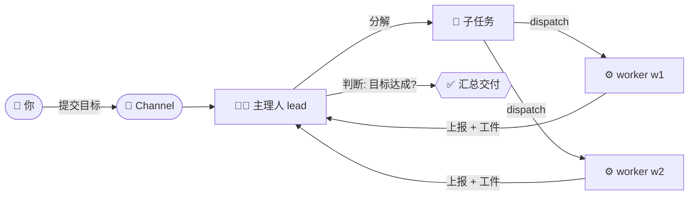
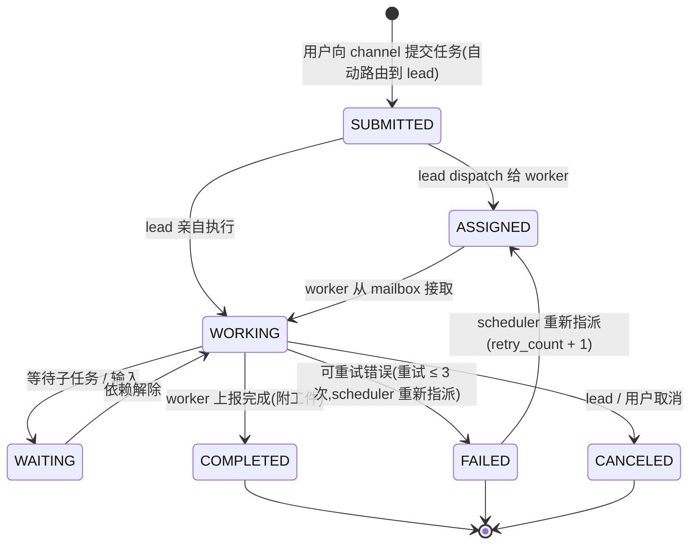
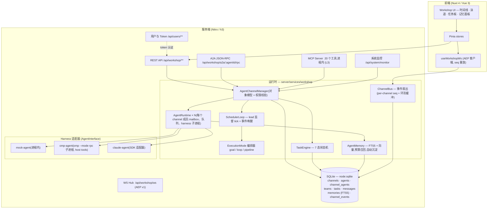

<div align="center">


# AgentWorkShop

**配置驱动的多 Agent 软件开发工坊**

> 在 **Channel(频道)** 中编排一支编码 Agent 团队 —— 任务是一等公民,主理人(lead)自动调度,Agent 拥有持久记忆,平台经四个互操作入口(WebSocket / MCP / A2A / REST)接入。

> [!IMPORTANT]
> **定位声明:监督层。** AgentWorkShop 是面向产线管理、数字孪生、数采与 Agent 编排的**监督层**(SCADA 同位)平台,运行在**秒级软实时**档位。它**不是**硬实时控制器:任何时序关键控制回路(**< 10 ms**、联锁、安全、伺服)**必须在 PLC 内实现**,严禁下沉到本平台;本平台下发的值均为建议性设定值,产线侧逻辑可否决。

[**English documentation → README.md**](./README.md)

[](#许可证)
[](https://github.com/kingdol666/AgentWorkShop)

</div>

<div align="center">

| | |
|---|---|
| **版本** | `0.1.0` |
| **运行环境** | Node.js `≥ 23.4.0`(内置 `node:sqlite`,零原生依赖) |
| **技术栈** | Nuxt 4 · Vue 3 · Nitro · Pinia · Ant Design Vue · MCP SDK |
| **国际化** | `zh-CN`(默认)/ `en` —— 由 `config.yml` 驱动 |

</div>

---

<div align="center">

## 📑 目录

- [特性总览](#特性总览)
- [工作原理](#工作原理)
- [快速开始](#快速开始)
- [使用说明](#使用说明)
- [四个入口](#四个入口)
- [任务状态机](#任务状态机)
- [A2A 消息与工件模型](#a2a-消息与工件模型)
- [Agent 持久记忆](#agent-持久记忆)
- [Harness 适配器](#harness-适配器)
- [设计架构](#设计架构)
- [项目结构](#项目结构)
- [技术栈](#技术栈)
- [开发指南](#开发指南)
- [配置说明](#配置说明)
- [设计文档](#设计文档)
- [路线图](#路线图)
- [许可证](#许可证)

</div>

---

## 特性总览

<div align="center">

| 🔒 Channel 强隔离 | 🧑‍💼 主理人编排 |
|:---:|:---:|
| **Channel 强隔离** —— 每个 Channel 是硬性隔离边界:独立工作目录、mailbox、任务池与事件流,Agent 只能感知自己所在 Channel 的同事、任务与消息。 | **主理人(lead)** —— 每个 Channel 恰有一个主理人:统筹分解任务、`dispatch` 分发给空闲下属、重新指派失败任务、汇总交付。 |

| 🎯 三种执行模式 | 📦 任务一等公民 |
|:---:|:---:|
| **`goal` / `loop` / `pipeline`** —— 主理人判断目标达成、固定间隔循环重放、或有序阶段顺序依赖流。 | **7 态任务状态机** —— 归属/指派、0–100 进度、工件(artifacts)、完整执行历史、父子任务分解。 |

| 🧠 持久记忆 | 🔌 harness 无关 |
|:---:|:---:|
| **私有 + 公共记忆域** —— FTS5 全文检索(CJK 切分,中文开箱即用)、可选向量混合召回(`sqlite-vec`)、token 预算注入、任务完成时自动沉淀。 | **同一份 `AgentInterface` 契约** —— `mock`(进程内)、`omp`(真实编码 Agent 子进程,经 RPC)、`claude`(SDK 适配器),平台零感知。 |

| 🚪 四入口 | 🔑 Token 认证 + 监控 |
|:---:|:---:|
| **WS / MCP / A2A / REST** —— 同一个 Manager 坐在四扇门后:AEP 事件流、20 个进程内 MCP 工具、A2A JSON-RPC 2.0(含 `AgentCard`)、完整 REST。 | **用户账号 + API token** 管理界面,以及 `/monitor` 页面:全部存活 runtime、每个 harness 子进程(含孤儿)、一键进程树强杀,以及 **harness 原生终端** —— xterm 实时 TUI 渲染 omp 会话流,支持 Human-in-the-loop 控制(steer/follow_up 注入、中止、`ask` 对话框应答)。 |

</div>

---

## 工作原理

<div align="center">


*时间线视图 —— 每个事件(agent 状态、流式增量、进度、结果)都流式进入实时、可回放的时间线。*

</div>



向 Channel 提交一个目标,主理人会自动分解、把子任务 `dispatch` 给空闲的 worker、重新指派失败的任务,并把结果汇总成交付 summary —— 全过程在时间线、泳道、任务板中实时可见。

---

## 快速开始

### 前置条件

```bash
node -v   # ≥ 23.4.0(需要 node:sqlite)
pnpm -v   # 11.x
```

> 使用 `omp` harness(真实作业推荐)需安装 `omp` CLI 并保证 `omp` 在 `PATH` 中(或在 agent 配置里指定 `command`)。`mock` harness 开箱即用,适合演示与联调。

### 安装与运行(开发)

```bash
git clone https://github.com/kingdol666/AgentWorkShop.git && cd AgentWorkShop

pnpm install          # postinstall 自动执行 nuxt prepare

pnpm dev              # 开发服务,端口取自 config.yml → server.dev.port(默认 :3000)
```

打开 **http://localhost:3000** 即可。

### 生产部署

```bash
pnpm build            # nuxt build → .output/
pnpm start            # node scripts/start.mjs → 端口取自 config.yml → server.prod.port(默认 :3001)
```

`scripts/start.mjs` 从 `config.yml` 读取配置并注入 `HOST` / `PORT` 后启动 Nitro 产物;环境变量 `HOST` / `PORT` 优先级最高。

### 60 秒上手

1. **注册/登录** —— 侧边栏用户菜单中注册(或 `POST /api/users/register`),登录后 UI 保存你的 API token。
2. **创建 Agent 模板** —— `Workshop → Agents → New`(名称、harness 选 `mock` 或 `omp`、可选 JSON 配置)。
3. **创建 Channel** —— `Workshop → Channels → New`;命名并指定一个 agent 为 **lead**。
4. **添加 worker** —— 把更多 agent 模板放入 Channel(每次放置都克隆出带独立身份 token 的实例);或先建 **Team** 再一键 *deploy* 整队部署。
5. **提交任务** —— 打开 Channel,在 composer 输入目标。主理人接取、分解、分发;实时时间线里可以看到每个事件。

---

## 使用说明

### 认证与 token

用户使用 `email + password` 登录;凭证为 **bearer token**(API 调用无需 cookie)。

| 接口 | 用途 |
|---|---|
| `POST /api/users/register` | 创建账号 `{ email, password, name? }` → 返回 token |
| `POST /api/users/login` | 登录 → 返回 token |
| `GET  /api/users/me` | 当前用户资料 |
| `POST /api/users/logout` | 吊销当前 token |
| `GET/POST /api/users/tokens`,`PATCH/DELETE /api/users/tokens/:id` | token 管理(`/tokens` 页面同样提供) |

所有 `/api/workshop/**` 路由要求 `Authorization: Bearer <token>`。

### 执行模式

在任务描述中使用模式前缀:`[mode:goal] …`、`[mode:loop] …`、`[mode:pipeline] …`(或在 composer UI 中选择)。

| 模式 | 语义 | 配置(描述或 UI) |
|---|---|---|
| `goal` | lead 分解 → worker 完成 → **lead 判断目标是否满足**;不满足继续下发新任务,满足则完成主任务。 | `goalCriteria` —— 注入 lead 监督 prompt 的满意度标准 |
| `loop` | 固定间隔循环重放相同任务。 | `intervalMs`(默认 `60000`)、`maxIterations`(默认 ∞) |
| `pipeline` | 有序阶段;阶段 N+1 接收阶段 N 的产出。 | `stages: [{ name, description, assigneeId? }]` |

### REST API 一览

所有路由返回统一信封,请求体经 `zod` 校验。

| 领域 | 路由 |
|---|---|
| **用户 / token** | `/api/users`(CRUD)、`/api/users/login`、`/api/users/me`、`/api/users/tokens`(CRUD) |
| **Channel** | `/api/workshop/channels`(list/create)、`/api/workshop/channels/:id`(get/patch/delete/activate)、`.../messages`、`.../tasks`、`.../agents`(add/remove/patch/stop)、`.../events`、`.../queue`、`.../memories` |
| **Agent 模板** | `/api/workshop/agents`(list/create/get/patch/delete/subscribe) |
| **Team** | `/api/workshop/teams`(CRUD)、`.../members`(add/remove)、`POST .../deploy`(整队克隆部署到 channel) |
| **任务** | `/api/workshop/tasks`、`/api/workshop/tasks/:id`(get/report/complete/cancel/retry/dispatch) |
| **记忆** | 每 agent + channel 记忆:list / create / delete / `search`,以及 `POST /api/workshop/memories/maintenance` |
| **A2A** | `GET /api/workshop/a2a/:agentId/card`(AgentCard)、`POST /api/workshop/a2a/:agentId/rpc`(JSON-RPC 2.0)、`POST /api/workshop/a2a/send`(点对点消息) |
| **邮件** | `GET /api/workshop/mailbox`(自己的收件箱)、`GET /api/workshop/mailbox/all`(仅 lead:Channel 邮件全览) |
| **系统** | `GET /api/system/config`、`GET /api/system/monitor`、`POST /api/system/monitor/terminate`、`WS /api/system/monitor/terminal/ws?pid&token`(harness 终端:实时 TUI 镜像 + HITL 输入)|
| **游戏 demo** | `/api/game/ws`(WS)、`/api/game/brain`、`/api/game/cmd` |

**A2A JSON-RPC 方法**:`tasks/send`(阻塞,30s 超时)、`tasks/sendSubscribe`(SSE 流式)、`tasks/get`、`tasks/list`、`tasks/cancel`、`message/send`、`agent/getCard`。

---

## 四个入口

同一个 `AgentChannelManager` 坐在四扇门后 —— 按需选用。

| 入口 | 端点 / 传输 | 面向 | 说明 |
|---|---|---|---|
| **WS(观察)** | `/api/workshop/ws?channelId=…` | 前端 / 仪表盘 | AEP v1 信封,per-channel 单调 `seq`;5000 事件环形缓冲;`sub` 带 `lastSeq` 重放缺失段,否则下发 `channel.snapshot` 全量对齐。`agent.delta` 流式事件驱动打字机 UI。 |
| **MCP(作业)** | 进程内服务,20 个工具 | Agent(omp 的 host tools) | 身份 = 每实例 bearer token。管理面工具(`channel.create`、`task.submit` 等)开放;作业面工具(`task.dispatch`、`a2a.send` 等)严格限定在 caller 所在 channel 作用域内。 |
| **A2A(互操作)** | `POST /api/workshop/a2a/:agentId/rpc` | 外部 A2A 客户端 | 标准 JSON-RPC 2.0 + A2A 错误码;`AgentCard` 在 `/a2a/:agentId/card`;`tasks/sendSubscribe` 提供 SSE 流。 |
| **REST(管理)** | `/api/workshop/**` | 人 / 脚本 / 上位机 | 完整管理面:channel、agent、team、任务、记忆、workspace。 |

**MCP 工具目录**

| 分组 | 工具 |
|---|---|
| Channel | `workshop.channel.create` · `workshop.channel.list` · `workshop.channel.remove` |
| Agent | `workshop.agent.create` · `workshop.agent.add` · `workshop.agent.definitions` · `workshop.agent.list` · `workshop.agent.remove` |
| 任务 | `workshop.task.submit` · `workshop.task.dispatch` · `workshop.task.list` · `workshop.task.get` · `workshop.task.report` · `workshop.task.complete` · `workshop.task.cancel` |
| A2A | `workshop.a2a.send` · `workshop.a2a.poll` · `workshop.a2a.subscribe` |
| 邮件与队列 | `workshop.mail.list`(仅 lead:Channel 邮件全览)· `workshop.queue.overview`(全员状态 + 队列总览)|

---

## 任务状态机



---

## A2A 消息与工件模型

内部通信统一使用 A2A 语义 —— WS、MCP、REST、A2A 四种入口共用同一形状:

```ts
Part      = { text, mediaType? } | { data, mediaType? } | { url, … } | { raw, … }
Message   = { messageId, channelId, taskId?, fromAgentId, toAgentId?, role, parts: Part[], metadata }
Artifact  = { artifactId, name?, description?, parts: Part[], metadata? }   // 任务交付物
```

---

## Agent 持久记忆

- **域** —— 每 Agent 私有域 + Channel 公共域(`__team__` 哨兵行),按 channel 隔离。
- **种类** —— `episodic-task` / `episodic-peer`(任务完成时自动沉淀,零 LLM 成本)与 `semantic`(人工策展,衰减豁免)。
- **检索** —— FTS5 + CJK 字符切分(中文开箱即用);可选 `sqlite-vec` 向量嵌入升级为混合检索;综合分排序 = `0.5×相关性 + 0.3×时近性 + 0.2×重要性`,贪心 token 预算装配。
- **动态感知模式** —— 运行时只注入小预算"引子"(`AW_MEMORY_PRIMER_TOKENS`,默认 300 token);Agent 作业时经 `search_memory` 工具按需抓取完整内容,经 `save_memory` 主动沉淀(自动分流私有/公共域,`dedup_key` 去重)。
- **维护** —— `POST /api/workshop/memories/maintenance` 执行衰减周期与整理。

---

## Harness 适配器

```
AgentInterface(契约:info · run · supervise · workspace 工具面 · dispose)
 ├── MockAgentImpl      进程内、脚本化 —— 演示与测试
 ├── OmpRpcAgentImpl    拉起 `omp --mode rpc` 子进程(lazy spawn,跨消息复用);
 │                      AgentWorkspace 方法注册为 omp 的 *host tools*,
 │                      agent 原生调用 report_progress / complete_task /
 │                      dispatch_task —— 无需文本解析
 └── ClaudeSdkAgentImpl Claude Agent SDK 适配器(骨架)
```

每个 harness 子进程都会在进程注册表(`harness-process.ts`)中登记 —— 这是 `/monitor` 页面的事实源,支持孤儿进程检测与进程树强杀(Windows `taskkill /T /F`,POSIX 进程组 `SIGKILL`)。

**harness 原生终端(HITL)** —— omp harness 以 `--mode rpc-ui` 运行:全部 JSONL 帧(消息增量、工具执行、host tool 调用、`extension_ui_request` 对话框)由 `harness-terminal.ts` 按 pid 镜像(净化环形缓冲 + 微批广播)。`/monitor` 页与 channel 控制台的 **Agent lanes** 视图均可为每个成员打开 xterm.js 终端抽屉:直接打字即可注入运行中的会话(流式中 `steer` 同轮注入 / 空闲 `follow_up` 新回合),`Ctrl+C` 中止回合,并通过 `extension_ui_response` 应答 agent 的 `ask` 对话框(select/confirm/input/editor)。lanes 以 `agentId` 寻址终端(进程重启自动跟随新会话),并经 `GET /api/workshop/channels/:id/terminals` 驱动实时会话徽标(`streaming`/`turn`/`idle`)。无人接入时对话框自动取消(Esc 语义)。

---

## 设计架构



---

## 项目结构

```
AgentWorkShop/
├── app/                        # Nuxt 4 前端(srcDir)
│   ├── pages/                  # / · /workshop(+ agents · teams · /w/[wsId])· /users · /tokens · /monitor · /settings
│   ├── components/workshop/    # TranscriptTimeline · AgentLanesView · TaskBoardView · MemoryPanel …
│   ├── composables/workshop/   # useWorkshopWs(AEP 客户端)…
│   ├── stores/workshop/        # Pinia:channels · agents · tasks · user …
│   └── game/                   # Phaser RPG demo(client、scene、protocol)
├── server/
│   ├── api/                    # REST + WS 路由(users · workshop · system · game · mcp)
│   ├── services/workshop/
│   │   ├── runtime/            # manager · agent-runtime · scheduler-loop · execution-mode
│   │   │                       # task-engine · memory · mailbox · monitor · channel-runtime
│   │   ├── agents/             # agent-interface · factory · mock-agent · omp-agent · claude-agent
│   │   │   └── adapters/       # omp-rpc-client(RPC 传输层)
│   │   ├── db/                 # schema.sql + 仓储层(node:sqlite)
│   │   └── types/              # a2a · task
│   ├── mcp/workshop-server.ts  # MCP 服务(20 个工具)
│   ├── repositories/           # 用户仓储
│   ├── schemas/ utils/ types/  # zod 校验 · 认证 · 响应信封
│   └── plugins/workshop.ts     # manager 装配(单例)
├── shared/
│   ├── workshop-protocol.ts    # AEP v1 —— 前后端统一事件协议(权威定义)
│   └── game-protocol.json/.ts  # 游戏指令注册表(JSON → zod,"改 JSON 即生效")
├── config.yml                  # ⚙ 单一事实来源(端口 · i18n · 主题 · 安全)
├── data/                       # 运行时 SQLite(git 忽略)
└── scripts/                    # e2e / 压测 / 验证套件(tsx)
```

---

## 技术栈

| 层 | 技术 |
|---|---|
| 框架 | [Nuxt 4](https://nuxt.com)(compatibility v4)+ Nitro(支持 WebSocket) |
| UI | Vue 3.5 · Pinia(持久化)· Ant Design Vue 4 · UnoCSS(attributify + icons) |
| 可视化 | ECharts / vue-echarts · Phaser 4(游戏 demo) |
| 语言 / 类型 | TypeScript 5.7 全栈;`shared/` 模块前后端共用 |
| 持久化 | `node:sqlite`(零原生依赖)+ FTS5 + 可选 `sqlite-vec` |
| 校验 | `zod` —— 每个端点一份 schema,消息边界统一编译校验 |
| Agent 互操作 | `@modelcontextprotocol/sdk` · A2A(JSON-RPC 2.0)· 自研 AEP v1 WS 协议 |
| 国际化 | `zh-CN`(默认)/ `en`,由 `config.yml` 驱动 |
| 质量 | ESLint 9(flat)· husky + lint-staged · commitlint(conventional) |

---

## 开发指南

```bash
pnpm dev              # 开发服务(端口取自 config.yml)
pnpm build && pnpm start   # 生产构建 + 启动
pnpm typecheck        # nuxt typecheck
pnpm lint             # eslint .
pnpm lint:fix

# 验证套件(scripts/)
node scripts/api-live-e2e.mjs     # 活体 API e2e
node scripts/verify-game.mjs      # 游戏渲染验证
pnpm game:test                    # agent brain + 游戏会话测试
```

> husky pre-commit 会对暂存文件运行 ESLint(带 `--fix`),commitlint 强制 conventional 提交信息。

---

## 配置说明

**`config.yml` 是单一事实来源** —— 构建/开发期由 `nuxt.config.ts` 一次性读取,生产启动期由 `scripts/start.mjs` 读取。环境变量(`.env`)可覆盖经 `runtimeConfig.public` 暴露的同名字段。

| 键 | 含义 |
|---|---|
| `server.host` / `server.dev.port` / `server.prod.port` | 绑定地址;开发端口(`pnpm dev`);生产端口(`pnpm start`) |
| `api.baseURL` / `api.timeout` / `api.pageSize` / `api.maxPageSize` | API 基址、超时、分页默认值 |
| `i18n.*` | 默认语言 + 语言列表 |
| `theme.primaryColor` / `theme.mode` | UI 色板(钴蓝墨水"制图台"主题)与明暗模式 |
| `security.sessionPassword` | session cookie 加密密钥 —— **生产环境务必修改**(或设置 `NUXT_SESSION_PASSWORD`) |

运行时环境变量(可选):`AW_MEMORY_PRIMER_TOKENS`(记忆引子预算)、嵌入提供方相关变量(见 `server/services/workshop/runtime/embedding-provider.ts`)。

---

## 设计文档

- [`docs/superpowers/specs/2026-08-13-agent-workshop-multi-agent-design.md`](docs/superpowers/specs/2026-08-13-agent-workshop-multi-agent-design.md) —— 系统设计(角色、任务模型、四入口、错误处理)
- [`docs/superpowers/plans/2026-08-13-agent-workshop-multi-agent.md`](docs/superpowers/plans/2026-08-13-agent-workshop-multi-agent.md) —— 实施计划 + 核心契约(T3/T5)
- [`docs/superpowers/plans/2026-08-15-agent-memory.md`](docs/superpowers/plans/2026-08-15-agent-memory.md) —— 持久记忆设计
- [`docs/superpowers/plans/2026-08-16-agent-harness-frontend.md`](docs/superpowers/plans/2026-08-16-agent-harness-frontend.md) —— harness 与前端计划

---

## 路线图

| | 事项 | 状态 |
|---|---|---|
| ✅ | Channel 运行时、主理人编排、7 态任务引擎 | 已交付 |
| ✅ | 持久记忆(FTS5 + 可选向量混合检索) | 已交付 |
| ✅ | 四个入口:WS(AEP v1)· MCP(20 工具)· A2A(JSON-RPC 2.0)· REST | 已交付 |
| ✅ | Token 认证 + 用户/token 管理界面、`/monitor` 页面 | 已交付 |
| ✅ | Phaser 4 RPG demo(游戏协议 + agent brain) | 已交付 |
| 🔨 | Claude Agent SDK 适配器 —— 与 `mock` / `omp` 完全对齐 | 进行中 |
| 📜 | 许可证文件 | 待补充 |
| ⚙️ | CI 流水线(typecheck + lint + e2e) | 规划中 |
| 🧪 | 任务引擎 / 记忆 / scheduler 单元测试 | 规划中 |

---

<div align="center">

## 许可证

AgentWorkShop 是独立项目,**并非 Anthropic 或任何 LLM 厂商的官方产品**。它通过公开接口集成 agent harness(如 `omp`)。

**许可证待补充** —— 将在 `v1.0` 发布前添加 LICENSE 文件。

<a href="https://star-history.com/#kingdol666/AgentWorkShop&Date">
  <picture>
    <source media="(prefers-color-scheme: dark)" srcset="https://api.star-history.com/svg?repos=kingdol666/AgentWorkShop&type=Date&theme=dark" />
    <source media="(prefers-color-scheme: light)" srcset="https://api.star-history.com/svg?repos=kingdol666/AgentWorkShop&type=Date" />
    
  </picture>
</a>

</div>
