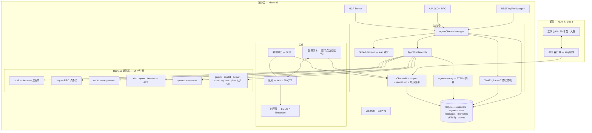

<div align="center">


# AgentWorkShop

**AI Agent 团队与产线在此交汇。**

[](https://nuxt.com)
[](https://vuejs.org)
[](https://www.typescriptlang.org)
[](https://nodejs.org)
[](https://nodejs.org/api/sqlite.html)
[](./LICENSE)

**[English →](./README.md)** · **[在线文档 →](https://kingdol666.github.io/AgentWorkShop/)** · **[版本发布 →](https://github.com/kingdol666/AgentWorkShop/releases)** · **[更新日志 →](./changelog.md)**

*当前版本：**v0.7.37** · 14 个执行引擎 · 5 种现场协议 · 99 个运行时设置项 · 双语文档（简体中文 / English）*

*一个配置驱动的平台：**AI Agent 团队**与**工业数字孪生**共享同一运行时——Agent 查询真实遥测、经人工审批的写控回路下发监督设定值，每个事件实时推送到 3D 孪生。*

</div>

> **定位声明：监督层。** AgentWorkShop 是面向产线管理、数字孪生、数采与 Agent 编排的**监督层**（SCADA 同位）平台，运行在**秒级软实时**档位。它**不是**硬实时控制器：任何时序关键回路（**< 10 ms**、联锁、安全、伺服）**必须在 PLC 内实现**。本平台下发的设定值均为建议性——产线侧逻辑可否决。

---

## 目录

| | | |
|---|---|---|
| [这是什么？](#这是什么) | [特性总览](#特性总览) | [界面一览](#界面一览) |
| [设计架构](#设计架构) | [快速开始](#快速开始) | [配置与 CLI](#配置与-cli--真正的配置驱动) |
| [工业栈详解](#工业栈详解) | [使用说明](#使用说明) | [端到端验证](#端到端验证) |
| [项目结构](#项目结构) | [技术栈](#技术栈) | [开发指南](#开发指南) |
| [路线图](#路线图) | [许可证](#许可证) | |

## 文档

文档双语——[VitePress 文档站](https://kingdol666.github.io/AgentWorkShop/)的每个板块都提供语言切换（简体中文 / English）。深度文档同样随仓库发布，CLI 还会把它们一并复制进发布包：

| 主题 | 在线 | 仓库内 | 覆盖内容 |
|---|---|---|---|
| **快速上手** | [指南](https://kingdol666.github.io/AgentWorkShop/guide/getting-started) | `docs/site/guide/` | 安装 → 首次运行 → 第一次「Agent × 产线」会话、配置、数采协议、数控读写、HITL、配方版本化、多 Harness 团队、产线级权限、AML |
| **插件开发** | [插件指南](https://kingdol666.github.io/AgentWorkShop/plugins/) | [`docs/plugins.md`](./docs/plugins.md) | 完整扩展契约：三种作用域、`index.mjs` 清单、`ctx` 服务端/浏览器能力面、`settings`/`groups` 声明、生命周期事件、i18n、面板、团队级开关、一个真实示例 |
| **SDK** | [SDK 指南](https://kingdol666.github.io/AgentWorkShop/sdk/) | [`docs/sdk.md`](./docs/sdk.md) | `agentworkshop/sdk` 既是编程客户端（带信封处理的平台 REST 客户端），也是插件扩展基座；TypeScript 类型；浏览器侧 SDK |
| **CLI** | [CLI 手册](https://kingdol666.github.io/AgentWorkShop/cli/) | [`docs/cli.md`](./docs/cli.md) | 全部 14 条 `aw` 指令、全局参数、退出码、双模式路径模型、指令注册系统、维护者发布指南 |
| **AML** | [AML 指南](https://kingdol666.github.io/AgentWorkShop/guide/aml) | [`docs/aml.md`](./docs/aml.md) | 自动建模实验室：数据集构建、作业编排、模型注册表、晋级门禁、Agent 工具 |
| **TUI** | — | [`docs/tui.md`](./docs/tui.md) · [`tui/README.md`](./tui/README.md) | 终端工作台：频道、Agent、任务、实时监控、HITL 作答 |
| **多 Harness 架构** | — | [`docs/multi-harness-architecture.md`](./docs/multi-harness-architecture.md) | 引擎分类、归一化会话契约、provider/model 目录、失效模式 |

---

## 这是什么？

AgentWorkShop 起家于**多智能体软件工作坊**——Channel 内的编码 Agent 团队，配备 lead 调度器、7 状态任务机、持久记忆，以及四个互操作入口（WebSocket / MCP / A2A / REST）。

随后它长出了**工业半边**：完整的数采与写控栈（Modbus TCP / OPC UA）、带配方与批次运行的产线、3D 数字孪生小镇、一个**自动建模实验室**（数据集 → 训练作业 → 排行榜 → 门禁晋级）——以及让它独一无二的桥：**Agent 可被授予带绑定、带权限作用域的真实工业节点访问权**，带着物理语义查询其实时遥测，并经「联锁 → 人工审批 → 回读校验」管线驱动写操作。

它同时**天生可扩展**：一个自包含插件可以同时增强服务端（钩子、路由、Agent 工具、数采驱动、配置分组）与浏览器（面板、i18n），而同样的能力面也通过 SDK 开放给普通程序——见 [`docs/plugins.md`](./docs/plugins.md) 与 [`docs/sdk.md`](./docs/sdk.md)。

最终效果：提交一个目标，比如「分析熔体温度趋势并优化设定值」——Agent 团队读取真实传感器历史、计算统计量、提议新设定值、在 HITL 面板等您批准、写入 PLC、校验回读、带着数值汇报。**端到端，自动化 E2E 已验证。**

<div align="center">

<br><sub><b>实时 3D 孪生。</b>产线设备、设备健康、数采通道与趋势分析——全部由实时遥测驱动。</sub>
</div>

---

## 特性总览

#### Agent 团队运行时

| 能力 | 为何重要 |
|---|---|
| **Lead 编排** | 每个 Channel 一名 lead：分解目标、派发空闲 worker、失败重派、判定目标满足度。LLM 决策 + 确定性规则引擎兜底——系统永不停滞。 |
| **三种执行模式** | `goal`（满意度判定）· `loop`（定间隔重放）· `pipeline`（顺序阶段）。7 状态任务机带进度、产物与完整历史。 |
| **Harness 无关** | 一个 `AgentInterface`，**14 个引擎**分三类传输形态：**进程内**——`mock`（无 LLM）、`claude`（Claude Agent SDK，常驻会话，同轮 steer）；**经协议常驻会话**——`omp`（RPC 子进程）、`codex`（app-server JSON-RPC）、`dsh` / `qwen` / `hermes`（ACP）、`opencode`（serve + HTTP/SSE）；**带结构化事件流的无头 CLI**——`gemini`（stream-json）、`copilot`（JSONL）、`cursor`（stream-json）、`crush`（非交互运行）、`goose`（stream-json）、`pi`（`-p --mode json`）。平台永远不知道跑的是哪个。 |
| **Channel 级 LLM 选择** | 每个 Channel 从 Harness 实时目录中选 **harness → provider → model（+effort）**（如 omp 的 `zhipu-coding-plan/glm-5.3-flash`）。成员未显式覆盖即继承——一个团队混用多种 harness 是一等公民设定，不是绕行。 |
| **Harness 可用性检查** | `GET /api/workshop/harnesses` 逐引擎探测 PATH 上的 CLI。前端禁用未安装项，且每个入口在执行前都做强校验。 |
| **停滞安全的监督** | 任务回收区分「卡死」与「慢」：看门狗把 Agent 工具调用当作活性信号，健康的长工业作业不会被误回收，真停滞仍会呈报 lead。 |
| **持久记忆** | 私有 + Channel 共享双域；FTS5 CJK 切分，可选向量混合检索，token 预算注入；团队编年史与空闲反思持续沉淀。 |
| **四个入口** | 一个 manager 坐在每扇门后：**WS**（AEP v1 事件流，seq 续传）、**MCP**（约 25 个进程内工具）、**A2A**（JSON-RPC 2.0 + AgentCard）、**REST**。 |

#### 工业栈

| 能力 | 为何重要 |
|---|---|
| **五协议现场总线** | Modbus TCP、Modbus RTU-over-TCP（串口网关）、OPC UA、MQTT、HTTP/REST——数采**与**写控双驱动带连接池、分类错误文案与逐驱动连接测试；`mock` 覆盖演示/CI；插件可注册新协议。 |
| **Agent 团队 × 工业作用域** | 把 Agent 绑定到数采/数控节点。Agent 看到的是语义卡（物理含义、单位、安全量程、配方窗口）——而不是裸寄存器。 |
| **人工审批的写控** | 数控下发经过「**安全量程 ∩ 活动配方窗口**」联锁 → 可选 **HITL 审批** → PLC 写入 → **回读校验** → 带签名的写历史。 |
| **数控读写通道** | 每个控制节点都能沿它写入时所用的同一套标定**读回 PLC 当前值**：周期读 + 按需读 + Agent 读取，SET 与 ACT 并排呈现——读是被动观测，永不被写联锁阻断。 |
| **Recipe 版本化治理** | 参数修改按版本入史（归因 用户/Agent/系统 + 操作者 + 原因）。可非破坏地回退到任意修订版或最近一次良好批次。失效节点参数跳过并明确标识。 |
| **产线运营** | 产线 → 产品 → 配方 → 批次。配方窗口门控采集并联锁写入；每条样本打标 `product/recipe/run`，实现按批次隔离。 |
| **多形态数采帧管线** | 多点轮廓（测厚仪/扫描仪）与 CCD 图像帧流经模板 sink 管线：向量与元数据入 Timescale（`daq_frames`），像素入对象存储（MinIO，不可达自动降级本地磁盘）；派生指标阈值越限走既有告警链路。 |
| **Agent 自查工具** | `line_context`、`ops_log`、`recipe_log`、`recipe_versions`、`dcw_journal`——Agent 清楚自己操控的产线/产品/配方，谁做过什么，每个值怎么变。 |

#### 治理、配置与扩展

| 能力 | 为何重要 |
|---|---|
| **产线级权限** | 工业数据按**产线**三态门控（无权/仅查看/可操控），强制点在数据面——普通用户未授权前看不到任何产线数据。 |
| **全操作审计日志** | 用户 / Agent / 系统 的每个动作都落进同一份可检索日志；操作者归属「Channel名/成员名」，与用户和系统天然区分。经 WS 实时推送。 |
| **团队级插件开关** | 每个团队（Channel）持有**独立插件开关组**（`channel_plugins`）：被关闭插件的工具不注入该团队 Agent。插件本体经 `aw plugin` 与 `/plugins` 页热管理。 |
| **插件扩展 API** | `plugins/<name>/` 下的一个自包含目录**同时增强两半**：`index.mjs`（服务端：钩子、路由、Agent 工具、数采驱动/处理器/模板、配置分组、KV、定时器）与 `client.mjs`（浏览器：注入具名插槽的面板、i18n、设置 UI）。三种作用域——`builtin`（随包发布）> `project`（检出）> `user`（`~/.AgentWorkShop`）——启停**与代码修改**均有约 1 秒热重载。完整契约见 [`docs/plugins.md`](./docs/plugins.md)。 |
| **AML —— 自动建模实验室** | 数据集构建 → 训练作业 → 排行榜 → 晋级门禁 → 模型引用，全部可在 `/aml` 页驱动，也可由 Agent 通过 10 个 `aml_*` 工具驱动。Python 运行时由 `uv` 引导至 `./aml` 资产根；产物与元数据都留在配置根下。 |
| **全量配置驱动运行时** | 全部运行旋钮（记忆预算、上下文压缩、回退护栏、保留策略、备份、日志级别…）在设置描述符注册表声明一次，优先级 **config.yml < runtime-settings < env**——**99 个设置项、16 组**，代码零硬编码默认。 |
| **可配置节拍** | 采样与查询的默认值/下限全部是 **live 设置**（`daq.sampling.*`、`daq.query.*`）：热重载、create/patch 时钳制，Agent 工具描述实时携带当前值。 |

#### 数字孪生

| 能力 | 为何重要 |
|---|---|
| **3D 数字孪生** | Three.js 小镇：放置产线设备与 Channel 领地，实时查看设备健康、告警与数值——由同一事件总线驱动。自适应画质阶梯（DPR / 阴影 / Bloom 分档 + 墙钟 FPS 预算）自动匹配机器，`window.__townStats` 暴露真实渲染指标供性能探针使用。 |

---

## 界面一览

<div align="center">

| Agent 工作台 | 产线运营 |
|:---:|:---:|
|  |  |

| 数采中心 | 数字孪生小镇 |
|:---:|:---:|
|  |  |

| 仪表盘 | 实时监控与 HITL |
|:---:|:---:|
|  |  |

</div>

---

## 设计架构



**Agent × 机器之桥**（值得读源码的部分）：

```
agent ──绑定──▶ 节点 (daq: auto / dcw: manual)
  │                    │
  │  my_industrial_nodes  ◀── 语义卡：物理含义 · 单位 · 安全量程 · 配方窗口
  │  daq_query             ◀── 时序库历史，统计 + 物理语义
  │  dcw_control           ──▶ 联锁（安全量程 ∩ 配方窗口）
  │                           ──▶ HITL 审批（manual 模式，180s 超时）
  │                           ──▶ PLC 写入 → 回读校验 → ACK + 写历史
  ◀── Agent 可引用数值的结果文本
```

---

## 快速开始

### 前置条件

```bash
node -v   # ≥ 23.4.0（需要内置 node:sqlite）
```

> 真实 Agent harness 需要对应 CLI 在 PATH 中——`omp`、`codex`、`dsh`、`opencode`、`gemini`、`qwen`、`copilot`、`cursor`、`crush`、`goose`、`pi` 或 `hermes`（任选子集；同一 Channel 可混用）。`mock` 与 `claude`（SDK）**进程内运行**，无需 PATH 上的 CLI。仪表盘「执行引擎」面板以绿/灰状态点展示每个引擎的就绪度，未安装引擎可点击跳转官网安装页。可选数采基础设施（MQTT broker + TimescaleDB）在 Docker 可达时自动拉起（`docker compose up -d`）。

### 方式 A —— 从 npm 安装（推荐）

```bash
npm install -g agentworkshop     # → `aw` / `agentworkshop` 进入 PATH
aw start                         # → http://localhost:3001
```

发布出的包内含**预构建的生产产物**（`.output/`），所以 npm 安装后可直接启动——无需构建步骤，也无需构建工具。首次启动时一切初始化进配置根 **`~/.AgentWorkShop`**：默认 `config.yml`、自动生成含随机会话密钥的 `.env`、`runtime-settings.json`、docker-compose 种子、`prompts/`、`commands/`、`plugins/`（由 SDK 示例播种，**默认关闭**）与空的 `data/` 目录。全部运行数据（SQLite、JSON 仓库、备份、日志）也都落在配置根——配置与数据跟着安装走，与当前工作目录无关。

不想全局安装、只想跑一次？

```bash
npx agentworkshop start          # 无需全局 npm 安装
```

> `npx` 同样会创建 `~/.AgentWorkShop`——不装全局并不等于在磁盘上不留任何痕迹。

### 方式 B —— 源码运行

```bash
git clone https://github.com/kingdol666/AgentWorkShop.git && cd AgentWorkShop
pnpm install
pnpm dev          # → http://localhost:3000（端口取自 config.yml）
```

源码生产部署：

```bash
pnpm build        # nuxt build → .output/
pnpm start        # 端口取自 config.yml → server.prod.port
```

> 在源码检出内，配置根是项目里的 **`.AgentWorkShop/`** 文件夹（运行时覆盖、数据、项目级指令），而 `config.yml` / `.env` 留在检出根，作为版本化的工厂默认值。

### 版本更新

```bash
aw update                              # 检查 + 就地更新全局安装
aw update --check                      # 只报告，不安装
npm install -g agentworkshop@latest    # 手动等效
```

版本遵循 semver。每次 `aw start` 都会校验配置根，并把 `home` 之前的旧版 `data/` 布局迁移进来（最新文件胜出），因此数据可以跨版本存活。SQLite schema 迁移在服务端启动时执行。当前版本：**v0.7.37**——见[版本发布](https://github.com/kingdol666/AgentWorkShop/releases)。

### 第一次「Agent × 产线」会话（约 2 分钟）

1. **登录** —— 侧边栏注册（或 `POST /api/users/register`）。
2. **搭产线** —— 「产线运营」→ 建产线，加数采节点（如 `daq-temp-tc`）与数控节点（如 `dcw-temp-sp`），建产品 + 配方，点**开跑**。实时值开始流动。
3. **建团队** —— 「Agent 工作台」→ 选 lead + workers，**deploy** 部署进 Channel。
4. **绑定节点** —— 打开 Agent 详情面板 → 绑定数采节点（*auto*）与数控节点（*manual* = 需您的批准）。
5. **提交目标** —— 「分析最近 5 分钟熔体温度；若与 182 °C 偏差超过 1 °C，修正设定值（等我的批准）。」
6. **审批** —— Agent 读取真实历史、计算均值、发起写请求 → 在 HITL 面板批准 → 看设定值变化，goal 收口并给出数值报告。

---

## 配置与 CLI —— 真正的配置驱动

一个运行时，一个事实来源。**`config.yml`** 声明默认值；配置根内的 **`runtime-settings.json`** 承载运行时覆盖；环境变量与 CLI 参数在最上层。每个可编辑键在 `shared/config/schema.json` 中声明一次（类型、范围、枚举、实时/重启生效），**前端设置页与 CLI 消费同一份描述符**。

```
config.yml（默认值）  <  .AgentWorkShop/runtime-settings.json（运行时）  <  环境变量 / CLI 参数
```

配置根：全局安装（`npm i -g`）时为 **`~/.AgentWorkShop`**——无论在哪个目录运行 `aw`；源码检出时为项目内的 **`<repo>/.AgentWorkShop`**（`config.yml` / `.env` 留在检出根，作为版本化的工厂默认值）。`AW_HOME` 可重定向；`AW_MODE=home` 强制全局形态。

### 设置持久化与热重载

- **系统设置 → 运行配置**标签页按描述符渲染每个可编辑键——改服务端口、主题、API 超时、语言环境或审批闸门，点保存即可。
- `live` 键立即生效（主题、标题、超时、审批闸门、数采采样节拍、时序查询桶宽……），经服务端事件流推送，**无需刷新、无需重启**。
- `restart` 键（端口、主机）落盘持久化，在下一次以对应模式启动时生效（`aw dev` / `aw start`）。
- 所有写入方共用一条通道：**设置页、CLI、服务端文件监听**最终都收敛到同一个设置文件——任何一端改，处处生效。

示例——在线调节数采与查询节拍：

```bash
aw config set daq.sampling.defaultIntervalMs 2000   # 新节点每 2s 采样
aw config set daq.sampling.minIntervalMs 500        # 节点级下限（create/patch 钳制）
aw config set daq.query.defaultBucketMs 3000        # 时序查询缺省 3s 桶
aw config set daq.query.minBucketMs 500             # 查询下限（samples/产线查询/Agent 工具共用）
```

注入 Agent 的工具描述会在每次装配时以当前配置值重新渲染——LLM 永远看到对自己 `daq_query` 调用真正生效的下限与缺省值。

### `aw` CLI

| 指令 | 作用 |
|---|---|
| `aw start · aw dev · aw build` | 生产服务 / 开发服务器 / 构建——端口取自有效配置；首次 `start` 构建一次 |
| `aw stop` | 依单实例锁终止运行中的 aw 服务实例 |
| `aw config list · get · set · unset · reset` | 读写运行时设置（schema 校验 + 原子写盘） |
| `aw plugin list · create · enable · disable` | 跨三种作用域管理插件：查看、脚手架（默认 project 作用域；`--global` 为 user 作用域）、启停（写状态文件，运行中的服务约 1 秒热重载） |
| `aw home` | 查看/初始化配置根 `.AgentWorkShop` |
| `aw init <dir>` | 脚手架一个可运行的新项目（含完整配置系统与 CLI） |
| `aw register <路径\|URL\|npm:包名>` | 注册一条新指令——项目级或 `--global` 用户级 |
| `aw update` | 对比 npm 远程最新版本，有新版就就地更新全局安装 |
| `aw doctor` | 环境 + 项目健康检查（node、配置、端口、密钥） |
| `aw status` | 运行态总览：模式、配置来源、运行中服务、指令表 |
| `aw tui` | 终端工作台：频道/成员管理、任务下发、实时监控面板、HITL 作答（见 [`docs/tui.md`](./docs/tui.md) · [`tui/README.md`](./tui/README.md)） |
| `aw version` | 打印 CLI/包版本（别名 `v`） |

全局参数：`--help/-h` · `--version/-v` · `--json`（机器可读） · `--root <dir>` · `--debug`。

退出码：**0** 成功 · **1** 运行时错误 · **2** 用法错误。带 `--json` 时，失败会以信封返回 `{ ok: false, error: 'unknown-command' \| 'no-project' \| 'usage' \| 'internal' \| <code> }`，自动化无需解析 stderr 即可分支。

### 指令注册

指令就是导出 `{ meta, run }` 的普通模块。把它放进扫描目录，下次调用即生效——无需任何登记清单，约定优于配置：

| 作用域（同名高者优先） | 目录 |
|---|---|
| 项目级 | `<检出>/.AgentWorkShop/commands/` |
| 用户级 | `~/.AgentWorkShop/commands/` |
| 内建 | 随 CLI 发布（`cli/commands/`） |

`aw register <file|url|npm:pkg>` 把指令复制进对应作用域（`--global` 进用户级）；`aw help` 列出全部已注册指令。

```js
// ~/.AgentWorkShop/commands/hello.mjs
export const meta = { name: 'hello', group: '自定义', summary: '问好', usage: 'aw hello [--name <n>]' }
export async function run(argv, ctx) {
  console.log(`你好 ${argv.flags.name ?? 'AW'} —— 模式: ${ctx.mode}`)
}
```

---

## 工业栈详解

### 数据采集（DAQ）

- **五协议驱动**：Modbus TCP、Modbus RTU-over-TCP（串口网关）、OPC UA、MQTT、HTTP/REST——连接池、分类错误文案、逐驱动连接测试；驱动注册表接受插件注册新协议。
- **逐节点边缘运行时**：独立采样节拍、下发节拍、节点级在飞互斥——一个慢驱动绝不拖累邻居。采样与查询的默认值/下限由 `daq.sampling.*`、`daq.query.*` live 设置驱动。
- **管线**：驱动 → 队列（进程内 / MQTT，断连离线缓冲）→ 消费泵乱序防御 → 三路分发：WS 实时直推（节拍门控）、TSDB 批量落库、设备孪生回写。
- **鲁棒性**：TSDB 单 in-flight 写 + 有界重试，缓冲背压带丢弃计数，真实丢失指标随 `daq.controller` 帧暴露。
- **告警**：配方级监控窗口，**2% 滞回 + 3 拍去抖**；alarm/offline 切换即时生效（安全优先）。

### 写控制（DCW）

- 工程量写入：`linear` 标定（scale/offset）PLC↔物理，**回读校验**（死区容差），ACK 状态 + 写历史。
- **联锁**：产线运行时，活动配方的参数窗口对该节点**替代**全局安全量程。
- **HITL**：`manual` 绑定挂起写入等用户批准（同 Agent+节点去重；批准时二次校验——权限在您点击批准那一刻重查）。

### 配方与批次

`产线 → 产品 → 配方 → 批次`。开跑逐节点应用配方参数（每次写都校验），逐线门控采集，每条样本打标 `line/product/recipe/run`——产品级数据隔离 + 五维查询（产线 × 产品 × 配方 × 时间 × 节点）。

### AML —— 自动建模实验室

这是闭环里的建模半边：`/aml` 用已打标的遥测构建**数据集**，把**训练作业**提交到 `uv` 托管的 Python 运行时，在**排行榜**上给各次运行排名，并且只有跨过配置的**门禁**（NRMSE、rollout NRMSE、验证/测试差距、最小行数与运行次数）才允许晋级。晋级后的模型按 id 引用，因此 MPC 或影子孪生控制器消费的是有版本号的产物，而不是含糊的「最新」。

- Agent 通过 10 个工具做同样的事（`aml_dataset_build`、`aml_job_submit`、`aml_job_status`、`aml_leaderboard`、`aml_model_promote`……）——提交一个目标，让团队去训练并汇报。
- Python 运行时由 `uv` 自行引导进配置根内的 `./aml` 资产根；数据集/产物/元数据路径、磁盘配额、作业超时、并发与保留策略全部是**设置项**（`aml` 组共 16 项），而不是常量。
- 治理默认保守：跨配方数据集除非显式允许否则拒绝，每个作业都有归属。

---

## 使用说明

### 认证

邮箱 + 密码登录签发 **bearer token**（每用户多 token，可单独吊销）。

```bash
# 注册
curl -X POST http://localhost:3000/api/users/register \
  -H 'content-type: application/json' \
  -d '{"email":"you@example.com","password":"secret","name":"you"}'

# 所有 workshop 调用
curl http://localhost:3000/api/workshop/channels \
  -H 'authorization: Bearer <token>'
```

### 产线级权限

工业数据按**产线**三态管控，由管理员在内置「权限管理」页（`/permissions`，仅 admin 侧栏可见）维护：

| 状态 | 数采节点 | 数控(写控)节点 | 可见性 |
|---|---|---|---|
| **无权**（普通用户默认） | 隐藏 | 隐藏 | 后端不返回该产线数据——产线运营/数采中心/数字孪生均不可见 |
| **仅查看** | 只读 | ✕ | 产线可见、实时值可看，但不可写/不可下发/不可绑定设备 |
| **可操控** | 读取 | 读取+写入 | 全量能力：设定值下发、参数下发、设备绑定 |

- `admin` / `editor` 为运营角色，不受授权约束（全量全权）。
- 普通用户**默认无权**——未授权前看不到任何产线数据。
- 强制点在数据面：列表接口按授权过滤，写控/下发接口返回人话 403，Agent↔节点绑定校验产线授权（数采需仅查看+，写控需可操控）。
- 插件经 `ctx.permissions`（`lineMode` / `visibleLineIds` / `listGrants` / `setGrants`）获得同一能力面，并有 `permissions:changed` 生命周期钩子；SDK REST 客户端提供 `client.permissions.overview()` / `client.permissions.set(...)`。

### 执行模式

在任务描述中使用模式前缀（或在 composer UI 中选择）：

| 模式 | 语义 | 配置 |
|---|---|---|
| `goal` | lead 分解 → worker 交付 → **lead 判定满意度**；不满足继续补发；满足收口父任务。 | `goalCriteria` |
| `loop` | 固定间隔循环重放同一任务。 | `intervalMs`（默认 60000）、`maxIterations`（默认 ∞） |
| `pipeline` | 有序阶段；阶段 N+1 消费阶段 N 产出。 | `stages: [{name, description, assigneeId?}]` |

### 四个入口

| 入口 | 端点 | 面向 |
|---|---|---|
| **WS** | `/api/workshop/ws?channelId=…` | 仪表盘 / UI——AEP v1 信封，per-channel 单调 `seq`，5000 事件环形缓冲，`lastSeq` 续传，快照兜底。 |
| **MCP** | 进程内服务，约 25 个工具 | Agent（omp host tools）——管理面 + 作业面工具，Channel 作用域。 |
| **A2A** | `POST /api/workshop/a2a/:agentId/rpc` | 外部 Agent——JSON-RPC 2.0，`AgentCard` 在 `/card`，`tasks/sendSubscribe` SSE。 |
| **REST** | `/api/workshop/**` | 人 / 脚本——完整管理面。 |

### 任务状态机

```
SUBMITTED ─▶ ASSIGNED ─▶ WORKING ─▶ WAITING ─▶ COMPLETED
    │            │           │           │
    └────────────┴───────────┴──▶ CANCELED / FAILED ─▶（重试 ≤ 3 或取消）
```

---

## 端到端验证

上面每一条论断，背后都有一个可复跑的套件。闭环套件在**生产实例上、跑真实模拟产线协议**（Modbus TCP/RTU、OPC UA、MQTT、HTTP + MQTT/Timescale 管线），配真实 LLM Agent，断言落在数据库、事件流与 HTTP API 上——而不是 mock。

| 套件 | 最新结果 | 覆盖 | 复现 |
|---|---|---|---|
| `e2e-full-closedloop.mjs` | **124 PASS / 0 FAIL**（2026-09-12，v0.7.36） | 注册 → 登录 → 产线/产品/配方 → 数采采样 → Agent 绑定节点 → `daq_query` → `dcw_control` → HITL 审批 → PLC 写入 → 回读 → 配方回退 → 级联删除 → 数据根隔离 | `node scripts/e2e-full-closedloop.mjs http://127.0.0.1:3111` |
| `e2e-aml.ts --real` | 0 失败（2026-09-11） | AML 数据集 → 作业提交 → 状态/日志 → 排行榜 → 晋级门禁，跑在真实 Python 运行时上 | `node node_modules/tsx/dist/cli.mjs --tsconfig .nuxt/tsconfig.server.json scripts/e2e-aml.ts --real` |
| 五协议真实产线 | 37/37 | 逐协议连通、数采入 Timescale、逐协议数控下发 + 回读、Agent 闭环、HITL 经真实 OPC UA 写入、配方 + 参数账本回退 | `node scripts/_dbg-live-line-e2e.mjs` |
| 生产 API 全链路 | 64/64 | 跨重启持久化、模板 CRUD、任务 assign/complete/cancel/loop/pipeline、A2A + mailbox、WS 广播、MCP 端点、级联删除 | `AW_E2E_TOKEN=<token> node scripts/api-live-e2e.mjs` |
| 产线权限 / 审计负向 | 20/20 + 9/9 | 三态产线授权 + 人话 403、授权撤销收敛、无 token WS 零遥测 | `scripts/e2e-auth-matrix.mjs` |
| 渲染回归 | 29/29 | 227 行数采表完整性、WS 驱动行更新、筛选、详情页、3D 小镇 + 模型库、7 页 smoke、零 pageerror | `node scripts/_dbg-render-regression.mjs <base> <email> <pass>` |
| 多 Harness 并行 | 21 | omp 闭环 · codex 真实寄存器写入 · dsh 真实数采 · opencode 配方写入+回退——四引擎在一条开跑产线上 | `node scripts/e2e-multiharness-team.mjs` |
| 离线单元/属性套件 | 全绿 | AEP 事件索引（`test-events-index`）、LRU、数据根拆分（`test-data-root`）、日志洪泛、回退索引、插件加固、记忆按月查询、CLI 退出码（`test-cli-exit`）、SDK 能力面（`test-sdk-surface`） | `node scripts/test-<name>.mjs` |

五协议与生产 API 两行是历史上的 **v0.7.20** 验收基线——*156 断言、0 失败*，完整报告见 [`docs/audit/e2e-2026-09-07.md`](./docs/audit/e2e-2026-09-07.md)。闭环与 AML 两行是当前 HEAD 的跑批结果。性能探针：`scripts/_dbg-render-perf.mjs`。

---

## 项目结构

```
AgentWorkShop/
├── bin/ · cli/                 # aw CLI——指令注册表 · 内置指令 · 配置引擎接线
├── app/                        # Nuxt 4 前端（srcDir）
│   ├── pages/                  # / · /workshop · /workshop/agents · /workshop/teams
│   │                           # /workshop/channel-templates · /workshop/w/:id
│   │                           # /town · /daq · /daq/:id · /dcw · /dcw/:id
│   │                           # /aml · /monitor · /logs · /permissions
│   │                           # /plugins · /users · /tokens · /settings
│   ├── components/workshop/    # 时间线 · 泳道 · 任务板 · 记忆面板 · 3D 小镇
│   └── stores/composables/     # Pinia + AEP 客户端
├── server/
│   ├── api/                    # REST + WS + A2A + MCP 路由
│   ├── services/workshop/
│   │   ├── runtime/            # manager · scheduler-loop · task-engine · memory · mailbox
│   │   ├── agents/             # AgentInterface：14 个引擎（+ 工业工具）
│   │   ├── daq/ dcw/ aml/      # 边缘运行时 · 驱动 · 队列 · 存储 · 建模实验室
│   │   └── db/                 # node:sqlite 仓储层
│   ├── mcp/                    # MCP 服务（25 个工具）
│   ├── plugins-builtin/        # 随包发布的插件（diag-bridge · rag-bridge）
│   └── plugins/                # 运行时装配（单例）
├── sdk/                        # agentworkshop/sdk——插件上下文、钩子总线、REST 客户端、浏览器 SDK
├── tui/                        # 终端工作台（aw tui）
├── shared/
│   └── config/                 # schema.json（98 个设置描述符）+ 引擎（合并/校验/持久化）+ 路径解析器
├── config.yml                  # 工厂默认值（构建/启动时读取；版本号来自 package.json）
├── .AgentWorkShop/             # 检出内的配置根——prompts（版本化）+ 运行时覆盖 · 数据 · 日志 · 指令（git 忽略）
├── data/                       # 迁移前的旧版位置（自动迁移进配置根）
└── scripts/                    # 启动器 · home 引导 · E2E · 验证套件
```

## 技术栈

| 层 | 技术 |
|---|---|
| 框架 | [Nuxt 4](https://nuxt.com) + Nitro（WebSocket） |
| UI | Vue 3.5 · Pinia · Ant Design Vue · UnoCSS · Three.js · ECharts |
| 语言 | TypeScript 5.7 全栈；`shared/` 前后端共用 |
| CLI | Node ESM CLI，可插拔指令注册表（`bin/aw.mjs`） |
| 持久化 | `node:sqlite`（零原生依赖）+ FTS5 + 可选 `sqlite-vec`；时序用 TimescaleDB |
| 校验 | `zod` —— 每个消息边界 |
| 互操作 | `@modelcontextprotocol/sdk` · A2A（JSON-RPC 2.0）· AEP v1（自研 WS 协议） |
| 现场总线 | `modbus-serial` · `node-opcua` · `mqtt` |

## 开发指南

```bash
pnpm dev          # 开发服务（端口取自有效配置）
pnpm cli …        # 仓库内使用 CLI：pnpm cli config list
pnpm tui          # 终端工作台（连运行中的实例）
pnpm build && pnpm start
pnpm typecheck
pnpm lint
pnpm test:api-live                        # 针对运行中服务的 API 套件
node scripts/e2e-full-closedloop.mjs      # 全链路闭环（需服务端运行中）
node scripts/test-sdk-surface.mjs         # SDK 导出面守卫
```

文档站位于 `docs/site/`（VitePress），由 [`.github/workflows/deploy-docs.yml`](./.github/workflows/deploy-docs.yml) 部署到 GitHub Pages：

```bash
cd docs/site && npx vitepress dev        # 本地预览
cd docs/site && npx vitepress build      # 生产构建 → .vitepress/dist
```

该工作流在构建前把 `docs/{cli,plugins,sdk}.md`（及其 `.en.md` 双语对照）同步进文档站，因此这些文件是单页指南的唯一事实来源。

## 路线图

| 能力 | 状态 |
|---|---|
| Channel 运行时、lead 编排、7 态任务引擎 | 已交付 |
| 四入口：WS（AEP v1）· MCP · A2A · REST | 已交付 |
| 持久记忆（FTS5 + 可选向量混合） | 已交付 |
| 工业栈：数采 · 数控写控 · 产线/配方/批次 | 已交付 |
| Agent ↔ 节点绑定 + HITL 审批 + 联锁 | 已交付 |
| 3D 数字孪生小镇 · 产线运营 UI · 仪表盘 | 已交付 |
| 全功能 live E2E（Agent 读写真实产线，23 项检查） | 已交付 |
| 运行时配置系统：设置持久化 · 热重载 · 设置页 UI | 已交付 |
| `aw` CLI：config · run · init · register · doctor | 已交付 |
| 多 Harness 注册表：omp · codex · dsh · opencode 子进程引擎 | 已交付 |
| 五种现场协议：Modbus RTU-over-TCP · MQTT · HTTP（数采 + 数控双向） | 已交付 |
| Harness 可用性探测 + 执行前引擎强校验（UI 禁选 + 409） | 已交付 |
| Recipe 归因版本化 + 非破坏回退（界面 + Agent 工具） | 已交付 |
| Agent 自查工具：line_context / ops_log / recipe_log / recipe_versions / dcw_journal | 已交付 |
| 多 Harness 并行真实产线 live E2E（四引擎、一条产线） | 已交付 |
| HITL 审批流经真实 OPC UA 写入验证 | 已交付 |
| 双语文档（简体中文 / English，VitePress 语言切换） | 已交付 |
| Channel 级 LLM provider/model 选择（取自实时 Harness 目录） | 已交付 |
| 可配置数采/时序节拍（采样与查询的默认值 + 下限，live 热重载） | 已交付 |
| 团队级插件开关（建队勾选 + 团队弹层，按 Channel 过滤工具注入） | 已交付 |
| 插件热管理：`/plugins` 管理页 + `aw plugin list/enable/disable` | 已交付 |
| 渲染性能专项（v0.7.27）：数采主线程阻塞 −90%、孪生 −69%，自适应画质回升最高档；`window.__townStats` 仪表化 | 已交付 |
| 插件系统 v2：浏览器面板注入、插件级 settings/groups、插件 i18n、宿主运行时服务（`ctx.services`/`ctx.daq`/`ctx.omp`） | 已交付 |
| Instrument Glass 材质层（v0.7.36）：三级半透明材质、通透感、高光边缘、弹簧动效、逐页路由转场 | 已交付 |
| 实时管线优化：数采帧索引 O(n²)→O(n)、逐 Agent 增量事件索引、图表原地更新、按大小感知的 JSON 持久化 | 已交付 |
| AML 自动建模实验室：数据集构建 · 作业编排（uv 托管 Python）· 排行榜 · 晋级门禁 · 10 个 Agent 工具 | 已交付 |
| Claude Agent SDK 适配器——常驻会话、同轮 steer 与 `canUseTool` HITL | 已交付 |
| 生产硬化：TLS、MQTT 鉴权、OPC UA 签名+加密缺省、结构化审计日志 | 规划中 |
| 边缘部署形态：独立 edge-agent + 中心 broker | 规划中 |
| 报警外送（邮件/webhook）+ 确认工作流 | 规划中 |
| CI 流水线（typecheck + lint + e2e）——文档部署已跑在 GitHub Actions 上 | 规划中 |
| License：PolyForm Noncommercial 1.0.0（源码可得 · 禁止商用） | 已交付 |

## 许可证

AgentWorkShop 是独立项目，**不是 Anthropic 或任何 LLM 厂商的官方产品**。它通过公开接口与 Agent harness（如 `omp`）集成。

**AgentWorkShop 为源码可得（source-available）软件，依据 [PolyForm Noncommercial 1.0.0](./LICENSE) 发布。**

- **允许** —— 个人学习、科研、兴趣项目、教学，以及非商业组织（公益、教育、公共研究、政府机构）的使用。
- **未经版权人事先书面许可不得商用** —— 任何**商业用途**：销售、付费服务、集成进商业产品、服务于经营活动的生产使用均未获授权。商用授权可向版权人申请。
- **再分发时** 必须随附本协议条款与 `Required Notice` 版权声明行。

商用授权联系：[GitHub @kingdol666](https://github.com/kingdol666) · kingdol6080@gmail.com

<div align="center">

<a href="https://star-history.com/#kingdol666/AgentWorkShop&Date">
  <picture>
    <source media="(prefers-color-scheme: dark)" srcset="https://api.star-history.com/svg?repos=kingdol666/AgentWorkShop&type=Date&theme=dark" />
    <source media="(prefers-color-scheme: light)" srcset="https://api.star-history.com/svg?repos=kingdol666/AgentWorkShop&type=Date" />
    
  </picture>
</a>

</div>
