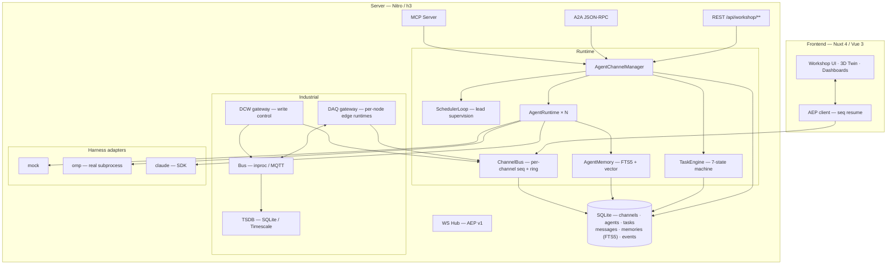

<div align="center">


# AgentWorkShop

**Where AI agent teams meet the production line.**

[](https://nuxt.com)
[](https://vuejs.org)
[](https://www.typescriptlang.org)
[](https://nodejs.org)
[](https://nodejs.org/api/sqlite.html)
[](./LICENSE)

**[中文文档 →](./README-zh.md)** · **[Online Docs →](https://kingdol666.github.io/AgentWorkShop/)**

*A configuration-driven platform where **AI agent teams** and an **industrial digital twin** share one runtime — agents query real telemetry, issue supervisory setpoints through human-approved write control, and every event streams live to a 3D twin.*

</div>

> ⚠️ **Positioning: supervisory layer.** AgentWorkShop is a *supervisory* (SCADA-adjacent) layer for production-line management, digital twins, DAQ and agent orchestration, operating at **second-level soft real-time**. It is **not** a hard real-time controller: any time-critical loop (**< 10 ms**, interlocks, safety, servo) **must live inside the PLC**. Setpoints written here are advisory — plant-side logic may veto.

---

## What is this?

AgentWorkShop started as a **multi-agent software workshop** — channels of coding agents with a lead-agent scheduler, a 7-state task machine, persistent memory, and four interoperable entry points (WebSocket / MCP / A2A / REST).

It grew an **industrial half**: a full data-acquisition and write-control stack (Modbus TCP / OPC UA), production lines with recipes and batch runs, a 3D digital-twin town — and the bridge that makes it unique: **agents can be granted bound, permission-scoped access to real industrial nodes**, query their live telemetry with physical semantics attached, and drive write operations through an interlock → human-in-the-loop → readback pipeline.

The result: submit a goal like *"analyze the melt temperature trend and optimize the setpoint"* — and an agent team reads real sensor history, computes statistics, proposes a new setpoint, waits for your approval in the HITL panel, writes it to the PLC, verifies the readback, and reports the numbers back. **End to end, verified by automated E2E.**

<div align="center">

<br><sub><b>Live 3D twin.</b> Line equipment, device health, DAQ channels and trend analysis — all driven by real-time telemetry.</sub>
</div>

---

## Highlights

| Capability | Why it matters |
|---|---|
| **Agent teams, industrial scope** | Agents bind to DAQ/DCW nodes and see semantic cards — physical meaning, units, safe range, recipe window — never raw registers. |
| **Human-approved write control** | DCW writes flow through **safe-range ∩ recipe-window** interlock → optional **HITL approval** → PLC write → **readback verification** → signed write history. |
| **Read-write DCW channels (v0.7)** | Every control node also **reads its PLC value back** through the same calibration path it writes with: periodic + on-demand + agent reads surface **SET vs ACT** side by side in the DCW console, the twin panel (green ACT row) and a new `dcw_read` agent tool — passive observation, never blocked by write interlocks. |
| **Fully config-driven runtime (v0.7)** | Every runtime knob (memory budgets, compaction, rollback guardrails, retention, backups, log level…) is declared once in the settings descriptor registry with precedence **config.yml < runtime-settings < env** — legacy env names kept as aliases, no hardcoded defaults left in code. Project-level `.AgentWorkShop` wins; `~/.AgentWorkShop` is the user-level fallback (auto-seeded on install). |
| **Real field buses** | Modbus TCP with per-connection op queues; OPC UA with session pools. Linear calibration hooks (PLC value ↔ engineering unit) on every node. |
| **Multi-modal DAQ frame pipeline (v0.6)** | Multi-point profiles (thickness/scanner) and CCD image frames are processed through template sink pipelines before storage: vectors & metadata into Timescale (`daq_frames`), pixels into object storage (MinIO, auto disk fallback); derived-metric thresholds ride the existing alarm chain. |
| **Plugin extension API (v0.6)** | `ctx.daq.registerDriver / registerProcessor / registerTemplate` for custom acquisition and sink algorithms (drop into `plugins/`); `ctx.omp.registerTool` for custom agent tools, hot-injected into every running session on registry change. |
| **Line operations** | Lines → products → recipes → batch runs. Recipe windows gate acquisition and interlock writes; every sample is tagged `product/recipe/run` for per-batch isolation. |
| **Lead-agent orchestration** | Each channel has one lead: decomposes goals, dispatches to idle workers, reassigns failures, judges goal satisfaction. LLM decisions with a deterministic rule-engine fallback — the system never stalls. |
| **Three execution modes** | `goal` (satisfaction judging) · `loop` (fixed-interval replay) · `pipeline` (ordered stages). 7-state task machine with progress, artifacts and full history. |
| **Four entry points** | One manager behind every door: **WS** (AEP v1 event stream with seq-resume), **MCP** (in-process tools), **A2A** (JSON-RPC 2.0 + AgentCard), **REST**. |
| **Persistent memory** | Private + channel-shared domains; FTS5 with CJK segmentation, optional vector hybrid recall, token-budgeted injection; session compaction summaries auto-archived, team chronicle and idle reflections keep accumulating (v0.6). |
| **Harness-agnostic** | One `AgentInterface`: `mock` (in-process), `omp` (real agent subprocess via RPC), `claude` (SDK adapter). The platform never knows which one runs. |
| **3D digital twin** | Three.js town: place line equipment and channel territories, watch device health, alarms and live values — driven by the same event bus. |

---

## Interface

<div align="center">

| Agent Workbench | Line Operations |
|:---:|:---:|
|  |  |

| DAQ Center | Digital Twin Town |
|:---:|:---:|
|  |  |

</div>

---

## Architecture



**The agent × machine bridge** (the part worth reading the source for):

```
agent ──binds to──▶ node (daq: auto / dcw: manual)
  │                    │
  │  my_industrial_nodes  ◀── semantic card: meaning · unit · safe range · recipe window
  │  daq_query             ◀── TSDB history, stats + physical semantics
  │  dcw_control           ──▶ interlock (safe range ∩ recipe window)
  │                           ──▶ HITL approval (manual mode, 180 s timeout)
  │                           ──▶ PLC write → readback check → ACK + write history
  ◀── result text with numbers the agent can cite
```

---

## Quick start

### Prerequisites

```bash
node -v   # ≥ 23.4.0  (needs built-in node:sqlite)
```

> The `omp` harness (recommended for real work) requires the `omp` CLI on PATH. The `mock` harness works out of the box for demos and CI. Optional DAQ infrastructure (MQTT broker + TimescaleDB) auto-starts via Docker when reachable (`docker compose up -d`).

### Option A — install from npm (recommended)

```bash
npm install -g agentworkshop     # → `aw` / `agentworkshop` on PATH
aw start                         # first run builds once (~2-3 min) → http://localhost:3001
```

That's it — no checkout, no build tools. On first launch everything initializes into the config root **`~/.AgentWorkShop`**: the default `config.yml`, a generated `.env` holding a random session secret, `runtime-settings.json`, a docker-compose seed and an empty `data/` directory. All runtime data (SQLite, JSON repos, backups, logs) lives there too — config and data stay with the install, not the working directory.

Prefer a one-off run without installing?

```bash
npx agentworkshop start          # fetch + run, nothing persisted globally
```

### Option B — from source

```bash
git clone https://github.com/kingdol666/AgentWorkShop.git && cd AgentWorkShop
pnpm install
pnpm dev          # → http://localhost:3000  (port from config.yml)
```

Production from source:

```bash
pnpm build        # nuxt build → .output/
pnpm start        # port from config.yml → server.prod.port
```

> In a source checkout the config root is the project's **`.AgentWorkShop/`** folder (runtime overrides, data, project-level commands), while `config.yml` / `.env` stay at the checkout root, version-controlled as the factory defaults.

### Updating

```bash
aw update                              # check + self-update the global install
aw update --check                      # only report; nothing is installed
npm install -g agentworkshop@latest    # manual equivalent
```

Releases follow semver. Every `aw start` verifies the config root and migrates it in place when a new version changes the layout — your data survives upgrades.

### Your first agent × line session (~2 minutes)

1. **Sign in** — register in the sidebar (or `POST /api/users/register`).
2. **Build a line** — `Line Operations` → create a line, add DAQ nodes (e.g. `daq-temp-tc`) and control nodes (e.g. `dcw-temp-sp`), create a product + recipe, hit **Start**. Live values start flowing.
3. **Create a team** — `Agent Workshop` → pick a lead + workers, **deploy** into a channel.
4. **Bind nodes** — open the agent's detail panel → bind the DAQ node (*auto*) and the control node (*manual* = needs your approval).
5. **Submit the goal** — *"Analyze the last 5 minutes of melt temperature; if deviation from 182 °C exceeds 1 °C, correct the setpoint (wait for my approval)."*
6. **Approve** — the agent reads real history, computes the mean, requests the write → approve in the HITL panel → watch the setpoint change and the goal close with a numeric report.

---

## Configuration & CLI — config-driven by design

One runtime, one source of truth. **`config.yml`** declares defaults; **`runtime-settings.json`** inside the config root carries runtime overrides; environment variables and CLI flags sit on top. Every editable key is described once in `shared/config/schema.json` (type, range, enum, live-vs-restart) and surfaced through the same descriptors in **both the UI and the CLI**.

```
config.yml (defaults)  <  .AgentWorkShop/runtime-settings.json (runtime)  <  env vars / CLI flags
```

The config root is **`~/.AgentWorkShop`** for a global install (`npm i -g`) — wherever you run `aw` from — and **`<repo>/.AgentWorkShop`** in a source checkout (with `config.yml` / `.env` staying at the checkout root as version-controlled factory defaults). `AW_HOME` redirects it; `AW_MODE=home` forces the global shape.

### Live settings, persisted, hot-reloaded

- The **Settings → Runtime config** tab renders every editable key from the descriptors — change server ports, theme, API timeouts, locale or the approval gate, hit save.
- `live` keys apply instantly (theme, title, timeouts, approval gate…) over a server-sent event stream — no reload, no restart.
- `restart` keys (ports, hosts) persist to disk and take effect on the next launch of the matching mode (`aw dev` / `aw start`).
- One channel for every writer: the UI, the CLI and the server's file watcher all converge on the same settings file, so a change made anywhere shows up everywhere.

### The `aw` CLI

| Command | What it does |
|---|---|
| `aw start · aw dev · aw build` | Production server / dev server / build — ports from the effective config; first `start` builds once |
| `aw config list · get · set · unset · reset` | Read & write runtime settings (validated against the schema, atomic writes) |
| `aw home` | Inspect / initialize the config root `.AgentWorkShop` |
| `aw init <dir>` | Scaffold a runnable project (full config system + CLI included) |
| `aw register <path\|url\|npm:pkg>` | Register a new command — project-local or `--global` |
| `aw update` | Check npm for the latest release and self-update the global install |
| `aw doctor` | Environment + project health check (node, config, ports, keys) |
| `aw status` | Live overview: mode, config sources, running server, command table |
| `aw tui` | Terminal workbench: channel/agent management, task submission, live monitor pane, HITL answering (see `tui/README.md`) |

Global flags: `--help/-h` · `--version/-v` · `--json` (machine-readable) · `--root <dir>` · `--debug`.

### Command registration

Commands are plain modules exporting `{ meta, run }`. Drop one into a scanned directory and it's live on the next invocation — no registry bookkeeping, convention over configuration:

| Scope (highest wins) | Directory |
|---|---|
| project | `<root>/.AgentWorkShop/commands/` |
| user | `~/.AgentWorkShop/commands/` |
| built-in | packaged with the CLI (`cli/commands/`) |

`aw register <file|url|npm:pkg>` copies a command into the right scope (`--global` for user scope); `aw help` lists everything that's registered.

```js
// ~/.AgentWorkShop/commands/hello.mjs
export const meta = { name: 'hello', group: 'Custom', summary: 'Say hi', usage: 'aw hello [--name <n>]' }
export async function run(argv, ctx) {
  console.log(`Hi ${argv.flags.name ?? 'AW'} — mode: ${ctx.mode}`)
}
```

---

## The industrial stack in detail

### Data acquisition (DAQ)

- **Per-node edge runtimes**: independent sampling cadence, publish cadence, in-flight mutex per node — one slow driver never blocks its neighbors.
- **Pipeline**: driver → queue (in-process or MQTT, offline buffer on disconnect) → consumer with out-of-order defense → three-way fan-out: WS live push (gated), TSDB batch write, device-twin writeback.
- **Robustness**: TSDB single-in-flight writes with bounded retries, buffer backpressure with drop counters, real loss metrics exposed on `daq.controller` frames.
- **Alarms**: recipe-scoped monitoring windows with **2 % hysteresis + 3-tick debounce**; alarm/offline transitions are instant (safety first).

### Write control (DCW)

- Engineering-unit writes: `linear` calibration (scale/offset) PLC↔physical, **readback verification** with deadband tolerance, ACK states and write history.
- **Interlock**: with a line running, the active recipe's parameter window *replaces* the node's global safe range for that node.
- **HITL**: `manual`-mode bindings suspend the write for user approval (deduped per agent+node; re-validation at approval time — permission is re-checked when you click approve).

### Recipe & batch

`Line → Product → Recipe → Run`. Starting a run applies recipe params node-by-node (each write verified), gates acquisition per line, and tags every sample with `line/product/recipe/run` — per-product data isolation with five-dimension queries (line × product × recipe × time × node).

---

## Usage

### Authentication

Email + password login issues a **bearer token** (multiple tokens per user, individually revocable).

```bash
# register
curl -X POST http://localhost:3000/api/users/register \
  -H 'content-type: application/json' \
  -d '{"email":"you@example.com","password":"secret","name":"you"}'

# every workshop call
curl http://localhost:3000/api/workshop/channels \
  -H 'authorization: Bearer <token>'
```

### Execution modes

Prefix the task description (or pick in the composer UI):

| Mode | Semantics | Config |
|---|---|---|
| `goal` | lead decomposes → workers deliver → **lead judges satisfaction**; unmet → more subtasks; met → parent completes. | `goalCriteria` |
| `loop` | replay the same task on a fixed interval. | `intervalMs` (default 60 000), `maxIterations` (default ∞) |
| `pipeline` | ordered stages; stage N+1 consumes stage N's output. | `stages: [{name, description, assigneeId?}]` |

### The four entry points

| Entry | Endpoint | Audience |
|---|---|---|
| **WS** | `/api/workshop/ws?channelId=…` | Dashboards / UI — AEP v1 envelopes, per-channel monotonic `seq`, 5 000-event ring, `lastSeq` resume, snapshot fallback. |
| **MCP** | in-process server, ~20 tools | Agents (omp host tools) — management + job-face tools, channel-scoped. |
| **A2A** | `POST /api/workshop/a2a/:agentId/rpc` | External agents — JSON-RPC 2.0, `AgentCard` at `/card`, `tasks/sendSubscribe` SSE. |
| **REST** | `/api/workshop/**` | Humans / scripts — full management face. |

### Task state machine

```
SUBMITTED ─▶ ASSIGNED ─▶ WORKING ─▶ WAITING ─▶ COMPLETED
    │            │           │           │
    └────────────┴───────────┴──▶ CANCELED / FAILED ─▶ (retry ≤ 3 or cancel)
```

---

## Verified end-to-end

The repo ships live E2E that exercises the full loop against a running server — the numbers below are from an actual run:

| Check | Result |
|---|---|
| Line start → recipe writes setpoint (180 °C) | ✅ |
| Interlock: write 170 (<176) and 200 (>188) → **400 rejected** | ✅ |
| Team deploy → goal dispatch (lead → omp worker) | ✅ t + 3 s |
| Worker reads real history: **mean 168.05 °C, 96 samples, min/max/latest** | ✅ |
| HITL approval → setpoint **180 → 182 °C** written & read back | ✅ |
| Goal closes with structured summary | ✅ |
| Batch tagging: samples carry product/recipe/run | ✅ |

Reproduce: `node scripts/_dbg-full-feature-e2e.mjs` (against a running server).

---

## Project layout

```
AgentWorkShop/
├── bin/ · cli/                 # aw CLI — command registry · built-in commands · config engine
├── app/                        # Nuxt 4 frontend (srcDir)
│   ├── pages/                  # / · /workshop · /town · /daq · /dcw · /monitor · /users · /tokens
│   ├── components/workshop/    # timeline · lanes · task board · memory panel · 3D town
│   └── stores/composables/     # Pinia + AEP client
├── server/
│   ├── api/                    # REST + WS + A2A + MCP routes
│   ├── services/workshop/
│   │   ├── runtime/            # manager · scheduler-loop · task-engine · memory · mailbox
│   │   ├── agents/             # AgentInterface: mock · omp · claude (+ industrial tools)
│   │   ├── daq/ dcw/           # edge runtimes · drivers · bus · storage
│   │   └── db/                 # repos over node:sqlite
│   ├── mcp/                    # MCP server (tools)
│   └── plugins/                # runtime assembly (singletons)
├── shared/
│   └── config/                 # schema.json (settings descriptors) + engine (merge/validate/persist) + mode/path resolver
├── config.yml                  # ⚙ single source of truth (factory defaults)
├── .AgentWorkShop/             # config root — prompts (versioned) + runtime overrides · data · logs · commands (git-ignored)
├── data/                       # legacy pre-migration location (auto-migrated into the config root)
└── scripts/                    # launchers · home bootstrap · E2E · verification suites
```

## Tech stack

| Layer | Tech |
|---|---|
| Framework | [Nuxt 4](https://nuxt.com) + Nitro (WebSocket) |
| UI | Vue 3.5 · Pinia · Ant Design Vue · UnoCSS · Three.js · ECharts |
| Language | TypeScript 5.7 across the stack; `shared/` used by both sides |
| CLI | Node ESM CLI with a pluggable command registry (`bin/aw.mjs`) |
| Persistence | `node:sqlite` (zero native deps) + FTS5 + optional `sqlite-vec`; TimescaleDB for time-series |
| Validation | `zod` at every message boundary |
| Interop | `@modelcontextprotocol/sdk` · A2A (JSON-RPC 2.0) · AEP v1 (in-house WS protocol) |
| Field bus | `modbus-serial` · `node-opcua` · `mqtt` |

## Development

```bash
pnpm dev          # dev server (port from effective config)
pnpm aw …         # the CLI is available in-repo too: pnpm aw config list
pnpm build && pnpm start
pnpm typecheck
pnpm lint
node scripts/_dbg-full-feature-e2e.mjs    # full-feature live E2E (server must be running)
```

## Roadmap

| Capability | Status |
|---|---|
| Channel runtime, lead orchestration, 7-state task engine | Shipped |
| Four entry points: WS (AEP v1) · MCP · A2A · REST | Shipped |
| Persistent memory (FTS5 + optional vector hybrid) | Shipped |
| Industrial stack: DAQ · DCW write control · lines/recipes/runs | Shipped |
| Agent ↔ node binding + HITL approval + interlock | Shipped |
| 3D digital-twin town · line operations UI · dashboards | Shipped |
| Full-feature live E2E (agent reads/writes a real line, 23 checks) | Shipped |
| Runtime configuration system: settings persistence · hot reload · settings UI | Shipped |
| `aw` CLI: config · run · init · register · doctor | Shipped |
| Claude Agent SDK adapter — full parity with `mock`/`omp` | In progress |
| Production hardening: TLS, MQTT auth, OPC UA sign+encrypt defaults, structured audit log | Planned |
| Edge deployment shape: standalone edge-agent + central broker | Planned |
| Alarm outbound delivery (email/webhook) + ack workflow | Planned |
| CI pipeline (typecheck + lint + e2e) | Planned |
| License: PolyForm Noncommercial 1.0.0 (source-available, non-commercial) | Shipped |

## License

AgentWorkShop is an independent project and is **not an official product of Anthropic** or any LLM vendor. It integrates with agent harnesses (e.g. `omp`) through their public interfaces.

**AgentWorkShop is source-available software, licensed under the [PolyForm Noncommercial 1.0.0](./LICENSE).**

- ✅ **Permitted** — personal study, research, hobby projects, teaching, and use by noncommercial organizations (charities, education, public research, government).
- ❌ **Not permitted without prior written permission** — any **commercial use**: selling, paid services, integrating into commercial products, or production use serving a business. Commercial licenses are available from the copyright holder.
- 📌 When you redistribute the software, you must pass through the `Required Notice` line and these terms.

For commercial licensing, contact: [GitHub @kingdol666](https://github.com/kingdol666) · kingdol6080@gmail.com

<div align="center">

<a href="https://star-history.com/#kingdol666/AgentWorkShop&Date">
  <picture>
    <source media="(prefers-color-scheme: dark)" srcset="https://api.star-history.com/svg?repos=kingdol666/AgentWorkShop&type=Date&theme=dark" />
    <source media="(prefers-color-scheme: light)" srcset="https://api.star-history.com/svg?repos=kingdol666/AgentWorkShop&type=Date" />
    
  </picture>
</a>

</div>
