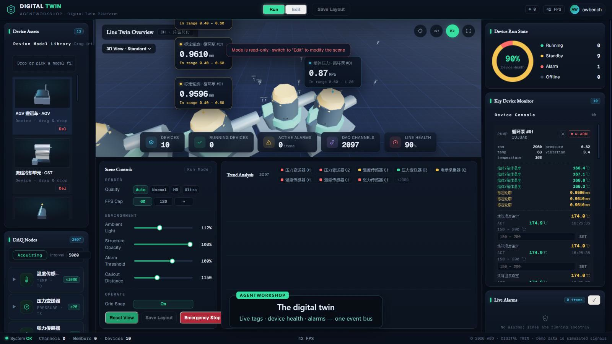
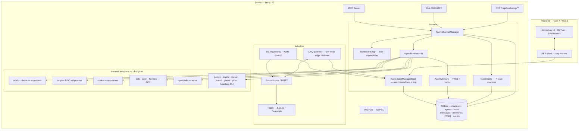

<div align="center">


<br />

# AgentWorkShop

**Where AI agent teams meet the production line.**

[](https://github.com/kingdol666/AgentWorkShop)
[](https://github.com/kingdol666/AgentWorkShop)
[](https://github.com/kingdol666/AgentWorkShop/releases)
[](https://github.com/kingdol666/AgentWorkShop/stargazers)
[](https://github.com/kingdol666/AgentWorkShop/commits)
[](https://github.com/kingdol666/AgentWorkShop/issues)
[](./LICENSE)

[](https://nuxt.com)
[](https://vuejs.org)
[](https://www.typescriptlang.org)
[](https://nodejs.org)
[](https://nodejs.org/api/sqlite.html)
[](./docs/site/guide/daq-protocols.md)
[](./docs/plugins.md)
[](https://kingdol666.github.io/AgentWorkShop)
[](https://github.com/kingdol666/AgentWorkShop/pulls)

**[简体中文](./README-zh.md)** · **[Documentation](https://kingdol666.github.io/AgentWorkShop)** · **[Releases](https://github.com/kingdol666/AgentWorkShop/releases)** · **[Changelog](./changelog.md)** · **[Plugin API](./docs/plugins.md)** · **[SDK](./docs/sdk.md)**

<sub><b>v0.7.48</b> · 14 engines · 6 field protocols (5 built-in + serial plugin) · 111 runtime settings · bilingual docs (简体中文 / English)</sub>

<br />

*A configuration-driven platform where **AI agent teams** and an **industrial digital twin** share one runtime — agents query real telemetry, issue supervisory setpoints through human-approved write control, and every event streams live to a 3D twin.*

</div>

> [!IMPORTANT]
> **Positioning: supervisory layer.** AgentWorkShop is a *supervisory* (SCADA-adjacent) layer for production-line management, digital twins, DAQ and agent orchestration, operating at **second-level soft real-time**.
> It is **not** a hard real-time controller: any time-critical loop (**< 10 ms**, interlocks, safety, servo) **must live inside the PLC**. Setpoints written here are advisory — plant-side logic may veto.

---

<table>
<tr>
<td width="33%" valign="top">

**FIGURE INDEX**

`FIG.01` closed loop ·<br/>
`FIG.02` DAQ console ·<br/>
`FIG.03` line operations ·<br/>
`FIG.04` digital twin ·<br/>
`FIG.05` dashboard ·<br/>
`FIG.06` responsive

</td>
<td width="33%" valign="top">

**JUMP TO**

[What is this?](#what-is-this) · [Highlights](#highlights)<br/>
[Interface](#the-interface) · [Architecture](#architecture)<br/>
[Quick start](#quick-start) · [Configuration & CLI](#configuration--cli--config-driven-by-design)<br/>
[Industrial stack](#the-industrial-stack-in-detail) · [Usage](#usage)<br/>
[Verification](#verified-end-to-end) · [Project layout](#project-layout)<br/>
[Tech stack](#tech-stack) · [Development](#development)<br/>
[Roadmap](#roadmap) · [License](#license)

</td>
<td width="33%" valign="top">

**AT A GLANCE**

Supervisory layer, second-level soft real-time<br/>
14 engines · 4 entry points<br/>
6 field protocols (5 built-in + serial plugin, read + write)<br/>
7-state task machine · root queue + lease fencing<br/>
Group chat jobs · scheduled tasks · HITL<br/>
FTS5 + vector memory · hot-reloadable plugins<br/>
SDK · CLI · TUI · ~1100+ acceptance assertions

</td>
</tr>
</table>

---

## Documentation

Docs are bilingual — the [VitePress site](https://kingdol666.github.io/AgentWorkShop) ships a language switcher (简体中文 / English) across every section. Deep-dive pages ship in this repo too, and the CLI copies them into the published tarball:

| Topic | Online | In-repo | What it covers |
|---|---|---|---|
| **Getting started** | [Guide](https://kingdol666.github.io/AgentWorkShop/guide/getting-started) | `docs/site/guide/` | install → first run → first agent × line session, configuration, DAQ protocols, DCW read/write, HITL, recipe versioning, multi-harness teams, line permissions, AML |
| **Plugin development** | [Plugin guide](https://kingdol666.github.io/AgentWorkShop/plugins/) | [`docs/plugins.md`](./docs/plugins.md) | the full extension contract: three scopes, `index.mjs` manifest, `ctx` server/browser surface, `settings`/`groups` declarations, lifecycle events, i18n, panels, team-scoped switches, a real example |
| **SDK** | [SDK guide](https://kingdol666.github.io/AgentWorkShop/sdk/) | [`docs/sdk.md`](./docs/sdk.md) | `agentworkshop/sdk` as a programming client (platform REST client with envelope handling) and as the plugin extension base; TypeScript types; browser-side SDK |
| **CLI** | [CLI manual](https://kingdol666.github.io/AgentWorkShop/cli/) | [`docs/cli.md`](./docs/cli.md) | all 14 `aw` commands, global options, exit codes, dual-mode path model, the command-registration system, maintainer publish guide |
| **AML** | [AML guide](https://kingdol666.github.io/AgentWorkShop/guide/aml) | [`docs/aml.md`](./docs/aml.md) | auto-modeling lab: dataset build, job orchestration, model registry, promotion gates, agent tools |
| **TUI** | — | [`docs/tui.md`](./docs/tui.md) · [`tui/README.md`](./tui/README.md) | terminal workbench: channels, agents, tasks, live monitor, HITL answering |
| **Multi-harness architecture** | — | [`docs/multi-harness-architecture.md`](./docs/multi-harness-architecture.md) | engine taxonomy, normalized session contract, provider/model catalog, failure modes |

---

## What is this?

AgentWorkShop started as a **multi-agent software workshop** — channels of coding agents with a lead-agent scheduler, a 7-state task machine, persistent memory, and four interoperable entry points (WebSocket / MCP / A2A / REST).

It grew an **industrial half**: a full data-acquisition and write-control stack (Modbus TCP / OPC UA), production lines with recipes and batch runs, a 3D digital-twin town, an **auto-modeling lab** (dataset → training job → leaderboard → gated promotion) — and the bridge that makes it unique: **agents can be granted bound, permission-scoped access to real industrial nodes**, query their live telemetry with physical semantics attached, and drive write operations through an interlock → human-in-the-loop → readback pipeline.

It is also **extensible by design**: a self-contained plugin can enhance the server (hooks, routes, agent tools, DAQ drivers, config groups) and the browser (panels, i18n) at the same time, and the same surfaces are available to ordinary programs through the SDK — see [`docs/plugins.md`](./docs/plugins.md) and [`docs/sdk.md`](./docs/sdk.md).

The result: submit a goal like *"analyze the melt temperature trend and optimize the setpoint"* — and an agent team reads real sensor history, computes statistics, proposes a new setpoint, waits for your approval in the HITL panel, writes it to the PLC, verifies the readback, and reports the numbers back. **End to end, verified by automated E2E.**

<div align="center">

### FIG.01 — The closed loop


<sub><b>Goal → read → compute → approve → write → readback → report.</b><br/>
Recorded against a running instance: real DAQ history, real write control, real HITL approval.</sub>

</div>

> [!NOTE]
> Every figure in this README is a recording or screenshot of a **running** instance — not a mockup. The numbers on screen come from seeded industrial data flowing through the same code paths the product ships.

<div align="center">

### 🎬 Live demo (4 min 11 s, English voice-over & captions)

<a href="https://github.com/kingdol666/AgentWorkShop/blob/main/docs/site/public/demo/agentworkshop-demo.mp4"></a>

<sub><b>Click the cover to watch the full demo.</b> Real PLC simulator, real serial-port enumeration, real agent-team execution — no cuts, no fakes.<br/>Scenes: dashboard → live DAQ → governed write & read-back → serial protocol plugin → agent team execution → closed-loop trend → 3D digital twin.</sub>

</div>

---

## Highlights

#### Agent team runtime

| Capability | Why it matters |
|---|---|
| **Lead-agent orchestration** | Each channel has one lead: decomposes goals, dispatches to idle workers, reassigns failures, judges goal satisfaction. LLM decisions with a deterministic rule-engine fallback — the system never stalls. |
| **Three execution modes** | `goal` (satisfaction judging) · `loop` (fixed-interval replay) · `pipeline` (ordered stages). 7-state task machine with progress, artifacts and full history. |
| **Harness-agnostic** | One `AgentInterface`, **14 engines** in three transport classes: **in-process** — `mock` (no LLM), `claude` (Claude Agent SDK, resident session, same-turn steer); **persistent session over a protocol** — `omp` (RPC subprocess), `codex` (app-server JSON-RPC), `dsh` / `qwen` / `hermes` (ACP), `opencode` (serve + HTTP/SSE); **headless CLI with a structured event stream** — `gemini` (stream-json), `copilot` (JSONL), `cursor` (stream-json), `crush` (non-interactive run), `goose` (stream-json), `pi` (`-p --mode json`). The platform never knows which one runs. |
| **Per-channel LLM selection** | Each channel picks a **harness → provider → model (+effort)** triple from the harness's live catalog (e.g. `zhipu-coding-plan/glm-5.3-flash` on omp). Members inherit it unless they override — mixing harnesses in one team is a first-class setup, not a workaround. |
| **Harness availability check** | `GET /api/workshop/harnesses` probes each engine's CLI on PATH. The UI disables not-installed engines, and dispatch is hard-checked at every entry point. |
| **Stall-safe supervision & task governance** | Submitted goals enter a **FIFO root queue** with visible queue positions. A **supervision watchdog** distinguishes *stuck* from *slow* — agent tool invocations count as liveness, so healthy long-running industrial work survives while genuinely stalled tasks surface to the lead. Every assignment carries a **generation + execution lease**, so events from a superseded worker are dropped by admission, not reconciled by hope. |
| **Harness continuity** | Engines declare a continuity mode (`persistent` / `per_turn`); persistent sessions are reused across turns under a read-only continuity lease (pid / session / reuse count / last restart reason), and a server restart restores what can be restored instead of silently re-forking. |
| **Channel group chat & native HITL** | The channel timeline is a real group chat: a member's request becomes a **trackable job** (not a lost message), and engines with a native ask surface (e.g. `omp`) route HITL questions through the platform — approve once, the engine continues with the receipt. Member permissions and notifications are first-class. |
| **Scheduled tasks** | Any channel task can run on a **schedule** — fixed `interval` (60 s floor) or `daily` at a set time — managed from `/workshop/schedules` or the REST API, with per-run history, busy-guard (no overlapping runs of the same schedule) and channel-scoped visibility. |
| **Persistent memory & channel process memory** | Private + channel-shared domains; FTS5 with CJK segmentation, optional vector hybrid recall, token-budgeted injection. On top sit **process memories**: deterministic root/child/lead event contracts, a canonical root summary, and a durable outbox (dead-letter + compensation worker) so the story of a goal survives restarts. |
| **Four entry points** | One manager behind every door: **WS** (AEP v1 event stream with seq-resume), **MCP** (~25 in-process tools), **A2A** (JSON-RPC 2.0 + AgentCard), **REST**. |

#### Industrial stack

| Capability | Why it matters |
|---|---|
| **Six field protocols** | Modbus TCP, Modbus RTU-over-TCP (serial gateway), OPC UA, MQTT and HTTP/REST, plus a **built-in serial plugin** (direct RS-232/485: Modbus RTU + ASCII line) — acquisition **and** write-control drivers with connection pools, classified error messages and per-driver connection tests. `mock` covers demos/CI. Protocols are plugins: `ctx.daq.registerDriver` / `ctx.dcw.registerWriteDriver` inject straight into the frontend protocol dropdown and dynamic forms (⌁ badge) — when a protocol ships self-describing metadata, the frontend forms render with zero changes. |
| **Agent teams, industrial scope** | Agents bind to DAQ/DCW nodes and see semantic cards — physical meaning, units, safe range, recipe window — never raw registers. |
| **Human-approved write control** | DCW writes flow through **safe-range ∩ recipe-window** interlock → optional **HITL approval** → PLC write → **readback verification** → signed write history. |
| **Read-write DCW channels** | Every control node also **reads its PLC value back** through the same calibration path it writes with: periodic + on-demand + agent reads surface **SET vs ACT** side by side — passive observation, never blocked by write interlocks. |
| **Recipe versioning & governance** | Parameter changes are versioned with attribution (user/agent/system + operator + reason). Roll back to any revision or the last-good batch — non-destructively. Stale-node params are skipped and clearly marked. |
| **Semantic parameter mapping & tuning loop** | Agents reason in engineering semantics: `param_control(param, value)` addresses a **process parameter** (stable across batches and recipe swaps) instead of a raw node, and `param_read` reads back the PLC value for evidence. Every write is narrowed by a **four-layer bound** — node safe range ∩ parameter baseline bounds ∩ active product bounds ∩ active recipe window — and each adjustment opens a tuning record that `dcw_judge` must close (keep / rollback / uncertain), with `dcw_rollback` executing the undo. |
| **Line operations** | Lines → products → recipes → batch runs. Recipe windows gate acquisition and interlock writes; every sample is tagged `product/recipe/run` for per-batch isolation. |
| **Multi-modal DAQ frame pipeline** | Multi-point profiles (thickness/scanner) and CCD image frames flow through template sink pipelines: vectors & metadata into Timescale (`daq_frames`), pixels into object storage (MinIO, auto disk fallback); derived-metric thresholds ride the existing alarm chain. |
| **Agent self-audit tools** | `line_context`, `ops_log`, `recipe_log`, `recipe_versions`, `dcw_journal` — agents see exactly which line/product/recipe they control, who did what, and how every value changed. |

#### Governance, configuration & extension

| Capability | Why it matters |
|---|---|
| **Line-level permissions** | Industrial data is gated **per production line** with three states (none / read-only / operate), enforced in the data plane — regular users see no line data until granted. |
| **Full-operation audit log** | Every user / agent / system action lands in one queryable log; operators are attributed to "Channel/Member", distinct from users and the system. Streamed live over WS. |
| **Team-scoped plugin switches** | Each team (channel) keeps an **independent plugin switch set** (`channel_plugins`): a disabled plugin's tools are not injected into that team's agents. Plugins themselves are hot-managed via `aw plugin` and the `/plugins` page. |
| **Plugin extension API** | A self-contained directory under `plugins/<name>/` enhances **both halves at once**: `index.mjs` (server: hooks, routes, agent tools, **DAQ read drivers / DCW write drivers**, frame processors, node templates, config groups, KV, timers) and `client.mjs` (browser: panels injected into named slots, i18n, settings UI). Three scopes — `builtin` (shipped) > `project` (checkout) > `user` (`~/.AgentWorkShop`) — with ~1 s hot reload on enable/disable **and on code edits**; a disabled plugin's drivers are removed on hot reload immediately. Built-in example: **serial-bridge** (serial communication: read/write drivers, serial probe API, frontend panel). Full contract in [`docs/plugins.md`](./docs/plugins.md). |
| **AML — auto-modeling lab** | Dataset build → training job → leaderboard → promotion gates → model reference, all driven from `/aml` or by agents through 10 `aml_*` tools. Python runtime bootstrapped with `uv` into an `./aml` asset root; artifacts and metadata stay under the config root. |
| **AML hybrid twin × MPC** | Grey-box physics core + bounded PyTorch residual, `TwinSnapshot` / `VirtualTrial` / `RecommendationCertificate` with UQ/OOD screening and all-trajectory gates; the `hybrid_twin` channel profile injects 6 extra tools (`twin_*`, `mpc_optimize`). Trials stay virtual (`candidateExecuted=false`) and writes are recommendation-only until a certificate is certified. |
| **Runtime observability** | `GET /api/system/monitor` exposes the agent-team internals as numbers: root queue depth, watchdog interventions, harness session reuse, pending memory outbox — each guarded by a documented rollback switch, so new machinery can be turned off without a redeploy. |
| **Fully config-driven runtime** | Every runtime knob (memory budgets, compaction, rollback guardrails, retention, backups, log level…) is declared once in the settings descriptor registry with precedence **config.yml < runtime-settings < env** — **111 settings across 16 groups** (32 live / 79 restart), no hardcoded defaults in code. |
| **Configurable cadences** | Sampling and query defaults/floors are **live settings** (`daq.sampling.*`, `daq.query.*`): hot-reloaded, clamped on node create/patch, and agent tool descriptions always carry the current values. |

#### Digital twin

| Capability | Why it matters |
|---|---|
| **3D digital twin** | Three.js town: place line equipment and channel territories, watch device health, alarms and live values — driven by the same event bus. An adaptive quality ladder (DPR / shadow / bloom tiers, wall-clock FPS budget) matches the machine, and `window.__townStats` exposes real render metrics for perf probes. |

---

## The interface

Every panel below is the real UI, at 1440×900, recorded from a running instance.

<div align="center">

### FIG.02 — DAQ console


<sub><b>Acquisition, end to end.</b> Node inventory and health under a live gauge band, trends that fill as samples land,
an alarm strip that only holds what is actually unacknowledged, and a tailing event stream.</sub>

<br />

### FIG.03 — Line operations


<sub><b>Lines, products, recipes, batches.</b> Starting a line gates acquisition through its recipe window and tags every
sample with <code>product/recipe/run</code>; control nodes expose <b>SET vs ACT</b> through the same calibration path they write with.</sub>

<br />

### FIG.04 — Digital twin


<sub><b>The twin is the same event bus, rendered.</b> Equipment, channel territories, alarms and live values — an adaptive
quality ladder (DPR / shadow / bloom, wall-clock FPS budget) keeps it honest on modest hardware.</sub>

<br />

### FIG.05 — Dashboard


<sub><b>One screen for the whole workshop.</b> Channels, agents, tasks, DAQ throughput and alarms — read from the same
state the API serves, not a separate metrics store.</sub>

<br />

### FIG.06 — Responsive


<sub><b>Desktop → tablet → phone.</b> The instrument rail collapses to an icon rail, then to an off-canvas drawer;
page headers stack, dense tables become scrollable ledgers with a pinned identity column.</sub>

</div>

<table>
<tr>
<td width="50%"><br/><sub><b>Agent workshop.</b> Channel timeline, lanes, tasks, memory and HITL in one workbench.</sub></td>
<td width="50%"><br/><sub><b>Runtime monitor.</b> Every wired channel, member count, dependency cycle and owner.</sub></td>
</tr>
<tr>
<td><br/><sub><b>Settings.</b> 111 keys across 16 groups, descriptor-driven — the same registry the CLI reads.</sub></td>
<td><br/><sub><b>Plugins.</b> Three scopes, hot reload on edit, per-team switches.</sub></td>
</tr>
</table>

---
## Architecture



**The agent × machine bridge** (the part worth reading the source for):

```
agent ──binds to──▶ node (daq: auto / dcw: manual)
  │                    │
  │  my_industrial_nodes  ◀── semantic card: meaning · unit · safe range · recipe window
  │  daq_query             ◀── TSDB history, stats + physical semantics
  │  dcw_control           ──▶ interlock (safe range ∩ recipe window)
  │                           ──▶ HITL approval (manual mode, 180 s timeout)
  │                           ──▶ PLC write → readback check → ACK + write history
  ◀── result text with numbers the agent can cite
```

---

## Quick start

### Prerequisites

```bash
node -v   # ≥ 23.4.0  (needs built-in node:sqlite)
```

> Real-agent harnesses require their CLI on PATH — `omp`, `codex`, `dsh`, `opencode`, `gemini`, `qwen`, `copilot`, `cursor`, `crush`, `goose`, `pi` or `hermes` (any subset; each channel can mix harnesses). `mock` and `claude` (SDK) run in-process and need no PATH CLI. The dashboard "execution engines" panel shows per-engine readiness with a green/grey dot; entries for uninstalled engines link to their official install pages. Optional DAQ infrastructure (MQTT broker + TimescaleDB) auto-starts via Docker when reachable (`docker compose up -d`).

### Option A — install from npm (recommended)

```bash
npm install -g agentworkshop     # → `aw` / `agentworkshop` on PATH
aw start                         # → http://localhost:3001
```

The published tarball ships a **prebuilt production bundle** (`.output/`), so an npm install boots straight away — no build step, no build tools. On first launch everything initializes into the config root **`~/.AgentWorkShop`**: the default `config.yml`, a generated `.env` holding a random session secret, `runtime-settings.json`, a docker-compose seed, `prompts/`, `commands/`, `plugins/` (seeded from the SDK examples, **disabled** by default) and an empty `data/` directory. All runtime data (SQLite, JSON repos, backups, logs) lives there too — config and data stay with the install, not the working directory.

Prefer a one-off run without installing globally?

```bash
npx agentworkshop start          # no global npm install required
```

> `npx` still creates `~/.AgentWorkShop` — running without a global install is not the same as leaving no trace on disk.

### Option B — from source

```bash
git clone https://github.com/kingdol666/AgentWorkShop.git && cd AgentWorkShop
pnpm install
pnpm dev          # → http://localhost:3000  (port from config.yml)
```

Production from source:

```bash
pnpm build        # nuxt build → .output/
pnpm start        # port from config.yml → server.prod.port
```

> In a source checkout the config root is the project's **`.AgentWorkShop/`** folder (runtime overrides, data, project-level commands), while `config.yml` / `.env` stay at the checkout root, version-controlled as the factory defaults.

### Updating

```bash
aw update                              # check + self-update the global install
aw update --check                      # only report; nothing is installed
npm install -g agentworkshop@latest    # manual equivalent
```

Releases follow semver. `aw start` verifies the config root on every launch and migrates the legacy pre-`home` `data/` layout into it (newest file wins), so data survives upgrades. SQLite schema migrations run server-side at boot. Current version: **v0.7.48** — see [Releases](https://github.com/kingdol666/AgentWorkShop/releases).

### Your first agent × line session (~2 minutes)

1. **Sign in** — register in the sidebar (or `POST /api/users/register`).
2. **Build a line** — `Line Operations` → create a line, add DAQ nodes (e.g. `daq-temp-tc`) and control nodes (e.g. `dcw-temp-sp`), create a product + recipe, hit **Start**. Live values start flowing.
3. **Create a team** — `Agent Workshop` → pick a lead + workers, **deploy** into a channel.
4. **Bind nodes** — open the agent's detail panel → bind the DAQ node (*auto*) and the control node (*manual* = needs your approval).
5. **Submit the goal** — *"Analyze the last 5 minutes of melt temperature; if deviation from 182 °C exceeds 1 °C, correct the setpoint (wait for my approval)."*
6. **Approve** — the agent reads real history, computes the mean, requests the write → approve in the HITL panel → watch the setpoint change and the goal close with a numeric report.

---

## Configuration & CLI — config-driven by design

One runtime, one source of truth. **`config.yml`** declares defaults; **`runtime-settings.json`** inside the config root carries runtime overrides; environment variables and CLI flags sit on top. Every editable key is described once in `shared/config/schema.json` (type, range, enum, live-vs-restart) and surfaced through the same descriptors in **both the UI and the CLI**.

```
config.yml (defaults)  <  .AgentWorkShop/runtime-settings.json (runtime)  <  env vars / CLI flags
```

The config root is **`~/.AgentWorkShop`** for a global install (`npm i -g`) — wherever you run `aw` from — and **`<repo>/.AgentWorkShop`** in a source checkout (with `config.yml` / `.env` staying at the checkout root as version-controlled factory defaults). `AW_HOME` redirects it; `AW_MODE=home` forces the global shape.

### Live settings, persisted, hot-reloaded

- The **Settings → Runtime config** tab renders every editable key from the descriptors — change server ports, theme, API timeouts, locale or the approval gate, hit save.
- `live` keys apply instantly (theme, title, timeouts, approval gate, DAQ sampling cadences, TSDB query buckets…) over a server-sent event stream — no reload, no restart.
- `restart` keys (ports, hosts) persist to disk and take effect on the next launch of the matching mode (`aw dev` / `aw start`).
- One channel for every writer: the UI, the CLI and the server's file watcher all converge on the same settings file, so a change made anywhere shows up everywhere.

Example — retune the acquisition and query cadences live:

```bash
aw config set daq.sampling.defaultIntervalMs 2000   # new nodes sample every 2 s
aw config set daq.sampling.minIntervalMs 500        # per-node floor (create/patch clamp)
aw config set daq.query.defaultBucketMs 3000        # TSDB reads default to a 3 s bucket
aw config set daq.query.minBucketMs 500             # query floor (samples/line query/agent tool)
```

Agent tool descriptions are re-rendered with the current values on every injection, so an LLM always sees the floor and default that will actually apply to its `daq_query` calls.

### The `aw` CLI

| Command | What it does |
|---|---|
| `aw start · aw dev · aw build` | Production server / dev server / build — ports from the effective config; first `start` builds once |
| `aw stop` | Stop a running `aw` service instance via the single-instance lock |
| `aw config list · get · set · unset · reset` | Read & write runtime settings (validated against the schema, atomic writes) |
| `aw plugin list · create · enable · disable` | Manage plugins across all three scopes: inspect, scaffold (project scope; `--global` for user scope), enable/disable (state file, ~1 s hot reload on the running server) |
| `aw home` | Inspect / initialize the config root `.AgentWorkShop` |
| `aw init <dir>` | Scaffold a runnable project (full config system + CLI included) |
| `aw register <path\|url\|npm:pkg>` | Register a new command — project-local or `--global` |
| `aw update` | Check npm for the latest release and self-update the global install |
| `aw doctor` | Environment + project health check (node, config, ports, keys) |
| `aw status` | Live overview: mode, config sources, running server, command table |
| `aw tui` | Terminal workbench: channel/agent management, task submission, live monitor pane, HITL answering (see [`docs/tui.md`](./docs/tui.md) · [`tui/README.md`](./tui/README.md)) |
| `aw version` | Print the CLI/package version (alias `v`) |

Global flags: `--help/-h` · `--version/-v` · `--json` (machine-readable) · `--root <dir>` · `--debug`.

Exit codes: **0** success · **1** runtime error · **2** usage error. With `--json`, failures come back as an envelope carrying `{ ok: false, error: 'unknown-command' \| 'no-project' \| 'usage' \| 'internal' \| … }`, so automation can branch without parsing stderr.

### Command registration

Commands are plain modules exporting `{ meta, run }`. Drop one into a scanned directory and it's live on the next invocation — no registry bookkeeping, convention over configuration:

| Scope (highest wins) | Directory |
|---|---|
| project | `<root>/.AgentWorkShop/commands/` |
| user | `~/.AgentWorkShop/commands/` |
| built-in | packaged with the CLI (`cli/commands/`) |

`aw register <file|url|npm:pkg>` copies a command into the right scope (`--global` for user scope); `aw help` lists everything that's registered.

```js
// ~/.AgentWorkShop/commands/hello.mjs
export const meta = { name: 'hello', group: 'Custom', summary: 'Say hi', usage: 'aw hello [--name <n>]' }
export async function run(argv, ctx) {
  console.log(`Hi ${argv.flags.name ?? 'AW'} — mode: ${ctx.mode}`)
}
```

---

## The industrial stack in detail

### Data acquisition (DAQ)

- **Six protocol drivers**: Modbus TCP, Modbus RTU-over-TCP (serial gateway), OPC UA, MQTT, HTTP/REST, plus the **serial-bridge built-in plugin** (direct RS-232/485: Modbus RTU framing + ASCII line protocol, write side with same-address readback verification, serial enumeration/probe API and a frontend panel) — connection pools, classified error messages, per-driver connection tests; the driver registry accepts plugin-registered protocols of any kind (with self-describing metadata, the frontend forms render with zero changes).
- **Per-node edge runtimes**: independent sampling cadence, publish cadence, in-flight mutex per node — one slow driver never blocks its neighbors. Sampling and query defaults/floors are driven by the live `daq.sampling.*` / `daq.query.*` settings.
- **Pipeline**: driver → queue (in-process or MQTT, offline buffer on disconnect) → consumer with out-of-order defense → three-way fan-out: WS live push (gated), TSDB batch write, device-twin writeback.
- **Robustness**: TSDB single-in-flight writes with bounded retries, buffer backpressure with drop counters, real loss metrics exposed on `daq.controller` frames.
- **Alarms**: recipe-scoped monitoring windows with **2% hysteresis + 3-tick debounce**; alarm/offline transitions are instant (safety first).
- **Querying is batch-scoped by default**: `daq_query` resolves the node's **active run** and filters by that batch's `run_id` + `recipe_id`, so an agent reading evidence always sees *the recipe currently running* — never a mix of the previous batch. The effective scope (`run=<id> 配方「name」(recipe_id)`) is printed in the result header and restated per node at the end, and the same ids can be fed straight back into `daq_query` or `aml_dataset_build`; pass `scope: 'all'` (or an explicit `recipe_id` / `run_id` / `product_id`) for cross-recipe comparison and history review. Lines that are not running stay unfiltered, so historical data remains queryable.

### Write control (DCW)

- Engineering-unit writes: `linear` calibration (scale/offset) PLC↔physical, **readback verification** with deadband tolerance, ACK states and write history.
- **Interlock**: with a line running, the active recipe's parameter window *replaces* the node's global safe range for that node.
- **HITL**: `manual`-mode bindings suspend the write for user approval (deduped per agent+node; re-validation at approval time — permission is re-checked when you click approve).

### Recipe & batch

`Line → Product → Recipe → Run`. Starting a run applies recipe params node-by-node (each write verified), gates acquisition per line, and tags every sample with `line/product/recipe/run` — per-product data isolation with five-dimension queries (line × product × recipe × time × node).

### AML — auto-modeling lab

The modeling half of the loop: `/aml` builds **datasets** out of tagged telemetry, submits **training jobs** to a `uv`-managed Python runtime, ranks runs on a **leaderboard**, and promotes a model only when it clears the configured **gates** (NRMSE, rollout NRMSE, validation/test gap, minimum rows and runs). Promoted models are referenced by id, so an MPC or shadow-twin controller can consume a versioned artifact instead of a vague "latest".

- Agents do the same work through 10 tools (`aml_dataset_build`, `aml_job_submit`, `aml_job_status`, `aml_leaderboard`, `aml_model_promote`, …) — submit a goal and let the team train and report.
- The Python runtime bootstraps itself with `uv` into an `./aml` asset root inside the config root; dataset/artifact/metadata paths, disk quota, job timeout, concurrency and retention are all **settings** (16 in the `aml` group), not constants.
- Governance defaults are conservative: cross-recipe datasets are refused unless explicitly allowed, and every job is attributed.
- **Hybrid twin × MPC core**: AML also owns the *hybrid twin* plane — `SceneContract` / `PhysicsModelManifest` / `TwinSnapshot` / `ObjectiveProfile` / `VirtualTrial` / `RecommendationCertificate` on top of a grey-box physics core with a bounded PyTorch residual, UQ/OOD screening and all-trajectory hard-constraint gates. Channels opt in through the `hybrid_twin` profile, which injects six extra agent tools (`twin_scene_read`, `twin_snapshot_create`, `twin_trial_run`, `mpc_optimize`, `twin_gate_evaluate`, `twin_calibration_request`); a trial is *virtual* by design (`candidateExecuted=false`) and a recommendation is only certified when gates and benefit pass. Server-side strategies are `safe_small_step` (insufficient data) and `precise_search` (model cleared gates). Plan + acceptance record: [`docs/aml-hybrid-twin-mpc-integration-plan.md`](./docs/aml-hybrid-twin-mpc-integration-plan.md), [`docs/aml-hybrid-twin-implementation-acceptance.md`](./docs/aml-hybrid-twin-implementation-acceptance.md).

---

## Usage

### Authentication

Email + password login issues a **bearer token** (multiple tokens per user, individually revocable).

```bash
# register
curl -X POST http://localhost:3000/api/users/register \
  -H 'content-type: application/json' \
  -d '{"email":"you@example.com","password":"secret","name":"you"}'

# every workshop call
curl http://localhost:3000/api/workshop/channels \
  -H 'authorization: Bearer <token>'
```

### Line-level permissions

Industrial data is gated **per production line** with three states, managed by an admin
in the built-in **Permissions** page (`/permissions`, admin-only in the sidebar):

| State | DAQ nodes | DCW (write) nodes | Visibility |
| --- | --- | --- | --- |
| **none** (default for regular users) | hidden | hidden | line data withheld server-side — invisible in Line Ops, DAQ center and the digital twin |
| **read-only** | read | ✕ | line visible, values stream, no writes / dispatch / device binding |
| **operate** | read | read + write | full access incl. setpoint writes, dispatch, binding |

- `admin` / `editor` roles are unrestricted (operations roles).
- Regular users **default to none** — they see no line data until granted.
- Enforcement lives in the data plane: list endpoints filter by grant, write/dispatch
  endpoints return a human-readable 403, and Agent↔node bindings validate the line grant
  (DAQ needs read-only+, DCW needs operate).
- Plugins get the same surface via `ctx.permissions` (`lineMode` / `visibleLineIds` /
  `listGrants` / `setGrants`) plus a `permissions:changed` lifecycle hook; the SDK REST
  client exposes `client.permissions.overview()` / `client.permissions.set(...)`.

### Execution modes

Prefix the task description (or pick in the composer UI):

| Mode | Semantics | Config |
|---|---|---|
| `goal` | lead decomposes → workers deliver → **lead judges satisfaction**; unmet → more subtasks; met → parent completes. | `goalCriteria` |
| `loop` | replay the same task on a fixed interval. | `intervalMs` (default 60000), `maxIterations` (default ∞) |
| `pipeline` | ordered stages; stage N+1 consumes stage N's output. | `stages: [{name, description, assigneeId?}]` |

### Scheduled tasks

Any task can also be attached to a **schedule** so a channel keeps working when nobody is watching:

| Aspect | Behavior |
|---|---|
| Modes | `interval` — fixed cadence (`intervalMs`, 60 s floor) · `daily` — once per day at `HH:MM` local time |
| Management | `/workshop/schedules` page, or `POST/PATCH /api/workshop/schedules` |
| Guard rails | busy-guard (a fire is deferred while the channel still has active tasks), per-run history with status, and a **consecutive-failure circuit breaker** (`maxConsecutiveFailures`) that auto-disables a misbehaving schedule |
| Typical use | nightly line patrol (`daq_query` + report to memory), periodic drift check with auto-judge, daily KPI digest |

```bash
# create a schedule: patrol the line every 30 minutes
curl -X POST http://localhost:3000/api/workshop/schedules \
  -H 'authorization: Bearer <token>' -H 'content-type: application/json' \
  -d '{"channelId":"<id>","name":"line-patrol","title":"Line patrol","description":"Read all DAQ nodes on line 1 and post a drift summary to channel memory.","mode":"interval","intervalMs":1800000}'
```

### The four entry points

| Entry | Endpoint | Audience |
|---|---|---|
| **WS** | `/api/workshop/ws?channelId=…` | Dashboards / UI — AEP v1 envelopes, per-channel monotonic `seq`, 5000-event ring, `lastSeq` resume, snapshot fallback. |
| **MCP** | in-process server, ~25 tools | Agents (omp host tools) — management + job-face tools, channel-scoped. |
| **A2A** | `POST /api/workshop/a2a/:agentId/rpc` | External agents — JSON-RPC 2.0, `AgentCard` at `/card`, `tasks/sendSubscribe` SSE. |
| **REST** | `/api/workshop/**` | Humans / scripts — full management face. |

### Task state machine

```
SUBMITTED ─▶ ASSIGNED ─▶ WORKING ─▶ WAITING ─▶ COMPLETED
    │            │           │           │
    └────────────┴───────────┴──▶ CANCELED / FAILED ─▶ (retry ≤ 3 or cancel)
```

---

## Verified end-to-end

Every claim above is backed by a suite you can re-run. The acceptance suites drive a
**production instance over real simulated plant protocols** (Modbus TCP/RTU, OPC UA, MQTT,
HTTP + an MQTT/Timescale pipeline) with real engine CLIs, and assert on the database,
the event stream and the HTTP API — not on mocks. Two 2026-09-24 waves are archived:
the baseline matrix (~1100+ real assertions, v0.7.45 production build, isolated `AW_HOME`,
real browser) in [`docs/audit/e2e-2026-09-24-full-coverage.md`](./docs/audit/e2e-2026-09-24-full-coverage.md),
and the follow-up feature wave (real **PLC node simulator** + injection-molding AgentTeam
closed loop, FIFO multi-goal, scheduled tasks, collaboration, ~1400+ assertions in total)
in [`docs/audit/e2e-2026-09-24-all-features.md`](./docs/audit/e2e-2026-09-24-all-features.md).

| Suite | Latest result | What it covers | Reproduce |
|---|---|---|---|
| `real-injection-closed-loop.mjs` | **2 goals COMPLETED / 0 failed** (2026-09-24, real PLC simulator + real `omp` team) | injection line provisioned from the simulator (11 DCW + 14 DAQ nodes) → real AgentTeam lead/analyst/optimizer → governed writes with a **65.8 s gap ≥ 60 s policy** → DAQ re-measurement → `qualityOk`, verdict `keep` | `AW_BASE=<base> SIM_BASE=http://127.0.0.1:4010 AW_TOKEN=<token> node scripts/real-injection-closed-loop.mjs` |
| `_run-real-injection-fifo-goals.mjs` | exit 0 (2026-09-24) | **FIFO root queue with multi-task serialization**: goal 2 dispatched only after goal 1 closed, role gate flip, two governed writes 65.04 s apart, two judged records, 4-anchor ledger | `AW_BASE=<base> SIM_BASE=… AW_TOKEN=<token> node scripts/_run-real-injection-fifo-goals.mjs` |
| `e2e-plc-plugin-closedloop.mjs` | core stages A–D all green (2026-09-24) | PLC simulator supply over Modbus 16040 → DAQ cross-check (AW sample 197 vs simulator register 197.37) → HITL closed-loop write to 3 zones (registers 40021/40023/40025 = 210, verified write-through) → `dcw_judge` keep; plugin stages E–H need the external diagnosis service and are reported as SKIP | `AW_BASE=<base> KB_BASE=http://127.0.0.1:8771 AW_E2E_USERS_DB=<home>/data/users.sqlite node scripts/e2e-plc-plugin-closedloop.mjs` |
| `_dbg-schedule-e2e.mjs` | **35 / 0** (2026-09-24) | scheduled tasks: plan CRUD + validation, `next_run_at`, `scheduledCount`, busy guard **409 CHANNEL_BUSY**, in-flight duplicate **409 SCHEDULE_RUNNING**, cancel reconciliation (run FAILED + failure counters), **timer auto-fire** (`trigger_kind=timer`), disable/enable state machine, 404 after delete | `SCHED_E2E_BASE=<base> node scripts/_dbg-schedule-e2e.mjs` |
| `e2e-crash-cycle.mjs` | **5 / 5 phases** (2026-09-24) | watch → hard kill → persistence check → restart → redelivery → auto-resume → consumption-gap replay, each phase in its own process | `node scripts/e2e-crash-cycle.mjs --port 3300 --home .e2e-home-full` |
| `e2e-full-closedloop.mjs` | **98 / 0** (2026-09-24, v0.7.45 production build) | 11 stages: registration → line/product/recipe modeling → DAQ sampling → frame pipeline → DCW write + readback → rollback ledger → agent-node authorization → bridge privilege boundaries → plugins → data-root isolation | `node scripts/e2e-full-closedloop.mjs <base>` |
| Protocol matrix, real protocols | **46 / 0** (2026-09-24) | MQTT · Modbus TCP · Modbus RTU · OPC UA · HTTP — acquisition, governed write + readback, recipe-window interlock and a real agent closed loop per protocol | `node scripts/_dbg-protocol-matrix.mjs` |
| Production API live | 60 / 0 (2026-09-24) | persistence across restart, template CRUD, task assign/complete/cancel/loop/pipeline, A2A + mailbox, WS broadcast, MCP endpoint, cascade delete | `AW_E2E_TOKEN=<token> node scripts/api-live-e2e.mjs` |
| AgentTeam chat + native HITL | 112 passed / 0 failed / 1 blocked (2026-09-24, real `omp`) | group-chat request → trackable job; `omp` native ask → HITL approval → engine resumes with the receipt | `node scripts/e2e-agentteam-chat.mjs --phase=all` |
| Terminal mirror + prompt composition | **26 / 0** and **16 / 0** (2026-09-24, real `omp`) | terminal mirror frames, `input`/`abort`/`ui_response` injection, native `ask` round-trip; five-section prompt assembly (scenario → profile → memory → manual → assignment) observed on the wire | `node scripts/test-terminal-e2e.mjs` · `node scripts/test-prompt-system.mjs` |
| Real-engine collaboration | task-flow real **PASS**, `e2e-omp-workspace` **13 / 13**, group-chat real **PASS**, multi-user HIL **PASS** (2026-09-24) | real `omp` lead + workers: decomposition, dispatch, progress, artifacts, workspace-scoped file reads, unload; multi-user HITL visibility; multi-harness team 14/18 (omp + dsh green) | `npx tsx scripts/e2e-agentteam-task-flow-real.ts` · `npx tsx scripts/e2e-omp-workspace.ts` |
| Front-end acceptance | responsive gate **16 / 16** routes, nav drawer **10 / 10** (2026-09-24, real Chromium) | every product page incl. the 3D town renders at the gate thresholds; drawer interaction, scroll lock, route change, zero page errors | `node scripts/ui/verify-responsive.mjs --routes all` · `node scripts/ui/verify-nav.mjs` |
| `_aw0746-stage12.mjs` | **10 / 0** (2026-09-25, globally installed **v0.7.48 packaged build**) | health gate (version=0.7.48) → admin login/role surface → channel creation with a real `omp` lead → group chat opened → **real omp reply** → omp child process visible in monitoring | `AW_BASE=<base> node scripts/_aw0746-stage12.mjs` |
| `_aw0746-stage34.mjs` | **11 / 0** (2026-09-25, v0.7.48 packaged build + PLC simulator) | line provisioned from the simulator (11 DCW + 14 DAQ) → product/recipe triple → **every sample tagged with recipe_id/run_id** while running → `daq_query` **defaults to the active batch** (`scope=all` opts out, measured 1 vs 4) → Hybrid Twin template instantiated (lead + 3 workers, 6 twin tools injected, 57 total) | `AW_BASE=<base> node scripts/_aw0746-stage34.mjs` |
| `_aw0746-stage6b-train-sweep.mjs` | gates **all green** (2026-09-25, v0.7.46 packaged build, real torch training) | 1 s grid dataset (**1724 rows / 10 runs**) → inline-code job trained for real → G1 one-step **0.0992** (≤0.10) / G2 rollout 0.1092 (≤0.25) / G3 generalisation 14.6% (≤20%) / G4 rows+runs → model registered and **promoted to production** | `AW_BASE=<base> AW_DATASET_ID=<ds> node scripts/_aw0746-stage6b-train-sweep.mjs` |
| `_aw0746-stage7-twin.mjs` | **17 / 0** (2026-09-25, v0.7.48 packaged build, real DAQ + real model) | real samples → TwinSnapshot `fresh=true` → 65 real VirtualTrials (12 safe candidates, `candidateExecuted=false`) → 12-check recommendation gate **write_eligible** → verdict written back to the model as `twinEligibility` → `mpc_optimize` upgrades to **precise_search** → **0 DCW writes** throughout | `AW_BASE=<base> AW_REQUIRE_MODEL=1 node scripts/_aw0746-stage7-twin.mjs` |
| `_aw0746-stage6c-jobsmoke.mjs` | **5 / 0** (2026-09-25, v0.7.48 packaged build) | AML job path: inline `code` accepted (no `workspace/train.py` required) → job reaches a terminal state → training logs/ONNX traces → experiment plus per-check gates persisted | `AW_BASE=<base> node scripts/_aw0746-stage6c-jobsmoke.mjs` |
| Industrial bench — integrated | **83 / 83 checks, hard gate green** (2026-09-21) | five-protocol five-line bench: connectivity, sampling into Timescale, governed writes, governance, agent closed loop, semantic parameter layer | `node bench/pipeline.mjs --profile integrated` |
| Multi-scenario closed loop | 4 scenarios · closed loops reached (2026-09-21) | injection-molding weight-window tuning · A²/O wastewater compliance with energy minimum · continuous-annealing quality window vs throughput · BOPET line mission | `node bench/scenarios.mjs --scenarios injection,wwtp,anneal` |
| Line permissions / audit-negative | 21 / 21 + 9 / 9 (2026-09-12) | three-state line grants with human-readable 403s, binding-subject validation, revocation convergence, unauthenticated WS receives zero telemetry | `node scripts/_dbg-perms-e2e.mjs <base> <adminPass>` · `node scripts/_dbg-audit-neg-e2e.mjs <base> <adminPass>` |
| Render regression | 30 / 30 (2026-09-12) | DAQ table integrity (row count aligned with the API), WS-driven row updates, filters, detail page, 3D town + model library, 7-page smoke, zero page errors | `node scripts/_dbg-render-regression.mjs <base> <email> <pass>` |
| AML auto-modeling | 25 / 0 (2026-09-24, deterministic trainer) | dataset build → cross-recipe refusal → job submit → gates → promotion guards → prediction guards → audit; `--real` adds the uv/torch runtime | `node node_modules/tsx/dist/cli.mjs --tsconfig .nuxt/tsconfig.server.json scripts/e2e-aml.ts` |
| Offline unit/property suites | all green | AEP event index (`test-events-index`), LRU, data-root split (`test-data-root`), log flooding, rollback index, plugin hardening, task lease fencing (`test-task-lease-fencing`), CLI exit codes (`test-cli-exit`), SDK surface (`test-sdk-surface`) | `node scripts/test-<name>.mjs` (TS suites via tsx) |

The historical **v0.7.20** acceptance baseline — *156 assertions, 0 failures* — is archived in
[`docs/audit/e2e-2026-09-07.md`](./docs/audit/e2e-2026-09-07.md). Perf probing:
`scripts/_dbg-render-perf.mjs`.

---

## Project layout

```
AgentWorkShop/
├── bin/ · cli/                 # aw CLI — command registry · built-in commands · config engine
├── app/                        # Nuxt 4 frontend (srcDir)
│   ├── pages/                  # / · /workshop · /workshop/agents · /workshop/teams
│   │                           # /workshop/channel-templates · /workshop/schedules · /workshop/w/:id
│   │                           # /town · /daq · /daq/:id · /dcw · /dcw/:id
│   │                           # /aml · /monitor · /logs · /permissions
│   │                           # /plugins · /users · /tokens · /settings
│   ├── components/workshop/    # timeline · lanes · task board · memory panel · 3D town
│   └── stores/composables/     # Pinia + AEP client
├── server/
│   ├── api/                    # REST + WS + A2A + MCP routes
│   ├── services/workshop/
│   │   ├── runtime/            # manager · scheduler-loop · task-engine · memory · mailbox
│   │   ├── agents/             # AgentInterface: 14 engines (+ industrial tools)
│   │   ├── daq/ dcw/ aml/      # edge runtimes · drivers · bus · storage · modeling lab
│   │   └── db/                 # repos over node:sqlite
│   ├── mcp/                    # MCP server (25 tools)
│   ├── plugins-builtin/        # plugins shipped with the package (diag-bridge · rag-bridge · serial-bridge)
│   └── plugins/                # runtime assembly (singletons)
├── sdk/                        # agentworkshop/sdk — plugin context, hook bus, REST client, browser SDK
├── tui/                        # terminal workbench (aw tui)
├── shared/
│   └── config/                 # schema.json (111 setting descriptors) + engine (merge/validate/persist) + path resolver
├── config.yml                  # factory defaults (read at build/start; version comes from package.json)
├── .AgentWorkShop/             # config root in a checkout — prompts (versioned) + runtime overrides · data · logs · commands (git-ignored)
├── data/                       # legacy pre-migration location (auto-migrated into the config root)
└── scripts/                    # launchers · home bootstrap · E2E · verification suites
```

## Tech stack

| Layer | Tech |
|---|---|
| Framework | [Nuxt 4](https://nuxt.com) + Nitro (WebSocket) |
| UI | Vue 3.5 · Pinia · Ant Design Vue · UnoCSS · Three.js · ECharts |
| Language | TypeScript 5.7 across the stack; `shared/` used by both sides |
| CLI | Node ESM CLI with a pluggable command registry (`bin/aw.mjs`) |
| Persistence | `node:sqlite` (zero native deps) + FTS5 + optional `sqlite-vec`; TimescaleDB for time-series |
| Validation | `zod` at every message boundary |
| Interop | `@modelcontextprotocol/sdk` · A2A (JSON-RPC 2.0) · AEP v1 (in-house WS protocol) |
| Field bus | `modbus-serial` · `node-opcua` · `mqtt` |

## Development

```bash
pnpm dev          # dev server (port from effective config)
pnpm cli …        # the CLI in-repo: pnpm cli config list
pnpm tui          # terminal workbench against a running instance
pnpm build && pnpm start
pnpm typecheck                            # wrapper: prepare → strip the stale volar entry → vue-tsc -b
pnpm lint
pnpm test:api-live                        # API suite against a running server
node scripts/e2e-full-closedloop.mjs      # full closed loop (server must be running)
node scripts/e2e-crash-cycle.mjs          # crash → restart → redelivery, manages its own instance
node scripts/test-sdk-surface.mjs         # SDK export-surface guard
```

> Two test-runner notes worth knowing before you debug a red suite: (1) `pnpm typecheck`
> runs [`scripts/typecheck.mjs`](./scripts/typecheck.mjs) rather than bare `nuxt typecheck`,
> because Nuxt 4.5 still writes the `vue-router/volar/sfc-route-blocks` compiler plugin into
> the generated tsconfig while vue-router 4.6 no longer exports it — bare vue-tsc dies while
> loading the config, so the check never actually ran; (2) TypeScript suites that import real
> route handlers (e.g. `scripts/e2e-memory-system.ts`) need the pure-node path
> `node --experimental-transform-types --import ./scripts/_audit/ts-register-hook.mjs <suite>.ts`,
> which maps the Nuxt `#imports` virtual module onto a shared-config stub.

The docs site lives in `docs/site/` (VitePress) and is deployed to GitHub Pages by
[`.github/workflows/deploy-docs.yml`](./.github/workflows/deploy-docs.yml):

```bash
cd docs/site && npx vitepress dev        # preview locally
cd docs/site && npx vitepress build      # production build → .vitepress/dist
```

The workflow syncs `docs/{cli,plugins,sdk}.md` (and their `.en.md` twins) into the site before
building, so those files are the single source of truth for the single-page guides.

## Roadmap

| Capability | Status |
|---|---|
| Channel runtime, lead orchestration, 7-state task engine | Shipped |
| Four entry points: WS (AEP v1) · MCP · A2A · REST | Shipped |
| Persistent memory (FTS5 + optional vector hybrid) | Shipped |
| Industrial stack: DAQ · DCW write control · lines/recipes/runs | Shipped |
| Agent ↔ node binding + HITL approval + interlock | Shipped |
| 3D digital-twin town · line operations UI · dashboards | Shipped |
| Full-feature live E2E (agent reads/writes a real line, 23 checks) | Shipped |
| Runtime configuration system: settings persistence · hot reload · settings UI | Shipped |
| `aw` CLI: config · start/dev · init · register · doctor | Shipped |
| Multi-harness registry: omp · codex · dsh · opencode subprocess engines | Shipped |
| Six field protocols: Modbus TCP · Modbus RTU-over-TCP · OPC UA · MQTT · HTTP + the built-in serial-bridge plugin (acquisition + write control) | Shipped |
| Harness availability probing + dispatch-time engine checks (UI disable + 409) | Shipped |
| Recipe versioning with attribution + non-destructive rollback (UI + agent tools) | Shipped |
| Agent self-audit: line_context / ops_log / recipe_log / recipe_versions / dcw_journal | Shipped |
| Multi-harness parallel live E2E on a real protocol line (four engines, one line) | Shipped |
| HITL approval flow verified over real OPC UA writes | Shipped |
| Bilingual docs (简体中文 / English) with VitePress language switcher | Shipped |
| Per-channel LLM provider/model selection from live harness catalogs | Shipped |
| Configurable DAQ/TSDB cadences (sampling & query defaults + floors, live) | Shipped |
| Team-scoped plugin switches (create-time pick + team dialog, per-channel tool injection) | Shipped |
| Plugin hot management: `/plugins` page + `aw plugin list/enable/disable` | Shipped |
| Rendering perf pass (v0.7.27): DAQ main-thread blocking −90%, twin −69%, adaptive quality restored to top tier; `window.__townStats` instrumentation | Shipped |
| Plugin system v2: browser panel injection, plugin-scoped settings/groups, plugin i18n, host runtime services (`ctx.services`/`ctx.daq`/`ctx.omp`) | Shipped |
| Instrument Glass material layer (v0.7.36): three-tier translucent materials, vibrancy, specular edges, spring motion, per-page route transitions | Shipped |
| Realtime pipeline optimizations: DAQ frame indexing O(n²)→O(n), incremental per-agent event index, chart in-place updates, size-aware JSON persistence | Shipped |
| AML auto-modeling lab: dataset build · job orchestration (uv-managed Python) · leaderboard · promotion gates · 10 agent tools | Shipped |
| Claude Agent SDK adapter — resident sessions with same-turn steer and `canUseTool` HITL | Shipped |
| Semantic parameter mapping: `param_control`/`param_read` by process parameter, four-layer write bound, tuning loop (`dcw_judge`/`dcw_rollback`) | Shipped |
| Channel group chat: requests become trackable jobs; native HITL (`omp` ask → approval → receipt) | Shipped |
| Scheduled tasks: `interval` / `daily`, per-run history, busy-guard + consecutive-failure circuit breaker | Shipped |
| Root task queue (FIFO, visible queue positions) + assignment generation & execution-lease fencing | Shipped |
| Supervision watchdog + harness continuity (`persistent`/`per_turn`, session-reuse lease with restart reasons) | Shipped |
| Channel process memory: deterministic event contracts, canonical root summary, durable outbox + compensation worker | Shipped |
| Runtime observability: `GET /api/system/monitor` team metrics, each with a documented rollback switch | Shipped |
| Industrial bench: integrated profile (83 checks, hard gate) + multi-scenario closed loops (injection / wwtp / anneal / BOPET) + quality-target optloop | Shipped |
| Full-coverage acceptance wave matrix on a production build (~1100+ real assertions, 2026-09-24) | Shipped |
| Production hardening: TLS, MQTT auth, OPC UA sign+encrypt defaults, structured audit log | Planned |
| Edge deployment shape: standalone edge-agent + central broker | Planned |
| Alarm outbound delivery (email/webhook) + ack workflow | Planned |
| CI pipeline (typecheck + lint + e2e) — docs deployment already runs on GitHub Actions | Planned |
| License: PolyForm Noncommercial 1.0.0 (source-available, non-commercial) | Shipped |

## License

AgentWorkShop is an independent project and is **not an official product of Anthropic** or any LLM vendor. It integrates with agent harnesses (e.g. `omp`) through their public interfaces.

**AgentWorkShop is source-available software, licensed under the [PolyForm Noncommercial 1.0.0](./LICENSE).**

- **Permitted** — personal study, research, hobby projects, teaching, and use by noncommercial organizations (charities, education, public research, government).
- **Not permitted without prior written permission** — any **commercial use**: selling, paid services, integrating into commercial products, or production use serving a business. Commercial licenses are available from the copyright holder.
- **When you redistribute** the software, you must pass through the `Required Notice` line and these terms.

For commercial licensing, contact: [GitHub @kingdol666](https://github.com/kingdol666) · kingdol6080@gmail.com

<div align="center">

<a href="https://star-history.com/#kingdol666/AgentWorkShop&Date">
  <picture>
    <source media="(prefers-color-scheme: dark)" srcset="https://api.star-history.com/svg?repos=kingdol666/AgentWorkShop&type=Date&theme=dark" />
    <source media="(prefers-color-scheme: light)" srcset="https://api.star-history.com/svg?repos=kingdol666/AgentWorkShop&type=Date" />
    
  </picture>
</a>

</div>

---

## Contributing

Issues and pull requests are welcome. Before opening a PR:

1. **Read the contract you are touching** — [`docs/plugins.md`](./docs/plugins.md) for the extension surface, [`docs/sdk.md`](./docs/sdk.md) for the programming client, [`docs/cli.md`](./docs/cli.md) for the command registry.
2. **Run the guards locally**:

```bash
pnpm typecheck                            # vue-tsc across app + server + shared
pnpm lint                                 # eslint 9, zero warnings expected
node scripts/e2e-full-closedloop.mjs      # full closed loop, server must be running
node scripts/test-sdk-surface.mjs         # SDK export surface must not drift
node scripts/check-docs-sync.mjs          # docs/site pages stay in sync with docs/*.md
```

3. **Keep commits conventional** — `commitlint` runs on `commit-msg` (`feat:`, `fix:`, `docs:`, `refactor:`, `perf:`, `test:`, `chore:`), and `lint-staged` fixes staged JS/TS/Vue on commit.
4. **Add a test for behavior you change.** The repo leans on live E2E scripts under `scripts/` rather than mocks — a new industrial path should be provable against a running instance.

> [!TIP]
> `aw doctor` checks your environment end to end (Node version, config root, port availability, SQLite, optional Docker services) before you file a bug — it answers most "it does not start" reports immediately.

## Security

Please **do not** open a public issue for a vulnerability. Report it privately through [GitHub Security Advisories](https://github.com/kingdol666/AgentWorkShop/security/advisories/new) with a reproduction and the affected version.

AgentWorkShop drives real equipment when you point it at real equipment: review `config.yml` interlocks, safe ranges and HITL settings before connecting a live PLC. The default posture is advisory — writes are interlocked, approved and read back — but the plant-side logic is always the final veto.

---

<div align="center">

**If this project is useful to you, a ⭐ helps other people find it.**

<a href="https://star-history.com/#kingdol666/AgentWorkShop&Date">
  <picture>
    <source media="(prefers-color-scheme: dark)" srcset="https://api.star-history.com/svg?repos=kingdol666/AgentWorkShop&type=Date&theme=dark" />
    <source media="(prefers-color-scheme: light)" srcset="https://api.star-history.com/svg?repos=kingdol666/AgentWorkShop&type=Date" />
    
  </picture>
</a>

<br />

**[Documentation](https://kingdol666.github.io/AgentWorkShop)** · **[Guide](https://kingdol666.github.io/AgentWorkShop/guide/getting-started)** · **[Plugin API](./docs/plugins.md)** · **[SDK](./docs/sdk.md)** · **[CLI](./docs/cli.md)** · **[中文](./README-zh.md)**

<sub>Built with Nuxt 4 · Vue 3 · TypeScript · <code>node:sqlite</code> — supervisory layer, second-level soft real-time.<br />
Time-critical loops stay in the PLC.</sub>

</div>
