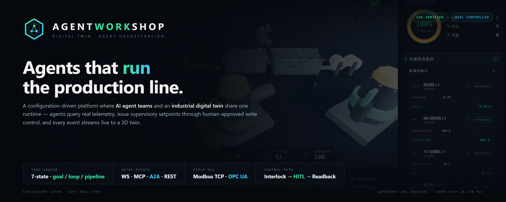
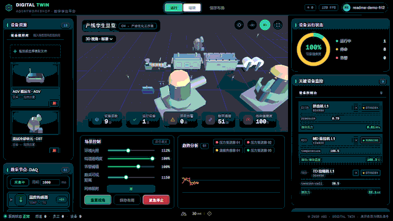
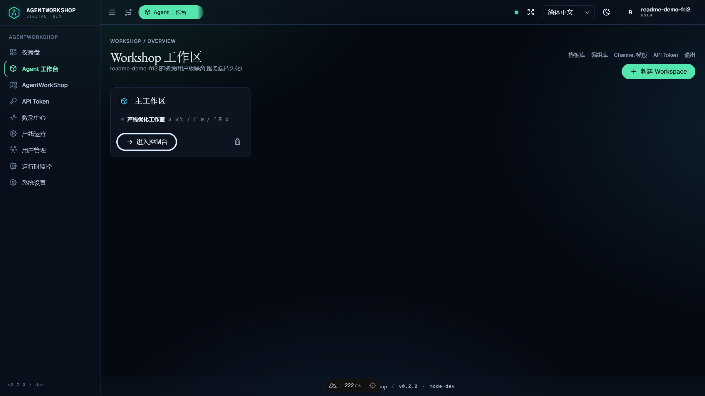
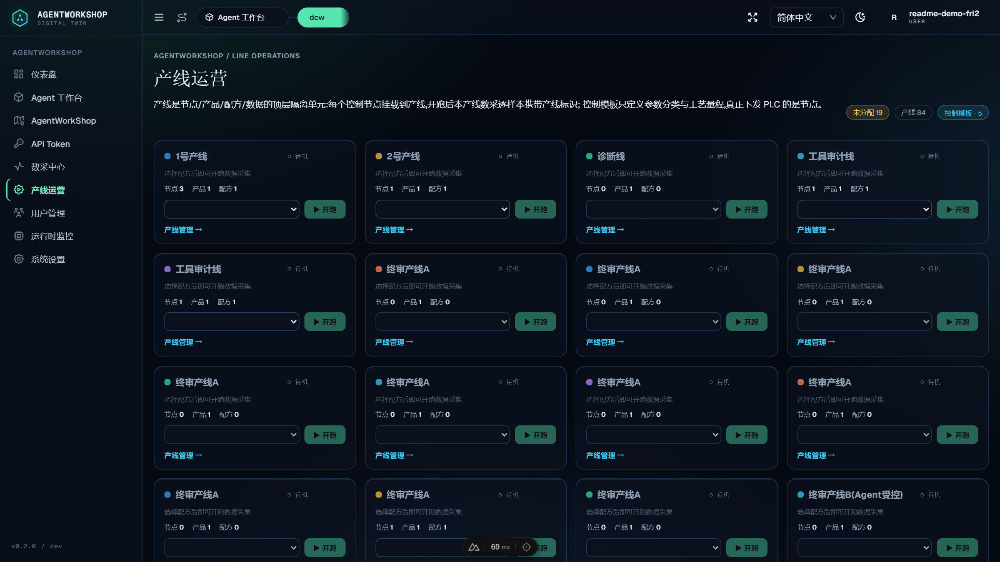
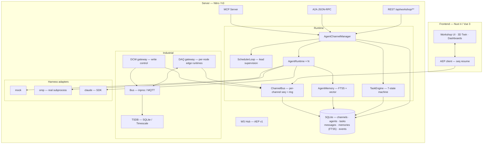

<div align="center">



# AgentWorkShop

**Where AI agent teams meet the production line.**

[](https://nuxt.com)
[](https://vuejs.org)
[](https://nodejs.org)
[](https://www.typescriptlang.org)
[](https://nodejs.org/api/sqlite.html)
[](#license)

**[中文文档 →](./README-zh.md)**

*A configuration-driven platform where **AI agent teams** and an **industrial digital twin** share one runtime. Agents query real telemetry, issue supervisory setpoints through human-approved write control — and every event streams live to a 3D twin.*

</div>

> [!IMPORTANT]
> **Positioning: supervisory layer.** AgentWorkShop is a *supervisory* (SCADA-adjacent) layer for production-line management, digital twins, DAQ and agent orchestration, operating at **second-level soft real-time**. It is **not** a hard real-time controller: any time-critical loop (**< 10 ms**, interlocks, safety, servo) **must live inside the PLC**. Setpoints written here are advisory — plant-side logic may veto.

---

## What is this?

AgentWorkShop started as a **multi-agent software workshop** — channels of coding agents with a lead-agent scheduler, a 7-state task machine, persistent memory, and four interoperable entry points (WebSocket / MCP / A2A / REST).

It then grew an **industrial half**: a full data-acquisition and write-control stack (Modbus TCP / OPC UA), production lines with recipes and batch runs, a 3D digital-twin town — and the bridge that makes it unique: **agents can be granted bound, permission-scoped access to real industrial nodes**, query their live telemetry with physical semantics attached, and drive write operations through an interlock → human-in-the-loop → readback pipeline.

The result: submit a goal like *"analyze the melt temperature trend and optimize the setpoint"* — and an agent team reads real sensor history, computes statistics, proposes a new setpoint, waits for your approval in the HITL panel, writes it to the PLC, verifies the readback, and reports the numbers back. **End to end, verified by automated E2E.**

<div align="center">

<br><sub><b>Live 3D twin.</b> Line equipment, device health, DAQ channels and trend analysis — all driven by real-time telemetry.</sub>
</div>

---

## Highlights

| | |
|---|---|
| 🤖 **Agent teams, industrial scope** | Bind agents to DAQ/DCW nodes. Agents see semantic cards (physical meaning, units, safe range, recipe window) — never raw registers. |
| 🛡️ **Human-approved write control** | DCW writes flow through **safety range ∩ active recipe window** interlock → optional **HITL approval** → PLC write → **readback verification** → signed write history. |
| 📡 **Real field buses** | Modbus TCP with per-connection op queues; OPC UA with session pools. Linear calibration hooks (PLC value ↔ engineering unit) on every node. |
| 🏭 **Line operations** | Lines → products → recipes → batch runs. Recipe windows gate acquisition and interlock writes; every sample is tagged product/recipe/run for per-batch isolation. |
| 🧑‍💼 **Lead-agent orchestration** | Each channel has one lead: decomposes goals, dispatches to idle workers, reassigns failures, judges goal satisfaction. LLM decisions with a deterministic rule-engine fallback — the system never stalls. |
| 🎯 **Three execution modes** | `goal` (satisfaction judging) · `loop` (fixed-interval replay) · `pipeline` (ordered stages). 7-state task machine with progress, artifacts and full history. |
| 🚪 **Four entry points** | One manager behind every door: **WS** (AEP v1 event stream with seq-resume), **MCP** (in-process tools), **A2A** (JSON-RPC 2.0 + AgentCard), **REST**. |
| 🧠 **Persistent memory** | Private + channel-shared domains; FTS5 with CJK segmentation, optional vector hybrid recall, token-budgeted injection, auto-harvest on completion. |
| 🧩 **Harness-agnostic** | One `AgentInterface`: `mock` (in-process), `omp` (real agent subprocess via RPC), `claude` (SDK adapter). The platform never knows which one runs. |
| 🌆 **3D digital twin** | Three.js town: place line equipment and channel territories, watch device health, alarms and live values — driven by the same event bus. |

<div align="center">

| Workshop | Line operations |
|:---:|:---:|
|  |  |

</div>

---

## Quick start

### Prerequisites

```bash
node -v   # ≥ 23.4.0  (needs built-in node:sqlite)
pnpm -v   # 11.x
```

> The `omp` harness (recommended for real work) requires the `omp` CLI on PATH. The `mock` harness works out of the box for demos and CI.

### Install & run

```bash
git clone https://github.com/kingdol666/AgentWorkShop.git && cd AgentWorkShop
pnpm install
pnpm dev          # → http://localhost:3000  (port from config.yml)
```

Production:

```bash
pnpm build        # nuxt build → .output/
pnpm start        # node scripts/start.mjs  (port from config.yml → server.prod.port)
```

Optional DAQ infrastructure (MQTT broker + TimescaleDB — auto-started via Docker when reachable):

```bash
docker compose up -d
```

### Your first agent × line session (~2 minutes)

1. **Sign in** — register in the sidebar (or `POST /api/users/register`).
2. **Build a line** — `Line Operations` → create a line, add DAQ nodes (e.g. `daq-temp-tc`) and control nodes (e.g. `dcw-temp-sp`), create a product + recipe, hit **Start**. Live values start flowing.
3. **Create a team** — `Agent Workshop` → pick a lead + workers, **deploy** into a channel.
4. **Bind nodes** — open the agent's detail panel → bind the DAQ node (*auto*) and the control node (*manual* = needs your approval).
5. **Submit the goal** — *"Analyze the last 5 minutes of melt temperature; if deviation from 182 °C exceeds 1 °C, correct the setpoint (wait for my approval)."*
6. **Approve** — the agent reads real history, computes the mean, requests the write → approve in the HITL panel → watch the setpoint change and the goal close with a numeric report.

---

## Architecture



**The agent × machine bridge** (this is the part worth reading the source for):

```
agent ──binds to──▶ node (daq: auto / dcw: manual)
  │                    │
  │  my_industrial_nodes  ◀── semantic card: meaning · unit · safe range · recipe window
  │  daq_query             ◀── TSDB history, stats + physical semantics
  │  dcw_control           ──▶ interlock (safe range ∩ recipe window)
  │                           ──▶ HITL approval (manual mode, 180 s timeout)
  │                           ──▶ PLC write → readback check → ACK + write history
  ◀── result text with numbers the agent can cite
```

---

## The industrial stack in detail

### Data acquisition (DAQ)

- **Per-node edge runtimes**: independent sampling cadence, publish cadence, in-flight mutex per node — one slow driver never blocks its neighbors.
- **Pipeline**: driver → queue (in-process or MQTT, offline buffer on disconnect) → consumer with out-of-order defense → three-way fan-out: WS live push (gated), TSDB batch write, device-twin writeback.
- **Robustness**: TSDB single-in-flight writes with bounded retries, buffer backpressure with drop counters, real loss metrics exposed on `daq.controller` frames.
- **Alarms**: recipe-scoped monitoring windows with **2 % hysteresis + 3-tick debounce**; alarm/offline transitions are instant (safety first).

### Write control (DCW)

- Engineering-unit writes: `linear` calibration (scale/offset) PLC↔physical, **readback verification** with deadband tolerance, ACK states and write history.
- **Interlock**: with a line running, the active recipe's parameter window *replaces* the node's global safe range for that node.
- **HITL**: `manual`-mode bindings suspend the write for user approval (deduped per agent+node; re-validation at approval time — permission is re-checked when you click approve).

### Recipe & batch

`Line → Product → Recipe → Run`. Starting a run applies recipe params node-by-node (each write verified), gates acquisition per line, and tags every sample with `line/product/recipe/run` — per-product data isolation with five-dimension queries (line × product × recipe × time × node).

---

## Usage

### Authentication

Email + password login issues a **bearer token** (multiple tokens per user, individually revocable).

```bash
# register
curl -X POST http://localhost:3000/api/users/register \
  -H 'content-type: application/json' \
  -d '{"email":"you@example.com","password":"secret","name":"you"}'

# every workshop call
curl http://localhost:3000/api/workshop/channels \
  -H 'authorization: Bearer <token>'
```

### Execution modes

Prefix the task description (or pick in the composer UI):

| Mode | Semantics | Config |
|---|---|---|
| `goal` | lead decomposes → workers deliver → **lead judges satisfaction**; unmet → more subtasks; met → parent completes. | `goalCriteria` |
| `loop` | replay the same task on a fixed interval. | `intervalMs` (default 60 000), `maxIterations` (default ∞) |
| `pipeline` | ordered stages; stage N+1 consumes stage N's output. | `stages: [{name, description, assigneeId?}]` |

### The four entry points

| Entry | Endpoint | Audience |
|---|---|---|
| **WS** | `/api/workshop/ws?channelId=…` | Dashboards / UI — AEP v1 envelopes, per-channel monotonic `seq`, 5 000-event ring, `lastSeq` resume, snapshot fallback. |
| **MCP** | in-process server, ~20 tools | Agents (omp host tools) — management + job-face tools, channel-scoped. |
| **A2A** | `POST /api/workshop/a2a/:agentId/rpc` | External agents — JSON-RPC 2.0, `AgentCard` at `/card`, `tasks/sendSubscribe` SSE. |
| **REST** | `/api/workshop/**` | Humans / scripts — full management face. |

### Task state machine

```
SUBMITTED ─▶ ASSIGNED ─▶ WORKING ─▶ WAITING ─▶ COMPLETED
    │            │           │           │
    └────────────┴───────────┴──▶ CANCELED / FAILED ─▶ (retry ≤ 3 or cancel)
```

---

## Verified end-to-end

The repo ships live E2E that exercises the full loop against a running server — the numbers below are from an actual run:

| Check | Result |
|---|---|
| Line start → recipe writes setpoint (180 °C) | ✅ |
| Interlock: write 170 (<176) and 200 (>188) → **400 rejected** | ✅ |
| Team deploy → goal dispatch (lead → omp worker) | ✅ t + 3 s |
| Worker reads real history: **mean 168.05 °C, 96 samples, min/max/latest** | ✅ |
| HITL approval → setpoint **180 → 182 °C** written & read back | ✅ |
| Goal closes with structured summary | ✅ |
| Batch tagging: samples carry product/recipe/run | ✅ |

Reproduce: `node scripts/_dbg-full-feature-e2e.mjs` (against a running server).

---

## Project layout

```
AgentWorkShop/
├── app/                        # Nuxt 4 frontend (srcDir)
│   ├── pages/                  # / · /workshop · /town · /daq · /dcw · /monitor · /users · /tokens
│   ├── components/workshop/    # timeline · lanes · task board · memory panel · 3D town
│   └── stores/composables/     # Pinia + AEP client
├── server/
│   ├── api/                    # REST + WS + A2A + MCP routes
│   ├── services/workshop/
│   │   ├── runtime/            # manager · scheduler-loop · task-engine · memory · mailbox
│   │   ├── agents/             # AgentInterface: mock · omp · claude (+ industrial tools)
│   │   ├── daq/ dcw/           # edge runtimes · drivers · bus · storage
│   │   └── db/                 # repos over node:sqlite
│   ├── mcp/                    # MCP server (tools)
│   └── plugins/                # runtime assembly (singletons)
├── shared/                     # AEP v1 + DAQ/DCW protocols (shared front/back)
├── config.yml                  # ⚙ single source of truth
├── data/                       # runtime SQLite (git-ignored)
└── scripts/                    # E2E · verification suites
```

## Tech stack

| Layer | Tech |
|---|---|
| Framework | [Nuxt 4](https://nuxt.com) + Nitro (WebSocket) |
| UI | Vue 3.5 · Pinia · Ant Design Vue · UnoCSS · Three.js · ECharts |
| Language | TypeScript 5.7 across the stack; `shared/` used by both sides |
| Persistence | `node:sqlite` (zero native deps) + FTS5 + optional `sqlite-vec`; TimescaleDB for time-series |
| Validation | `zod` at every message boundary |
| Interop | `@modelcontextprotocol/sdk` · A2A (JSON-RPC 2.0) · AEP v1 (in-house WS protocol) |
| Field bus | `modbus-serial` · `node-opcua` · `mqtt` |

## Development

```bash
pnpm dev          # dev server (port from config.yml)
pnpm build && pnpm start
pnpm typecheck
pnpm lint
node scripts/_dbg-full-feature-e2e.mjs    # full-feature live E2E (server must be running)
```

## Configuration

Everything is driven by `config.yml` — ports, i18n, theme, session secret, DAQ infrastructure (MQTT/Timescale endpoints, sampling defaults, retention). Change it, restart, done. `config.yml` is read once at build/start and injected into the runtime; the frontend receives its slice via `runtimeConfig`.

## Roadmap

| | Item | Status |
|---|---|---|
| ✅ | Channel runtime, lead orchestration, 7-state task engine | shipped |
| ✅ | Four entry points: WS (AEP v1) · MCP · A2A (JSON-RPC 2.0) · REST | shipped |
| ✅ | Persistent memory (FTS5 + optional vector hybrid) | shipped |
| ✅ | Industrial stack: DAQ (Modbus TCP/OPC UA) · DCW write control · lines/recipes/runs | shipped |
| ✅ | Agent ↔ node binding + HITL approval + interlock | shipped |
| ✅ | 3D digital-twin town · line operations UI · dashboards | shipped |
| ✅ | Full-feature live E2E (agent reads/writes a real line, 23 checks) | shipped |
| 🔨 | Claude Agent SDK adapter — full parity with `mock`/`omp` | in progress |
| 📜 | License file | pending |
| 🛡️ | Production hardening: TLS, MQTT auth, OPC UA sign+encrypt defaults, structured audit log | planned |
| 🏭 | Edge deployment shape: standalone edge-agent + central broker | planned |
| 📣 | Alarm outbound delivery (email/webhook) + ack workflow | planned |
| ⚙️ | CI pipeline (typecheck + lint + e2e) | planned |

## License

AgentWorkShop is an independent project and is **not an official product of Anthropic** or any LLM vendor. It integrates with agent harnesses (e.g. `omp`) through their public interfaces.

**License is TBD** — the license file will be added before the `v1.0` release.

<div align="center">

<a href="https://star-history.com/#kingdol666/AgentWorkShop&Date">
  <picture>
    <source media="(prefers-color-scheme: dark)" srcset="https://api.star-history.com/svg?repos=kingdol666/AgentWorkShop&type=Date&theme=dark" />
    <source media="(prefers-color-scheme: light)" srcset="https://api.star-history.com/svg?repos=kingdol666/AgentWorkShop&type=Date" />
    
  </picture>
</a>

</div>
