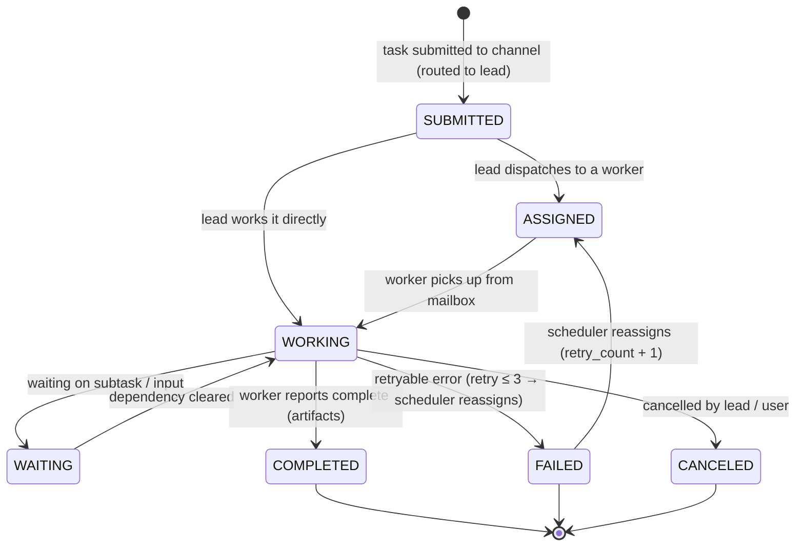

<div align="center">

# AgentWorkShop

**A configuration-driven, multi-agent software workshop**

> Orchestrating teams of coding agents inside **Channels** — with tasks as first-class objects, a lead-agent scheduler, persistent memory, and four interoperable entry points (WebSocket / MCP / A2A / REST).

[**中文文档 → README-zh.md**](./README-zh.md)

</div>

<div align="center">

| | |
|---|---|
| Version | `0.1.0` |
| Runtime | Node.js `≥ 23.4.0` (built-in `node:sqlite`) |
| Stack | Nuxt 4 · Vue 3 · Nitro · Pinia · Ant Design Vue · MCP SDK |
| License | TBD |

</div>

---

## <div align="center">Features</div>

<div align="center">

```
┌──────────────────────────────────────────────────────────────────────────┐
│                                                                          │
│   ● Channel isolation      ● Lead-agent orchestration   ● 3 exec modes   │
│   ● Task state machine     ● Persistent agent memory    ● Harness-agnostic│
│   ● 4 entry points         ● Token auth + monitor       ● Live WS timeline│
│                                                                          │
└──────────────────────────────────────────────────────────────────────────┘
```

</div>

| | Feature | Description |
|---|---|---|
| 🔒 | **Channel isolation** | Every Channel is a hard isolation boundary: its own workspace, mailbox, task pool and event stream. Agents can only perceive teammates *in their own channel* — zero cross-channel paths. |
| 🧑‍💼 | **Lead orchestration** | Each channel has exactly one *lead*. You submit a task to the channel; the lead decomposes it, dispatches subtasks to idle workers, watches progress, reassigns failures and summarizes the delivery. |
| 🎯 | **Three execution modes** | `goal` (lead judges goal-satisfaction), `loop` (fixed-interval re-dispatch with max iterations), `pipeline` (ordered stages with sequential dependencies). |
| 📦 | **Task as first-class object** | A 7-state machine (`SUBMITTED → ASSIGNED → WORKING → WAITING → COMPLETED / FAILED / CANCELED`), owner/assignee, 0–100 progress, artifacts, full history, parent/child decomposition. |
| 🧠 | **Persistent memory** | Per-agent private + channel-shared memory domains. FTS5 full-text search with CJK segmentation, optional vector hybrid recall (`sqlite-vec`), token-budgeted injection, `search_memory` / `save_memory` tools, automatic harvesting on task completion. |
| 🔌 | **Harness-agnostic** | `mock` (in-process), `omp` (real coding-agent subprocess via RPC), `claude` (SDK adapter) — all conform to one `AgentInterface`. The platform never knows which harness runs behind a member. |
| 🚪 | **Four entry points** | WS hub (AEP event stream), in-process MCP (18 tools), A2A JSON-RPC 2.0 (with `AgentCard`), and full REST — the same manager behind every door. |
| 🔑 | **Token auth** | User accounts with hashed passwords + API-token management UI (create / rename / revoke). Every workshop call is attributed to a user; every agent call is attributed to an instance token. |
| 📟 | **Runtime monitor** | `/monitor` page: all live runtimes, every spawned harness process (including orphans) with PID/uptime, and one-click process-tree kill (Windows `taskkill /T /F`, POSIX process-group SIGKILL). |

---

## <div align="center">Quick Start</div>

### Prerequisites

```bash
node -v   # ≥ 23.4.0 (node:sqlite required)
pnpm -v   # 11.x
```

> To use the `omp` harness (recommended for real work), install [`omp`](https://github.com/) CLI and make sure `omp` is on `PATH` (or set `command` in the agent config). The `mock` harness works out of the box for demos and integration tests.

### Install & run (development)

```bash
git clone <your-repo-url> AgentWorkShop && cd AgentWorkShop

pnpm install          # runs `nuxt prepare` via postinstall

pnpm dev              # dev server on the port from config.yml → server.dev.port (default :3000)
```

Open **http://localhost:3000** — you are in.

### Production

```bash
pnpm build            # nuxt build → .output/
pnpm start            # node scripts/start.mjs → port from config.yml → server.prod.port (default :3001)
```

`scripts/start.mjs` reads `config.yml` and injects `HOST` / `PORT` before booting the Nitro output. `HOST` / `PORT` env vars take precedence.

### 60-second first session

1. **Sign in** — `Register` in the sidebar user menu (or `POST /api/users/register`), log in → the UI stores your API token.
2. **Create an agent template** — `Workshop → Agents → New` (name, harness = `mock` or `omp`, optional JSON config).
3. **Create a channel** — `Workshop → Channels → New`; pick a name and mark one agent as **lead**.
4. **Add workers** — put more agent templates into the channel (each placement clones an independent instance with its own identity token), or create a **Team** and *deploy* it in one shot.
5. **Submit a task** — open the channel, type a goal in the composer. The lead picks it up, decomposes, dispatches; you watch every event (agent status, streaming deltas, progress, artifacts) in the live timeline.

---

## <div align="center">Getting Started</div>

### Authentication & tokens

Users authenticate with `email + password`; sessions are **bearer tokens** (no cookie required for API use).

| Endpoint | Purpose |
|---|---|
| `POST /api/users/register` | Create account `{ email, password, name? }` → returns a token |
| `POST /api/users/login` | Login → returns a token |
| `GET  /api/users/me` | Current profile |
| `POST /api/users/logout` | Revoke current token |
| `GET/POST /api/users/tokens`, `PATCH/DELETE /api/users/tokens/:id` | Token management (also in the `/tokens` UI) |

All `/api/workshop/**` routes require `Authorization: Bearer <token>`.

### The workshop workflow

```
create agent templates  →  create channel (designate lead)  →  add workers / deploy team
        →  submit task to channel  →  lead decomposes & dispatches  →  workers execute
        →  observe on /workshop (timeline, lanes, task board)  →  delivery artifacts
```

### Execution modes

Pass a mode prefix in the task description: `[mode:goal] …`, `[mode:loop] …`, `[mode:pipeline] …`.

| Mode | Semantics | Config (description or UI) |
|---|---|---|
| `goal` | Lead decomposes → workers complete → **lead judges goal satisfaction**; loops with new subtasks until satisfied. | `goalCriteria` — criteria injected into the lead's supervision prompt |
| `loop` | Fixed-interval re-dispatch of the same task. | `intervalMs` (default 60000), `maxIterations` (default ∞) |
| `pipeline` | Ordered stages; stage *N+1* receives stage *N*'s output. | `stages: [{ name, description, assigneeId? }]` |

### REST API at a glance

All routes return a uniform envelope and validate bodies with `zod`.

| Area | Routes |
|---|---|
| **Users / tokens** | `/api/users` (CRUD), `/api/users/login`, `/api/users/me`, `/api/users/tokens` (CRUD) |
| **Channels** | `/api/workshop/channels` (list/create), `/api/workshop/channels/:id` (get/patch/delete/activate), `.../messages`, `.../tasks`, `.../agents` (add/remove/patch/stop), `.../events`, `.../queue`, `.../memories` |
| **Agents (templates)** | `/api/workshop/agents` (list/create/get/patch/delete/subscribe) |
| **Teams** | `/api/workshop/teams` (CRUD), `.../members` (add/remove), `POST .../deploy` (clone whole team into a channel) |
| **Tasks** | `/api/workshop/tasks`, `/api/workshop/tasks/:id` (get/report/complete/cancel/retry/dispatch) |
| **Memory** | per-agent + channel memory: list / create / delete / `search`, plus `POST /api/workshop/memories/maintenance` |
| **A2A** | `GET /api/workshop/a2a/:agentId/card` (AgentCard), `POST /api/workshop/a2a/:agentId/rpc` (JSON-RPC 2.0), `POST /api/workshop/a2a/send` (peer message) |
| **System** | `GET /api/system/config`, `GET /api/system/monitor`, `POST /api/system/monitor/terminate` |
| **Game demo** | `/api/game/ws` (WS), `/api/game/brain`, `/api/game/cmd` |

**A2A JSON-RPC methods**: `tasks/send` (blocking, 30 s), `tasks/sendSubscribe` (SSE stream), `tasks/get`, `tasks/list`, `tasks/cancel`, `message/send`, `agent/getCard`.

---

## <div align="center">Architecture</div>

### Big picture


### The four entry points

The same `AgentChannelManager` sits behind every door — pick the one that fits your client.

| Entry | Endpoint / transport | Audience | Notes |
|---|---|---|---|
| **WS (observe)** | `/api/workshop/ws?channelId=…` | Frontend / dashboards | AEP v1 envelopes with per-channel monotonic `seq`; 5000-event ring buffer; `sub` with `lastSeq` replays the gap, otherwise a full `channel.snapshot` re-aligns. Streaming `agent.delta` events power the typewriter UI. |
| **MCP (act)** | in-process server, 18 tools | Agents (host tools for `omp`) | Identity via per-instance bearer token. Management tools (`channel.create`, `task.submit`, …) are open; agent-work tools (`task.dispatch`, `a2a.send`, …) are strictly channel-scoped to the caller. |
| **A2A (interop)** | `POST /api/workshop/a2a/:agentId/rpc` | External A2A clients | Standard JSON-RPC 2.0 with A2A error codes; `AgentCard` at `/a2a/:agentId/card`; SSE via `tasks/sendSubscribe`. |
| **REST (admin)** | `/api/workshop/**` | Humans / scripts / orchestrators | The full management surface: channels, agents, teams, tasks, memory, workspaces. |

**MCP tool catalog**

| Group | Tools |
|---|---|
| Channel | `workshop.channel.create` · `workshop.channel.list` · `workshop.channel.remove` |
| Agent | `workshop.agent.create` · `workshop.agent.add` · `workshop.agent.definitions` · `workshop.agent.list` · `workshop.agent.remove` |
| Task | `workshop.task.submit` · `workshop.task.dispatch` · `workshop.task.list` · `workshop.task.get` · `workshop.task.report` · `workshop.task.complete` · `workshop.task.cancel` |
| A2A | `workshop.a2a.send` · `workshop.a2a.poll` · `workshop.a2a.subscribe` |

### Task state machine



### A2A message & artifact model

All internal communication uses A2A semantics — one shape across WS, MCP, REST and A2A:

```ts
Part      = { text, mediaType? } | { data, mediaType? } | { url, … } | { raw, … }
Message   = { messageId, channelId, taskId?, fromAgentId, toAgentId?, role, parts: Part[], metadata }
Artifact  = { artifactId, name?, description?, parts: Part[], metadata? }   // task deliverables
```

### Persistent agent memory

- **Domains** — per-agent private + channel-shared (`__team__` sentinel row), isolated per channel.
- **Kinds** — `episodic-task` / `episodic-peer` (auto-harvested on completion, zero LLM cost) and `semantic` (human-curated, decay-exempt).
- **Retrieval** — FTS5 with CJK character segmentation (works for Chinese out of the box); optional `sqlite-vec` embedding provider upgrades recall to hybrid; ranking = `0.5×relevance + 0.3×recency + 0.2×importance` with a greedy token budget.
- **Dynamic pattern** — the runtime injects only a small "primer" budget (`AW_MEMORY_PRIMER_TOKENS`, default 300 tokens); agents fetch full content on demand via the `search_memory` tool and deposit lessons via `save_memory` (auto-routed private/shared, `dedup_key` de-duplication).
- **Maintenance** — `POST /api/workshop/memories/maintenance` runs decay cycles and housekeeping.

### Harness adapters

```
AgentInterface (contract: info · run · supervise · workspace tools · dispose)
 ├── MockAgentImpl      in-process, scripted — demos & tests
 ├── OmpRpcAgentImpl    spawns `omp --mode rpc` (lazy, reused across messages);
 │                      AgentWorkspace methods are registered as omp *host tools*,
 │                      so the agent calls report_progress / complete_task /
 │                      dispatch_task natively — no text parsing
 └── ClaudeSdkAgentImpl Claude Agent SDK adapter (scaffold)
```

Each spawned harness process is registered in a process registry (`harness-process.ts`) — the source of truth for the `/monitor` page, including orphan detection and process-tree kill.

### Project layout

```
AgentWorkShop/
├── app/                        # Nuxt 4 frontend (srcDir)
│   ├── pages/                  # / · /workshop (+ agents · teams · /w/[wsId]) · /game · /tokens · /users · /monitor · /settings
│   ├── components/workshop/    # TranscriptTimeline · AgentLanesView · TaskBoardView · MemoryPanel …
│   ├── composables/workshop/   # useWorkshopWs (AEP client) …
│   ├── stores/workshop/        # Pinia: channels · agents · tasks · user …
│   └── game/                   # Phaser RPG demo (client, scene, protocol)
├── server/
│   ├── api/                    # REST + WS routes (users · workshop · system · game · mcp)
│   ├── services/workshop/
│   │   ├── runtime/            # manager · agent-runtime · scheduler-loop · execution-mode
│   │   │                       # task-engine · memory · mailbox · monitor · channel-runtime
│   │   ├── agents/             # agent-interface · factory · mock-agent · omp-agent · claude-agent
│   │   │   └── adapters/       # omp-rpc-client (RPC transport)
│   │   ├── db/                 # schema.sql + repositories (node:sqlite)
│   │   └── types/              # a2a · task
│   ├── mcp/workshop-server.ts  # MCP server (18 tools)
│   ├── repositories/           # user repository
│   ├── schemas/ utils/ types/  # zod schemas · auth · response envelope
│   └── plugins/workshop.ts     # manager bootstrap (singletons)
├── shared/
│   ├── workshop-protocol.ts    # AEP v1 — the authoritative event protocol (both sides)
│   └── game-protocol.json/.ts  # game command registry (JSON → zod, "edit JSON, it just works")
├── config.yml                  # ⚙ single source of truth (ports · i18n · theme · security)
├── data/                       # runtime SQLite (git-ignored)
└── scripts/                    # e2e / stress / verification suites (tsx)
```

---

## <div align="center">Tech Stack</div>

| Layer | Technology |
|---|---|
| Framework | [Nuxt 4](https://nuxt.com) (compatibility v4) + Nitro (WS-capable) |
| UI | Vue 3.5 · Pinia (persisted) · Ant Design Vue 4 · UnoCSS (attributify + icons) |
| Visualization | ECharts / vue-echarts · Phaser 4 (game demo) |
| Language / typing | TypeScript 5.7, end-to-end; `shared/` modules imported by both sides |
| Persistence | `node:sqlite` (zero native deps) + FTS5 + optional `sqlite-vec` |
| Validation | `zod` — one schema per endpoint, compiled at the message boundary |
| Agent interop | `@modelcontextprotocol/sdk` · A2A (JSON-RPC 2.0) · custom AEP v1 WS protocol |
| i18n | `zh-CN` (default) / `en`, driven by `config.yml` |
| Quality | ESLint 9 (flat) · husky + lint-staged · commitlint (conventional) |

## <div align="center">Development</div>

```bash
pnpm dev              # dev server (port from config.yml)
pnpm build && pnpm start   # production
pnpm typecheck        # nuxt typecheck
pnpm lint             # eslint .
pnpm lint:fix

# verification suites (scripts/)
node scripts/api-live-e2e.mjs     # live API e2e
node scripts/verify-game.mjs      # game rendering verification
pnpm game:test                    # agent brain + game session tests
```

> Husky pre-commit runs ESLint (with `--fix`) on staged files and enforces conventional commit messages.

## <div align="center">Configuration</div>

**`config.yml` is the single source of truth** — read once at build/dev by `nuxt.config.ts` and at production boot by `scripts/start.mjs`. Env vars (`.env`) can override the fields exposed via `runtimeConfig.public`.

| Key | Meaning |
|---|---|
| `server.host` / `server.dev.port` / `server.prod.port` | bind host; dev port (`pnpm dev`); prod port (`pnpm start`) |
| `api.baseURL` / `api.timeout` / `api.pageSize` / `api.maxPageSize` | API base, timeout, pagination defaults |
| `i18n.*` | default locale + locale list |
| `theme.primaryColor` / `theme.mode` | UI palette (cobalt-ink "drafting bench" theme) and light/dark |
| `security.sessionPassword` | session-cookie encryption key — **change in production** (or set `NUXT_SESSION_PASSWORD`) |

Runtime env knobs (optional): `AW_MEMORY_PRIMER_TOKENS` (memory primer budget), embedding-provider variables (see `server/services/workshop/runtime/embedding-provider.ts`).

## <div align="center">Design documents</div>

- `docs/superpowers/specs/2026-08-13-agent-workshop-multi-agent-design.md` — system design (roles, task model, four entry points, error handling)
- `docs/superpowers/plans/2026-08-13-agent-workshop-multi-agent.md` — implementation plan + core contracts (T3/T5)
- `docs/superpowers/plans/2026-08-15-agent-memory.md` — persistent memory design
- `docs/superpowers/plans/2026-08-16-agent-harness-frontend.md` — harness & frontend plan

---

<div align="center">

## Disclaimer

AgentWorkShop is an independent project and is **not an official product of Anthropic** or any LLM vendor. It integrates with agent harnesses (e.g. `omp`) through their public interfaces.

**TBD** — license file to be added.

</div>
