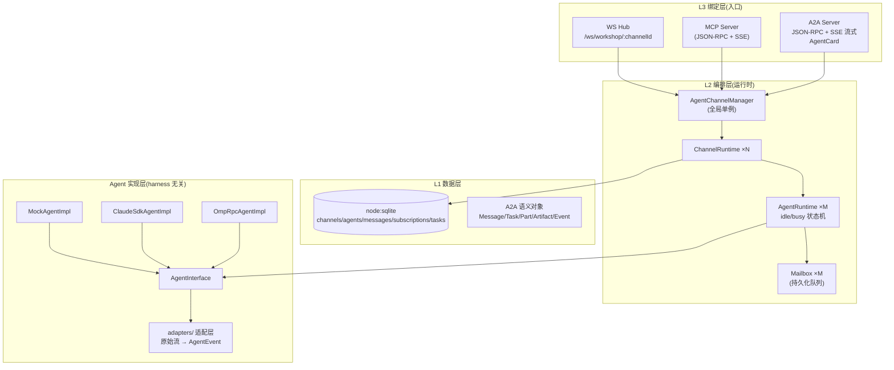

# AgentWorkShop 多 Agent 协同作业系统设计

> 状态: 待审阅 | 日期: 2026-08-13 | 范围: `server/services/workshop/**` + 平台 MCP/A2A/WS 三入口

## 1. 背景与目标

在现有 Nuxt 4 + Nitro 项目内构建与 Agent harness 无关的多 Agent 协同作业平台:

- **AgentInterface** 统一接口,标准流式返回;impl 的 utils 适配层把各 harness(omp RPC / Claude Code SDK / mock)的原始数据适配成同一套 Agent 事件
- **AgentChannelManager** 管理 Channel 生命周期;Channel 内 Agent 通过 A2A 协议语义互相理解消息
- **MCP** 是全局操作面:channel 创建、Agent 创建、A2A 消息发送/订阅/拉取均由 Agent 自主调用
- **持久化**: channel/agent/message 入库,启动时自动恢复启用的 channel 与其中的 agent
- **消费队列**: 消息投递到目标 Agent 的 mailbox;Agent 空闲即消费,繁忙则排队,执行结束后继续消费
- 平台仅提供 WS + 框架;管理当前为手动(后续由上位机 AgentBrain 自动化)

### 已确认决策

| 决策 | 选择 |
|------|------|
| 持久化 | `node:sqlite`(Node 内置,零依赖;engines 提升 `>=23.4`) |
| omp 对接 | RPC transport 抽象 + Mock 先行;omp 具体端点信息后续提供后再填 adapter |
| A2A 范围 | 内部事件统一为 A2A 语义 + 对外暴露标准 A2A JSON-RPC 端点与 AgentCard |

## 2. 总体架构

参照 A2A 规范的三层划分(L1 数据模型 / L2 操作 / L3 绑定),平台同样三层:



**分层规则**: L1 只依赖 sqlite 与 A2A 类型;L2 只依赖 L1;L3 只依赖 L2;impl 层只依赖 `AgentInterface` 与适配器。任何一层可独立测试与替换。

## 3. 核心抽象(server/services/workshop/agents/agent-interface.ts)

### 3.1 AgentInterface — harness 无关统一接口

```typescript
/** 一次执行请求:channel 内消息投递驱动的单位 */
export interface AgentRunRequest {
  /** A2A 消息(role=user),内容为 Parts */
  message: A2AMessage
  /** 关联任务 id(平台分配;点对点消息可无任务) */
  taskId?: string
  /** 上下文 = channelId */
  contextId: string
  /** 发送者 agentId(null = 外部/用户/广播源) */
  fromAgentId: string | null
  /** 目标 agentId(null = 广播) */
  toAgentId: string | null
}

/** 执行上下文:平台注入的只读能力 */
export interface AgentRunContext {
  agentId: string
  channelId: string
  /** 平台提供的回传工具:Agent 执行中可直接向 channel 发消息/订阅 */
  workspace: AgentWorkspace
  signal: AbortSignal
}

/** AgentInterface:所有 harness impl 的唯一契约 */
export interface AgentInterface {
  /** 标准流式返回:输入一次,产出统一事件流(AsyncIterable) */
  run(request: AgentRunRequest, ctx: AgentRunContext): AsyncIterable<AgentEvent>

  /** 生命周期钩子(可选) */
  init?(config: AgentRuntimeConfig): Promise<void>
  dispose?(): Promise<void>
}
```

**设计要点**:

- `run()` 返回 `AsyncIterable<AgentEvent>` 而非回调/Promise——**标准流式返回**,事件逐条产出即被平台广播,前端与订阅者实时收到(真流式)
- 平台通过 `signal` 取消;`workspace` 让 Agent 在执行中自主发起通信(对齐"MCP 自主通讯")
- harness 差异全部隔离在 impl + adapters;平台对 mock/omp/claude 零感知

### 3.2 AgentEvent — 统一事件(对齐 A2A StreamResponse 语义)

```typescript
/** 统一事件:A2A 语义的事件流,三类流式事件 + 终态 */
export type AgentEvent =
  /** 任务状态迁移(对齐 TaskStatusUpdateEvent) */
  | { kind: 'status', status: A2ATaskStatus }
  /** 直接产出消息(对齐 Message,role=agent) */
  | { kind: 'message', message: A2AMessage }
  /** 工件更新(对齐 TaskArtifactUpdateEvent,支持 append/lastChunk 分块) */
  | { kind: 'artifact', artifact: A2AArtifact, append?: boolean, lastChunk?: boolean }
  /** 错误(对齐 A2A Error) */
  | { kind: 'error', error: A2AError }
  /** 流结束 */
  | { kind: 'done', final?: { task?: A2ATask } }
```

与 A2A 的映射:

| AgentEvent | A2A StreamResponse 字段 | SSE event 名(对外) |
|------------|------------------------|-------------------|
| `status` | `statusUpdate` | `status-update` |
| `artifact` | `artifactUpdate` | `artifact-update` |
| `message` | `message` | `message` |
| `error` | JSON-RPC error | `error` |
| `done` | 流关闭(任务达终态) | (流结束) |

### 3.3 A2A 语义对象(server/services/workshop/types/a2a.ts)

从 A2A 1.0 proto 提取平台所需子集(字段名 snake_case 与规范一致):

```typescript
export type TaskState =
  | 'TASK_STATE_SUBMITTED' | 'TASK_STATE_WORKING'
  | 'TASK_STATE_COMPLETED' | 'TASK_STATE_FAILED'
  | 'TASK_STATE_CANCELED' | 'TASK_STATE_INPUT_REQUIRED'
  | 'TASK_STATE_REJECTED' | 'TASK_STATE_AUTH_REQUIRED'

export type Part =
  | { text: string, mediaType?: string, metadata?: Record<string, unknown> }
  | { data: unknown, mediaType?: string, metadata?: Record<string, unknown> }
  | { url: string, mediaType?: string, filename?: string, metadata?: Record<string, unknown> }
  | { raw: string /* base64 */, mediaType?: string, filename?: string, metadata?: Record<string, unknown> }

export interface A2AMessage {
  messageId: string
  contextId: string          // = channelId
  taskId?: string
  role: 'ROLE_USER' | 'ROLE_AGENT'
  parts: Part[]
  metadata?: Record<string, unknown>
  extensions?: string[]
  referenceTaskIds?: string[]
}

export interface A2AArtifact {
  artifactId: string
  name?: string
  description?: string
  parts: Part[]
  metadata?: Record<string, unknown>
}

export interface A2ATaskStatus {
  state: TaskState
  message?: A2AMessage
  timestamp: string          // ISO 8601
}

export interface A2ATask {
  id: string
  contextId: string
  status: A2ATaskStatus
  artifacts: A2AArtifact[]
  history: A2AMessage[]
  metadata?: Record<string, unknown>
}

export interface A2AError { code: string; message: string; data?: unknown }
```

## 4. 适配层(impl 的 utils 层)

`server/services/workshop/agents/adapters/`:

| 文件 | 职责 |
|------|------|
| `claude-stream.ts` | Claude Code SDK 消息流(SDKMessage: system/assistant/text/tool_use/result)→ 统一 AgentEvent(文本块→artifact 分块 append 事件;tool_use→message data part;result→done) |
| `omp-rpc.ts` | omp RPC transport 抽象:`OmpRpcTransport { call(method, params, signal): AsyncIterable<unknown> }`,原始响应→AgentEvent。具体端点(endpoint/认证)由环境变量注入,信息缺失时抛明确错误 |
| `to-a2a.ts` | 通用工具:任意文本/JSON→`Part`;harness 原始块→`A2AArtifact` |

**约定**: 每个 adapter 是纯函数/纯流变换,输入 harness 原始流,输出 AgentEvent 流;不触碰平台状态。

## 5. 运行时模型(server/services/workshop/runtime/)

### 5.1 AgentRuntime — 状态机 + Mailbox

```typescript
type AgentRuntimeState = 'idle' | 'busy' | 'stopped'

export class AgentRuntime {
  readonly agentId: string
  readonly config: AgentRuntimeConfig
  private impl: AgentInterface
  private mailbox: Mailbox
  private state: AgentRuntimeState = 'idle'

  /** 投递一条消息到 mailbox;若 idle 立即触发消费 */
  enqueue(message: A2AMessage): void
  /** 状态查询(WS/MCP 暴露) */
  getState(): AgentRuntimeState
  /** 消费循环:仅 idle 时执行;run() 全事件流结束后回到 idle 再取队首 */
  private async consumeLoop(): Promise<void>
  stop(): Promise<void>
}
```

**消费循环(核心机制)**:

```
while (state === 'idle') {
  msg = mailbox.dequeue()          // 无消息则挂起(事件驱动唤醒)
  if (!msg) return
  state = 'busy'
  try {
    for await (const event of impl.run(toRequest(msg), ctx)) {
      channelBus.emit(event, msg) // 逐事件广播 + 持久化
    }
  } finally {
    state = 'idle'                 // 结束后自动继续消费队列
    mailbox.markConsumed(msg)
    mailbox.wake()                 // 唤醒下一个循环(队列可能已积压)
  }
}
```

**语义**:

- 消息在 Agent **空闲时自动消费**;繁忙时只入队不消费
- 执行结束(事件流耗尽/出错/取消)立即回 idle 并继续消费管道内消息——满足"不空闲则先进入队列,等执行结束消费管道内的信息"
- 同一 Agent 的 run 严格串行;跨 Agent 天然并行(每个 Agent 一个循环)
- 消费循环由 mailbox 事件驱动(入队唤醒),无忙轮询

### 5.2 Mailbox — 持久化 FIFO + 订阅过滤

```typescript
export class Mailbox {
  enqueue(message: A2AMessage): Promise<void>       // 落库(state=pending) + 唤醒
  dequeue(): Promise<A2AMessage | null>             // 队首(state=pending 最早)
  markConsumed(messageId: string): Promise<void>
  /** 主动拉取(MCP poll 用):只读,不改状态 */
  peek(limit: number): Promise<A2AMessage[]>
}
```

- 队列持久化在 `messages` 表(见 §9),`state` 字段: `pending | consuming | consumed`
- **at-least-once**: 取走时置 `consuming`;服务重启时 `consuming` 一律重置回 `pending` 重新消费
- 排队顺序 = `created_at` 升序

### 5.3 ChannelRuntime — 路由 + 订阅 + 广播

```typescript
export class ChannelRuntime {
  readonly channelId: string
  private agents: Map<string, AgentRuntime>
  private bus: ChannelBus       // WS 广播 + MCP 通知的枢纽

  route(message: A2AMessage): void   // 核心路由
  addAgent(runtime: AgentRuntime): void
  removeAgent(agentId: string): Promise<void>
  /** 计算消息的投递目标 */
  resolveRecipients(message: A2AMessage): string[]
}
```

**路由规则(确定消息给谁)**:

1. `metadata['x-aw-target-agent'] = agentId` → 点对点,直投目标 mailbox(无视订阅)
2. 无 target(广播)→ 投递给 channel 内所有**订阅了发送者或频道**的 Agent(订阅过滤)
3. 订阅关系来源: `subscriptions` 表(MCP `a2a.subscribe` 写入)+ 消息 `metadata['x-aw-subscribe']` 声明

### 5.4 AgentChannelManager — 全局编排

```typescript
export class AgentChannelManager {
  private channels: Map<string, ChannelRuntime>

  // ---- 生命周期(供启动恢复与 MCP 管理面调用) ----
  async createChannel(input): Promise<ChannelInfo>
  async listChannels(): Promise<ChannelInfo[]>
  async removeChannel(channelId): Promise<void>
  async createAgent(input): Promise<AgentInfo>
  async listAgents(channelId): Promise<AgentInfo[]>
  async removeAgent(agentId): Promise<void>
  async pauseAgent(agentId): Promise<void>     // 手动控制(后续 AgentBrain 接管)
  async resumeAgent(agentId): Promise<void>

  // ---- 通信面(MCP/A2A 入口调用) ----
  async sendA2A(input: { channelId, fromAgentId?, toAgentId?, parts, metadata? }): Promise<A2AMessage>
  async pollMailbox(agentId, limit): Promise<A2AMessage[]>
  async subscribe(agentId, topics, targetAgentIds): Promise<void>

  // ---- 启动恢复 ----
  async restore(): Promise<void>   // 加载 enabled channels + agents
}
```

单例由 Nitro plugin 在启动时构造并 `restore()`。

## 6. 三个入口(L3 绑定)

### 6.1 MCP Server — Agent 自主操作面

`server/mcp/workshop-server.ts`,JSON-RPC 2.0 + Streamable HTTP(SSE),路由 `/api/mcp/workshop`。

工具集(全部经 AgentChannelManager):

| 工具 | 参数 | 说明 |
|------|------|------|
| `workshop.channel.create` | `{name, description?}` | 创建 channel,返回 `{channelId}` |
| `workshop.channel.list` | `{}` | 列出全部 channel |
| `workshop.channel.remove` | `{channelId}` | 删除 channel(级联 agent/消息) |
| `workshop.agent.create` | `{channelId, name, harness, config}` | 创建 Agent(harness ∈ mock/claude/omp) |
| `workshop.agent.list` | `{channelId?}` | 列出 Agent |
| `workshop.agent.remove` | `{agentId}` | 删除 Agent |
| `workshop.a2a.send` | `{channelId, fromAgentId, toAgentId?, parts, metadata?}` | **Agent 自主发消息**(点对点/广播) |
| `workshop.a2a.subscribe` | `{agentId, topics?, agentIds?}` | 声明订阅(主题/特定 Agent) |
| `workshop.a2a.poll` | `{agentId, limit?}` | **主动拉取自己的 mailbox**(未消费消息) |
| `workshop.a2a.tasks` | `{agentId}` | 查自己的任务列表 |

**身份约定**: 请求携带 `x-aw-agent-id` 头标识调用方 Agent;`workshop.a2a.send` 的 `fromAgentId` 必须与调用方一致(防冒用)。

MCP 实现依赖 `@modelcontextprotocol/sdk`(官方 SDK,保证与 Claude Code/omp 等 harness 的互操作正确性)。

### 6.2 A2A 对外标准端点

每个 Agent 对外是一个标准 A2A server(内部经 Mailbox 路由):

- `GET /api/workshop/a2a/:agentId/card` — AgentCard(由 AgentConfig + harness 动态生成;capabilities.streaming=true,skills 由 config 声明)
- `POST /api/workshop/a2a/:agentId/rpc` — JSON-RPC 2.0 方法:
  - `tasks/send`(同步,阻塞至终态)、`tasks/sendSubscribe`(SSE 流式:task → status-update/artifact-update 事件 → 终态关闭)、`tasks/get`、`tasks/list`、`tasks/cancel`、`message/send`、`message/stream`、`agent/getCard`
- 外部 A2A 客户端(其他平台 Agent)发任务 → 转成 A2A 消息投递目标 Agent mailbox → run() 事件流 → 映射回 A2A 任务生命周期 + SSE 事件

### 6.3 WS Hub — 前端观察与控制

`server/api/workshop/ws.ts`,`/ws/workshop/:channelId`。

下行(server → client)统一事件 JSON:

| 事件 | 载荷 |
|------|------|
| `channel.snapshot` | channel 信息 + agents 列表 + 最近 50 条消息(连接即发) |
| `agent.status` | `{agentId, state: idle/busy/stopped}` |
| `a2a.message` | A2A 消息(Agent 产出/广播) |
| `a2a.artifact` | 工件分块事件(append/lastChunk) |
| `task.status` | 任务状态迁移 |
| `error` | `{code, message}` |

上行(client → server)本期仅 `ping`;`agent.pause/resume` 预留(管理面经 MCP/HTTP,不重复暴露)。

## 7. 持久化(node:sqlite)

`server/services/workshop/db/`:

- `schema.sql` — 建表语句(见下)
- `database.ts` — 打开/初始化(启动时执行 schema;`PRAGMA journal_mode=WAL`;`data/workshop.sqlite`)
- `channel.repo.ts` / `agent.repo.ts` / `message.repo.ts` / `subscription.repo.ts` / `task.repo.ts` — repository 层(参照现有 user.repository 的分层约定)

```sql
CREATE TABLE IF NOT EXISTS channels (
  id          TEXT PRIMARY KEY,
  name        TEXT NOT NULL,
  description TEXT NOT NULL DEFAULT '',
  enabled     INTEGER NOT NULL DEFAULT 1,
  created_at  TEXT NOT NULL,
  updated_at  TEXT NOT NULL
);

CREATE TABLE IF NOT EXISTS agents (
  id          TEXT PRIMARY KEY,
  channel_id  TEXT NOT NULL REFERENCES channels(id) ON DELETE CASCADE,
  name        TEXT NOT NULL,
  harness     TEXT NOT NULL,            -- 'mock' | 'claude' | 'omp'
  config_json TEXT NOT NULL DEFAULT '{}',
  enabled     INTEGER NOT NULL DEFAULT 1,
  created_at  TEXT NOT NULL,
  updated_at  TEXT NOT NULL
);

CREATE TABLE IF NOT EXISTS messages (
  id            TEXT PRIMARY KEY,
  channel_id    TEXT NOT NULL REFERENCES channels(id) ON DELETE CASCADE,
  task_id       TEXT,
  from_agent_id TEXT,
  to_agent_id   TEXT,
  role          TEXT NOT NULL,          -- 'ROLE_USER' | 'ROLE_AGENT'
  parts_json    TEXT NOT NULL,          -- A2A Part[] JSON
  metadata_json TEXT NOT NULL DEFAULT '{}',
  state         TEXT NOT NULL DEFAULT 'pending',  -- pending|consuming|consumed
  created_at    TEXT NOT NULL,
  consumed_at   TEXT
);
CREATE INDEX IF NOT EXISTS idx_messages_queue
  ON messages(channel_id, to_agent_id, state, created_at);

CREATE TABLE IF NOT EXISTS subscriptions (
  agent_id        TEXT NOT NULL REFERENCES agents(id) ON DELETE CASCADE,
  topic           TEXT,
  target_agent_id TEXT,
  created_at      TEXT NOT NULL,
  PRIMARY KEY (agent_id, topic, target_agent_id)
);

CREATE TABLE IF NOT EXISTS tasks (
  id             TEXT PRIMARY KEY,
  channel_id     TEXT NOT NULL REFERENCES channels(id) ON DELETE CASCADE,
  agent_id       TEXT NOT NULL REFERENCES agents(id) ON DELETE CASCADE,
  state          TEXT NOT NULL,         -- A2A TaskState
  artifacts_json TEXT NOT NULL DEFAULT '[]',
  history_json   TEXT NOT NULL DEFAULT '[]',
  metadata_json  TEXT NOT NULL DEFAULT '{}',
  created_at     TEXT NOT NULL,
  updated_at     TEXT NOT NULL
);
```

## 8. 启动恢复流程

Nitro plugin(`server/plugins/workshop.ts`,在 ws/mcp/a2a 路由注册前执行):

1. 打开 sqlite,执行 schema 迁移
2. `manager.restore()`: 查 `enabled=1` 的 channels → 逐 channel 查 `enabled=1` 的 agents → 构造 ChannelRuntime + AgentRuntime(按 `harness` 工厂装配 impl)→ mailbox 中 `consuming` 消息重置 `pending`
3. 注册 WS hub、MCP server、A2A 路由,注入 manager 单例
4. 关机钩子:停止所有消费循环(等当前 run 事件流优雅结束或超时中止)

## 9. 错误处理

- **harness 不可用**(omp 端点未配置 / claude 无 api key):impl 在 `run()` 首事件产出 `{kind:'error'}` 并结束流;消息标记 `consumed` 不重试,错误广播到 channel(前端可见)
- **run() 抛异常**: 捕获 → 状态回 idle → 消息置 `consumed`(带错误记录)→ 继续消费下一条(单条消息失败不阻塞管道)
- **取消**(Agent 移除/channel 删除): `signal.abort()` → impl 流终止 → mailbox 清理
- **A2A 端点错误**: 按规范返回 JSON-RPC error 对象(错误码见规范 §3.3.2)

## 10. 测试策略

| 测试 | 覆盖 |
|------|------|
| `test-a2a-types.ts` | A2A 语义对象 ↔ 事件 ↔ SSE 序列化往返 |
| `test-agent-runtime.ts` | 状态机: idle→busy→idle;busy 时入队不消费;结束后自动消费积压;单消息失败不阻塞 |
| `test-channel-routing.ts` | 点对点直投;广播订阅过滤;订阅声明生效 |
| `test-manager-persistence.ts` | 创建→重启 restore→enabled=0 不加载;consuming 重置 pending |
| `test-mcp-tools.ts` | 10 个工具的参数校验 + 身份防冒用 |
| `test-a2a-server.ts` | tasks/send、tasks/sendSubscribe SSE 流事件序列、tasks/get |
| `test-ws-hub.ts` | snapshot/agent.status/a2a.message 事件推送 |

mock impl 回显 Agent 贯穿全部测试(harness 无关性由 mock 证明;claude/omp 接入后各加一条冒烟)。

## 11. 实施阶段(依赖顺序)

| Phase | 内容 | 验收 |
|-------|------|------|
| 1 | A2A 语义类型 + AgentInterface + AgentEvent + adapters/to-a2a | 类型层完整,`test-a2a-types` 绿 |
| 2 | node:sqlite 连接 + schema + 5 个 repository | CRUD 测试绿 |
| 3 | Mailbox + AgentRuntime 消费循环 + ChannelRuntime 路由 + Manager + 恢复 | `test-agent-runtime` / `test-channel-routing` 绿 |
| 4 | MockAgentImpl + 工厂(harness 装配) | mock 全链路跑通 |
| 5 | MCP server(官方 SDK + 10 工具) | `test-mcp-tools` 绿 |
| 6 | A2A 对外端点(card + JSON-RPC + SSE 流式) | `test-a2a-server` 绿 |
| 7 | WS hub + Nitro plugin 启动恢复 | `test-ws-hub` 绿;重启恢复验证 |
| 8 | Claude/omp impl 骨架(transport 抽象 + 适配器占位,端点信息待填) | 未配置时优雅报错 |

## 12. 非目标(YAGNI)

- 不做 AgentBrain 上位机(后续)
- 不做多进程/分布式(单进程单实例;channel 已在数据模型留边界)
- 不做消息确认重试(retry)/持久化 TTL 清理(仅 at-least-once + consuming 重置)
- 不做 A2A 扩展(extensions)与 pushNotification 的完整实现(端点接受但不扩展语义)
- 不做前端管理 UI(平台仅 WS + 框架;验证用测试 + 现有 /game 页面模式)
