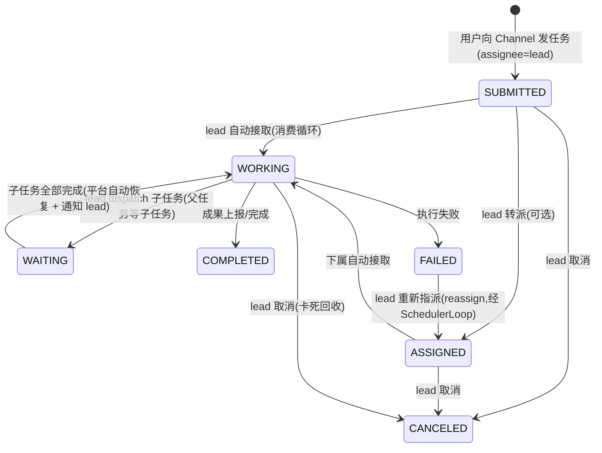
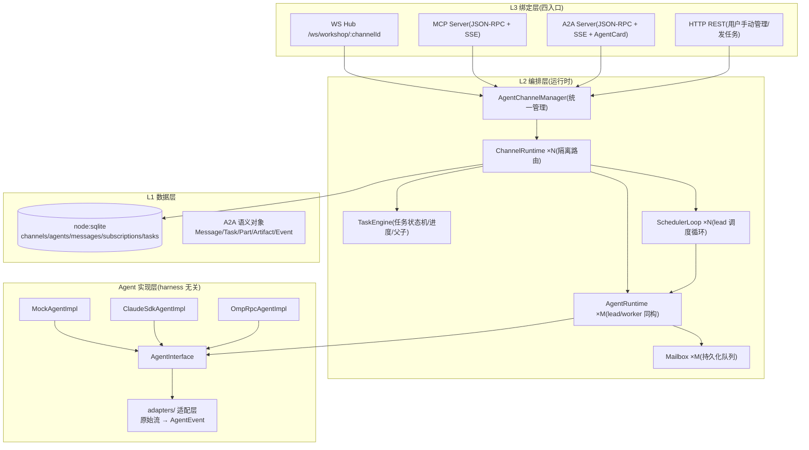

# AgentWorkShop 多 Agent 协同作业系统设计

> 状态: 待审阅(v3,任务驱动模型 + 四入口) | 日期: 2026-08-13 | 范围: `server/services/workshop/**` + 平台 MCP/A2A/WS/REST 四入口

## 1. 背景与目标

在现有 Nuxt 4 + Nitro 项目内构建与 Agent harness 无关的 **Agent 团队作业系统**:

- **Channel 强隔离**: 每个 Channel 独立作业、独立通信;Agent 只能通过 MCP 感知自己所属 Channel 的同事、任务与消息,跨 Channel 零通路
- **主理人编排**: 每个 Channel 有一个主理人(Lead Agent);用户向 Channel 发任务 → 主理人统筹分解 → `dispatch` 分发给下属;下属自动接取、执行、上报;主理人汇总交付
- **任务对象化**: 任务是独立对象(状态机/归属/进度/成果/父子关系);Agent 作为独立对象驱动任务;可查看同事任务进度与作业内容
- **harness 无关**: 每个 Agent 声明自己的 harness(mock/claude/omp);任何 harness 经 impl 适配层转成统一数据接口与事件流;平台零感知
- **自动作业**: 任务消息投递 mailbox → Agent 空闲即自动接取执行 → 完成/失败后继续消费队列
- 平台提供 WS/MCP/A2A/REST 四入口 + 框架;Channel/Agent 管理当前手动(后续上位机 AgentBrain 自动化)

### 已确认决策

| 决策 | 选择 |
|------|------|
| 持久化 | `node:sqlite`(Node 内置,零依赖;engines 提升 `>=23.4`) |
| omp 对接 | RPC transport 抽象 + Mock 先行;omp 具体端点信息后续提供后再填 adapter |
| A2A 范围 | 内部事件统一为 A2A 语义 + 对外暴露标准 A2A JSON-RPC 端点与 AgentCard |
| 作业模型 | 任务驱动:主理人编排 + 下属执行 + 进度可见(本轮修订) |

## 2. 角色与任务模型(核心)

### 2.1 角色

```
Channel(隔离边界,恰一个主理人 + 0..N 下属)
├── Lead Agent(主理人, role='lead')
│   ├─ 接收用户/外部投递给 Channel 的任务
│   ├─ 常驻调度循环(SchedulerLoop): 定时观察团队任务执行情况 → 主动调度
│   │   ├─ 发现待办任务 → dispatch 给合适成员(空闲优先)
│   │   ├─ 发现失败/卡死任务 → 重新指派或取消
│   │   ├─ 发现子任务全部完成 → 汇总交付(complete 父任务)
│   │   └─ 主动给成员发指令(notify)
│   └─ 拥有 dispatch / 全 Channel 任务可见 / 点对点通信权力
└── Worker Agent(下属, role='worker')
    ├─ 自动接取被指派的任务(消费循环)
    ├─ 执行、上报进度与成果
    ├─ 查看同 Channel 同事的任务进度与作业内容
    └─ 点对点 A2A 通信(与任何同事)
```

- `agents.role` 持久化;每 Channel 恰一个 lead(Manager 校验 + 创建时指定)
- 用户向 Channel 发任务时无需知道主理人是谁——任务投递给 Channel,Manager 自动路由到 lead

### 2.2 任务对象(一等公民)

```typescript
export type TaskState =
  | 'SUBMITTED'    // 已提交(给 lead,待分解)
  | 'ASSIGNED'     // 已指派(在下属 mailbox,待接取)
  | 'WORKING'      // 执行中
  | 'WAITING'      // 等待(等子任务/等输入)
  | 'COMPLETED'    // 完成(终态)
  | 'FAILED'       // 失败(终态)
  | 'CANCELED'     // 取消(终态)

export interface WorkspaceTask {
  id: string
  channelId: string
  parentId?: string        // 子任务挂主任务(主理人分解)
  assigneeId: string       // 当前负责 Agent
  creatorId: string        // 创建者(lead / 用户)
  title: string
  description?: string
  state: TaskState
  progress: number         // 0-100,由 Agent 事件驱动(artifact 分块累计)
  artifacts: A2AArtifact[] // 作业成果
  history: A2AMessage[]    // 执行过程(消息/上报)
  createdAt: string
  updatedAt: string
}
```


### 2.3 任务流转(端到端)

```mermaid
sequenceDiagram
  participant U as 用户/MCP/A2A
  participant M as AgentChannelManager
  participant L as Lead Agent(主理人)
  participant W as Worker Agent
  participant T as TaskStore

  U->>M: 向 Channel 发任务
  M->>T: 创建 Task(SUBMITTED, assignee=lead)
  M->>L: 任务消息投递 lead mailbox
  L->>L: 空闲自动接取 → 思考分解
  L->>M: task.dispatch(子任务1/2 → 下属)
  M->>T: 子任务(ASSIGNED, parent=主任务)
  M->>W: 子任务消息投递下属 mailbox
  W->>W: 空闲自动接取 → 执行
  W->>T: artifact/status 事件 → 更新进度(0→100)
  W->>M: task.complete(成果)
  M->>T: 子任务 COMPLETED
  M->>L: 完成通知投递 lead mailbox
  L->>L: 汇总成果 → task.complete(主任务)
  M->>U: 主任务 COMPLETED + 成果广播
**自动接取 = 消费循环复用**: 任务消息(带 `x-aw-task-kind: assign`)与普通消息同走 mailbox FIFO;Agent idle 自动消费,执行中不打断。这是"每个 Agent 自动接取任务"的机制基础。

**调度循环路径(lead 常驻主动调度,与事件驱动并存)**:

```mermaid
sequenceDiagram
  participant S as SchedulerLoop(lead 专属)
  participant L as Lead supervise
  participant M as AgentChannelManager
  participant T as TaskStore
  participant W as Worker

  loop 每 tick(定时 + 事件唤醒)
    S->>M: 收集快照(任务状态 + 成员 idle/busy)
    S->>L: supervise(snapshot)
    L-->>S: 决策[]: dispatch/reassign/cancel/complete/notify
    S->>M: 执行决策(身份=lead,权限校验)
    M->>T: 状态迁移
    M->>W: 任务消息投递成员 mailbox(自动接取)
  end
```

事件驱动路径(新任务投递/child-completed)仍走 lead 的 run() 消费循环;两条路径共享同一 workspace 与权限校验,互斥执行(§5.1)。

## 3. 总体架构

参照 A2A 规范三层划分(L1 数据模型 / L2 操作 / L3 绑定):



**分层规则**: L1 只依赖 sqlite 与 A2A 类型;L2 只依赖 L1;L3 只依赖 L2;impl 层只依赖 `AgentInterface` 与适配器。任何一层可独立测试与替换。

## 4. 核心抽象(server/services/workshop/agents/agent-interface.ts)

### 4.1 AgentInterface — harness 无关统一接口

```typescript
export interface AgentRunRequest {
  /** A2A 消息(role=user),内容为 Parts;任务类消息携带 taskId + x-aw-task-kind */
  message: A2AMessage
  taskId?: string
  contextId: string          // = channelId
  fromAgentId: string | null
  toAgentId: string | null
}

/** 执行上下文:平台注入的只读能力(Agent 的"手脚") */
export interface AgentRunContext {
  agentId: string
  channelId: string
  /** Agent 在 Channel 内的角色(lead 可 dispatch) */
  role: 'lead' | 'worker'
  /** workspace = MCP 工具的进程内直调版(Agent 自主作业的全部能力) */
  workspace: AgentWorkspace
  signal: AbortSignal
}

/** 调度快照:SchedulerLoop 每次 tick 喂给 lead 的团队观察 */
export interface SupervisionSnapshot {
  tick: number
  now: number
  /** 全 channel 任务摘要(状态/进度/assignee/parent) */
  tasks: WorkspaceTask[]
  /** 成员状态(idle/busy) */
  members: { agentId: string, name: string, role: 'lead' | 'worker', state: 'idle' | 'busy' | 'stopped' }[]
  /** 每个父任务未完成的子任务数 */
  pendingChildren: Record<string, number>
}

/** 调度决策:lead 对快照的回应(空数组 = 本轮无动作) */
export type SupervisionDecision =
  | { kind: 'dispatch', parentTaskId?: string, assigneeId: string, title: string, description?: string, parts?: Part[] }
  | { kind: 'reassign', taskId: string, toAgentId: string }
  | { kind: 'cancel', taskId: string }
  | { kind: 'complete', taskId: string, artifacts?: A2AArtifact[] }
  | { kind: 'notify', toAgentId: string, parts: Part[] }

/** AgentInterface:所有 harness impl 的唯一契约 */
export interface AgentInterface {
  /** 标准流式返回:输入一次,产出统一事件流(AsyncIterable) */
  run(request: AgentRunRequest, ctx: AgentRunContext): AsyncIterable<AgentEvent>
  /**
   * lead 调度决策(可选,仅 role='lead' 时被 SchedulerLoop 调用):
   * 观察团队快照 → 返回调度决策。harness 差异由 impl 适配(LLM 一次推理/规则引擎)。
   * 未实现时平台用内置规则引擎兜底(见 §5.6)。
   */
  supervise?(snapshot: SupervisionSnapshot, ctx: AgentRunContext): Promise<SupervisionDecision[]>
  init?(config: AgentRuntimeConfig): Promise<void>
  dispose?(): Promise<void>
}

**`AgentWorkspace`(Agent 自主作业能力面,MCP 工具的子集,进程内直调)**:

```typescript
export interface AgentWorkspace {
  /** 列出本 Channel 同事(lead 分解任务前必须知道有哪些下属) */
  listAgents(): Promise<AgentInfo[]>
  /** 任务分发(仅 lead;创建子任务并指派) */
  dispatchTask(input: { parentTaskId?, assigneeId, title, description?, parts? }): Promise<WorkspaceTask>
  /** 查看同 Channel 任务列表(含同事) */
  listTasks(): Promise<WorkspaceTask[]>
  /** 查看指定任务详情(含同事作业内容与成果) */
  getTask(taskId: string): Promise<WorkspaceTask>
  /** 上报进度/成果(更新自己负责的任务) */
  reportTask(input: { taskId, progress?, artifact?, message? }): Promise<WorkspaceTask>
  /** 完成任务 */
  completeTask(taskId: string, artifacts?: A2AArtifact[]): Promise<WorkspaceTask>
  /** 取消任务(lead/creator;向 assignee 投递 cancel 消息 + 中断其运行中的 run) */
  cancelTask(taskId: string): Promise<WorkspaceTask>
  /** 点对点发消息给同事 */
  sendMessage(input: { toAgentId, parts, metadata? }): Promise<A2AMessage>
  /** 拉取自己 mailbox 未消费消息 */
  pollMailbox(limit?: number): Promise<A2AMessage[]>
  /** 订阅同事产出 */
  subscribe(input: { agentIds?: string[] }): Promise<void>
}
```

**任务消息约定(平台投递消息的 metadata)**:

| `metadata` 键 | 值 | 含义 |
|---|---|---|
| `x-aw-task-kind` | `'assign' \| 'child-completed' \| 'cancel'` | 消息的任务语义类型 |
| `x-aw-task-id` | taskId | 关联任务(assign=被指派任务;child-completed=**父任务** id) |
| `x-aw-child-task-id` | taskId | child-completed 时的子任务 id |

impl 依据 `x-aw-task-kind` 区分消息类型,并用 `x-aw-task-id` 作为自身会话状态的键(无状态 impl 按 taskId 恢复"我正在统筹哪个任务")。

设计要点:

- `run()` 返回 `AsyncIterable<AgentEvent>` —— 标准流式返回;事件逐条产出即被平台广播与持久化(真流式)
- harness 差异全部隔离在 impl + adapters;平台对 mock/omp/claude 零感知
- `ctx.workspace` 与 MCP 工具同一实现(见 §6.1),Agent 执行中自主调用,无需额外通路

### 4.2 AgentEvent — 统一事件(对齐 A2A StreamResponse)

```typescript
export type AgentEvent =
  | { kind: 'status', status: A2ATaskStatus }                                  // → status-update
  | { kind: 'message', message: A2AMessage }                                   // → message
  | { kind: 'artifact', artifact: A2AArtifact, append?: boolean, lastChunk?: boolean, totalChunks?: number }  // → artifact-update
  | { kind: 'error', error: A2AError }
  | { kind: 'done', final?: { task?: A2ATask } }
```

平台对 `artifact`/`status` 事件做**任务成果联动**: 事件关联 taskId 时自动追加 `tasks.artifacts/history` 并广播。
**任务进度(0-100)只由 `reportTask({progress})` 显式上报**(impl 自行掌握完成度),artifact 事件可选携带 `totalChunks` 时平台按 `已收分块/总数` 折算——两个来源取最近一次更新,避免依赖流式中不可知的总数。

### 4.3 A2A 语义对象(server/services/workshop/types/a2a.ts)

从 A2A 1.0 proto 提取平台所需子集。JSON 字段采用 **camelCase**(protojson 序列化约定,与 A2A 官方 JS/TS SDK 一致;proto 定义是 snake_case,线上 JSON 是 camelCase):

```typescript
export type Part =
  | { text: string, mediaType?: string, metadata?: Record<string, unknown> }
  | { data: unknown, mediaType?: string, metadata?: Record<string, unknown> }
  | { url: string, mediaType?: string, filename?: string, metadata?: Record<string, unknown> }
  | { raw: string, mediaType?: string, filename?: string, metadata?: Record<string, unknown> }

export interface A2AMessage {
  messageId: string
  contextId: string            // = channelId
  taskId?: string
  role: 'ROLE_USER' | 'ROLE_AGENT'
  parts: Part[]
  metadata?: Record<string, unknown>   // 平台约定: x-aw-target-agent / x-aw-task-kind
  extensions?: string[]
  referenceTaskIds?: string[]
}

export interface A2AArtifact { artifactId: string; name?: string; description?: string; parts: Part[]; metadata?: Record<string, unknown> }
export interface A2ATaskStatus { state: string; message?: A2AMessage; timestamp: string }
export interface A2ATask { id: string; contextId: string; status: A2ATaskStatus; artifacts: A2AArtifact[]; history: A2AMessage[]; metadata?: Record<string, unknown> }
export interface A2AError { code: string; message: string; data?: unknown }
```

## 5. 运行时模型(server/services/workshop/runtime/)

### 5.1 AgentRuntime — 独立对象 + 状态机

```typescript
export class AgentRuntime {
  readonly agentId: string
  readonly role: 'lead' | 'worker'
  private impl: AgentInterface
  private mailbox: Mailbox
  private state: 'idle' | 'busy' | 'stopped'
  /** run() 与 supervise() 互斥锁(lead 双驱动:消息 + 调度循环) */
  private execLock: Promise<void> = Promise.resolve()

  enqueue(message: A2AMessage): void     // 投递;idle 立即唤醒消费
  getState(): 'idle' | 'busy' | 'stopped'
  /** 中止当前 run()(任务取消/Agent 移除时);空闲时无操作 */
  abortCurrent(): void
  stop(): Promise<void>
}
```

**消费循环(自动接取/自动作业的核心)**:

```
while (state === 'idle') {
  msg = mailbox.dequeue()          // 无消息则挂起(事件驱动唤醒)
  if (!msg) return
  state = 'busy'
  try {
    // 任务消息联动: assign → ASSIGNED→WORKING(接取); child-completed → 父任务已在 WAITING(由 TaskEngine 恢复 WORKING)
    if (msg.metadata?.['x-aw-task-kind'] === 'assign') {
      await taskEngine.transition(msg.metadata['x-aw-task-id'], 'WORKING', agentId)
    }
    for await (const event of impl.run(toRequest(msg), ctx)) {
      channelBus.emit(event, msg)  // 逐事件广播 + 持久化 + 任务成果联动
    }
  } finally {
    state = 'idle'
    mailbox.markConsumed(msg)
    mailbox.wake()                 // 继续消费积压
  }
}

- **挂起唤醒原语**: 每个 AgentRuntime 持有一个 promise 门闩(`wakeGate`);dequeue 无消息时 `await gate.promise`,enqueue/消费完成时 `resolve + 重建门闩`。单进程单线程(node:sqlite 同步)下无竞态
- **run/supervise 互斥**: lead 同时被消息驱动(run)与调度循环(supervise)驱动;两者经 `execLock` 串行化——supervise 触发时若 run 执行中则等待;反之 run 的消息 dequeue 在 supervise 期间挂起等待

### 5.2 Mailbox — 持久化 FIFO

- 队列在 `messages` 表,`state: pending | consuming | consumed`
- **at-least-once**: 取走置 `consuming`;服务重启时 `consuming` 重置 `pending` 重新消费
- 排队序 = `created_at` 升序

### 5.3 ChannelRuntime — 隔离路由 + 订阅 + 广播

```typescript
export class ChannelRuntime {
  readonly channelId: string
  route(message: A2AMessage): void      // 核心路由(仅在本 channel 内)
  sendToChannel(parts, metadata?): Promise<A2AMessage>   // 用户向 channel 发任务/消息 → 路由 lead 或广播
  addAgent / removeAgent / resolveRecipients
}
```

**路由规则(全部限定在本 channel 内,跨 channel 不可达)**:

1. `metadata['x-aw-target-agent'] = agentId` → 点对点,直投目标 mailbox(同 channel 校验)
2. 任务消息(`x-aw-task-kind` 存在)→ 直投 assignee mailbox
3. 无 target 的普通消息 → 广播给订阅了发送者/频道的 Agent
4. 用户向 channel 发送 → 任务类投 lead(channel 无主理人时报 `NO_LEAD_AGENT`,提示先创建 lead),普通消息广播全 channel

**订阅**: `subscriptions` 表(经 MCP `a2a.subscribe`);订阅关系只在本 channel 内生效。

### 5.4 TaskEngine — 任务对象引擎

```typescript
export class TaskEngine {
  create(input: { channelId, creatorId, assigneeId, title, description?, parentId?, parts? }): Promise<WorkspaceTask>
  dispatch(parent: WorkspaceTask, input): Promise<WorkspaceTask>     // 创建子任务 + 投递
  transition(taskId, state, by: string): Promise<WorkspaceTask>       // 状态机校验(非法迁移拒绝)
  applyEvent(taskId, event: AgentEvent): Promise<void>                // artifact/status → 进度/成果/历史
  list(channelId): Promise<WorkspaceTask[]>
  get(taskId): Promise<WorkspaceTask | undefined>
  complete(taskId, artifacts?): Promise<WorkspaceTask>
}
```

- 状态机在 §2.2;非法迁移(如 COMPLETED → WORKING)拒绝并报错
- 进度: `progress = 已收 artifact 分块 / 总块`(impl 在 done 时声明总数)或由 `reportTask({progress})` 显式上报
- 完成通知: 子任务完成 → 平台自动向 parent 的 assignee(lead)mailbox 投递 `x-aw-task-kind: child-completed` 消息;**parent 的最后一个未完成子任务完成时,父任务自动由 WAITING 恢复 WORKING**(lead 接续汇总)
- 查询可见性: 任何 Agent 可查**同 channel** 全部任务(含同事)——满足"查看其他 Agent 任务进度/作业内容"

### 5.5 AgentChannelManager — 统一管理(对象化)

```typescript
export class AgentChannelManager {
  private channels: Map<string, ChannelRuntime>

  // ---- 管理面(用户/MCP 管理工具调用) ----
  createChannel(input: { name, description?, leadAgent?: AgentCreateInput }): Promise<ChannelInfo>
  listChannels(): Promise<ChannelInfo[]>
  removeChannel(channelId): Promise<void>
  createAgent(input: { channelId, name, harness, role, config }): Promise<AgentInfo>
  listAgents(channelId): Promise<AgentInfo[]>
  removeAgent(agentId): Promise<void>
  pauseAgent / resumeAgent(agentId): Promise<void>

  // ---- 作业面(channel 内 Agent/用户调用) ----
  submitChannelTask(input: { channelId, title, description?, parts? }): Promise<WorkspaceTask>
  dispatchTask(callerAgentId, input): Promise<WorkspaceTask>          // 校验 caller 是 lead
  reportTask / completeTask(callerAgentId, input): Promise<WorkspaceTask>  // 校验 caller 是 assignee
  listTasks / getTask(callerAgentId, input): Promise<WorkspaceTask[]>  // 作用域强制 caller 的 channel
  sendA2A(callerAgentId, input): Promise<A2AMessage>                   // 点对点,同 channel 校验
  pollMailbox / subscribe(callerAgentId, input): Promise<...>

  // ---- 启动恢复 ----
  restore(): Promise<void>   // 加载 enabled channels + agents + 重置 consuming 消息
}
```

**对象化管理**: Channel/Agent/Task 全部是对象(ChannelRuntime/AgentRuntime/WorkspaceTask);Manager 只持有 `Map<channelId, ChannelRuntime>`,所有操作走对象方法,无散落的全局状态。

### 5.6 SchedulerLoop — lead 常驻调度循环(统一调度核心)

`server/services/workshop/runtime/scheduler-loop.ts`。每个 channel 一个实例,与 lead AgentRuntime 绑定;lead 缺失时不启动,任命新 lead 时启动。

```typescript
export class SchedulerLoop {
  constructor(channelRuntime: ChannelRuntime, lead: AgentRuntime, options?: { tickMs?: number })
  /** 启动定时 tick(默认 1000ms,测试可配 10ms) */
  start(): void
  /** 事件唤醒:新任务提交/成员上报/子任务完成/成员状态变化时立即触发一轮(去抖合并) */
  wake(): void
  stop(): void
}
```

**每轮 tick 流程**:

```
1. execLock 串行化(与 lead 的 run 互斥,§5.1)
2. 收集快照: 全 channel 任务(状态/进度/assignee/parent) + 成员 idle/busy + pendingChildren
3. 决策: impl.supervise?(snapshot) → SupervisionDecision[]
        impl 未实现 supervise → 平台内置规则引擎兜底(见下)
4. 逐条执行决策(身份=lead,经 TaskEngine/Manager 权限校验):
   dispatch → 创建子任务 + 投递成员 mailbox
   reassign → FAILED→ASSIGNED + 投递新 assignee
   cancel   → 任务 CANCELED + 中断运行中的 run
   complete → 父任务 COMPLETED + 成果广播
   notify   → 点对点消息投递成员 mailbox
```

**内置规则引擎兜底(harness 无关,lead impl 未实现 supervise 或 supervise 抛错时启用)**:

| 观察 | 规则动作 |
|------|---------|
| SUBMITTED 且 assignee=lead 且存在空闲 worker | dispatch 给最久空闲的 worker(round-robin) |
| FAILED | 若存在空闲 worker 且重试次数 < 3 → reassign;否则 cancel 并标记父任务 |
| WORKING 超时(可配,默认 300s 无 progress 变化) | 投递 notify 催促 assignee;再超时 → reassign/cancel |
| 子任务全部完成且父任务 WAITING | complete 父任务(汇总子任务成果) |

**防抖与保护**:

- 定时 tick + `wake()` 事件唤醒合并:一轮执行中到达的唤醒信号合并到下一轮(避免并发 supervise)
- supervise 抛错: 记录日志,本轮跳过,下轮重试(错误不阻塞调度循环)
- lead 停止/移除/channel 删除: SchedulerLoop 随 lead 生命周期停止

## 6. 四个入口(L3 绑定)

### 6.1 MCP Server — Agent 自主作业面

`server/mcp/workshop-server.ts`,JSON-RPC 2.0 + Streamable HTTP(SSE),路由 `/api/mcp/workshop`。依赖 `@modelcontextprotocol/sdk`。

| 工具 | 参数 | 调用方限定 | 说明 |
|------|------|-----------|------|
| `workshop.channel.create` | `{name, description?, leadAgent?}` | 管理 | 创建 channel(可同时创建主理人) |
| `workshop.channel.list` | `{}` | 管理 | 全部 channel |
| `workshop.channel.remove` | `{channelId}` | 管理 | 删除(级联) |
| `workshop.agent.create` | `{channelId, name, harness, role, config}` | 管理 | 创建 Agent(role=lead/worker) |
| `workshop.agent.list` | `{}` | Agent: 强制自己 channel | 列同事(Agent 只能看到自己 channel) |
| `workshop.agent.remove` | `{agentId}` | 管理 | 删除 Agent |
| `workshop.task.submit` | `{channelId, title, description?, parts?}` | 用户/管理 | 向 channel 发任务 → lead |
| `workshop.task.dispatch` | `{parentTaskId?, assigneeId, title, description?, parts?}` | **仅 lead** | 分解指派子任务 |
| `workshop.task.list` | `{}` | Agent: 强制自己 channel | 看全 channel 任务与进度 |
| `workshop.task.get` | `{taskId}` | Agent: 同 channel | 看同事作业内容与成果 |
| `workshop.task.report` | `{taskId, progress?, artifact?, message?}` | **仅 assignee** | 上报进度/成果 |
| `workshop.task.complete` | `{taskId, artifacts?}` | **仅 assignee** | 完成任务 |
| `workshop.task.cancel` | `{taskId}` | **仅 lead/creator** | 取消任务(卡死回收;向 assignee 投递 `x-aw-task-kind: cancel`) |
| `workshop.a2a.send` | `{toAgentId, parts, metadata?}` | Agent: 同 channel | 与同事点对点通信 |
| `workshop.a2a.poll` | `{limit?}` | Agent: 自己 | 拉取自己的消息 |
| `workshop.a2a.subscribe` | `{agentIds?}` | Agent: 同 channel | 订阅同事产出 |

**身份凭证与防冒用**: 每个 Agent 创建时生成 `token`(UUIDv4,存 `agents.token`)。
MCP 请求必须携带 `Authorization: Bearer <token>`;平台按 token 解析 caller——
无 token 或无效 token 一律拒绝(`UNAUTHORIZED`)。`workshop.a2a.send/poll/subscribe` 的
`fromAgentId` 由 token 决定,不接受请求体自报(防伪造)。

### 6.2 HTTP REST — 用户手动作业入口(管理阶段)

`server/api/workshop/`:用户(人)经 HTTP 管理 Channel/Agent 并向 Channel 发任务——
这是"手动管理"阶段的落地点,后续由上位机 AgentBrain 经同一 Manager 接口自动化。

| 端点 | 说明 |
|------|------|
| `POST /api/workshop/channels` | 创建 channel(可带 leadAgent 定义) |
| `GET /api/workshop/channels` | 列表 |
| `DELETE /api/workshop/channels/:id` | 删除 |
| `POST /api/workshop/channels/:id/agents` | 创建 Agent(harness/role/config) |
| `GET /api/workshop/channels/:id/agents` | 列 Agent |
| `DELETE /api/workshop/agents/:id` | 删除 Agent |
| `POST /api/workshop/channels/:id/tasks` | **向 channel 发任务** → 自动路由 lead |
| `GET /api/workshop/channels/:id/tasks` | 任务列表(含进度) |
| `GET /api/workshop/tasks/:id` | 任务详情(含成果) |
| `POST /api/workshop/tasks/:id/cancel` | 取消任务(用户手动回收卡死任务) |

与现有 `server/api/**` 约定一致(defineApiHandler + zod schema + repository/service 分层)。
### 6.3 A2A 对外标准端点

- `GET /api/workshop/a2a/:agentId/card` — AgentCard(由 AgentConfig 动态生成;capabilities.streaming=true;skills 由 config 声明)
- `POST /api/workshop/a2a/:agentId/rpc` — JSON-RPC 2.0: `tasks/send`(同步阻塞至终态)、`tasks/sendSubscribe`、`tasks/get`、`tasks/list`、`tasks/cancel`、`message/send`、`message/stream`、`agent/getCard`
- **SSE 事件集**(规范 §9 约定,`event: <type>\ndata: <json>\n\n`): `task`(初始 Task 对象)→ `status-update` / `artifact-update` / `message` → 任务达终态即关闭流
- 外部 A2A 客户端向某 Agent 发任务 → 转成任务消息投递其 mailbox → 事件流映射回 A2A 任务生命周期

### 6.4 WS Hub — 前端观察

`server/api/workshop/ws.ts`,`/ws/workshop/:channelId`。

下行统一事件 JSON:

| 事件 | 载荷 |
|------|------|
| `channel.snapshot` | channel 信息 + 同事列表(role/state/harness)+ 最近消息 + 任务列表 |
| `agent.status` | `{agentId, state}` |
| `a2a.message` | A2A 消息 |
| `a2a.artifact` | 工件分块(append/lastChunk) |
| `task.status` | `{taskId, state, assigneeId}` |
| `task.progress` | `{taskId, progress}` |
| `error` | `{code, message}` |

上行本期仅 `ping`。

## 7. 持久化(node:sqlite)

`server/services/workshop/db/`: `schema.sql` / `database.ts`(WAL;`data/workshop.sqlite`)/ 5 个 repository。

```sql
CREATE TABLE IF NOT EXISTS channels (
  id             TEXT PRIMARY KEY,
  name           TEXT NOT NULL,
  description    TEXT NOT NULL DEFAULT '',
  lead_agent_id  TEXT,                        -- 主理人
  enabled        INTEGER NOT NULL DEFAULT 1,
  created_at     TEXT NOT NULL,
  updated_at     TEXT NOT NULL
);

CREATE TABLE IF NOT EXISTS agents (
  id          TEXT PRIMARY KEY,
  channel_id  TEXT NOT NULL REFERENCES channels(id) ON DELETE CASCADE,
  name        TEXT NOT NULL,
  harness     TEXT NOT NULL,                  -- 'mock' | 'claude' | 'omp'
  role        TEXT NOT NULL DEFAULT 'worker', -- 'lead' | 'worker'
  token       TEXT NOT NULL,                  -- MCP 身份凭证(UUIDv4,创建时生成)
  config_json TEXT NOT NULL DEFAULT '{}',
  enabled     INTEGER NOT NULL DEFAULT 1,
  created_at  TEXT NOT NULL,
  updated_at  TEXT NOT NULL
);

CREATE TABLE IF NOT EXISTS messages (
  id            TEXT PRIMARY KEY,
  channel_id    TEXT NOT NULL REFERENCES channels(id) ON DELETE CASCADE,
  task_id       TEXT,
  from_agent_id TEXT,
  to_agent_id   TEXT,
  role          TEXT NOT NULL,                -- 'ROLE_USER' | 'ROLE_AGENT'
  parts_json    TEXT NOT NULL,
  metadata_json TEXT NOT NULL DEFAULT '{}',   -- x-aw-target-agent / x-aw-task-kind
  state         TEXT NOT NULL DEFAULT 'pending',  -- pending|consuming|consumed
  created_at    TEXT NOT NULL,
  consumed_at   TEXT
);
CREATE INDEX IF NOT EXISTS idx_messages_queue ON messages(channel_id, to_agent_id, state, created_at);

CREATE TABLE IF NOT EXISTS subscriptions (
  agent_id        TEXT NOT NULL REFERENCES agents(id) ON DELETE CASCADE,
  target_agent_id TEXT,
  created_at      TEXT NOT NULL,
  PRIMARY KEY (agent_id, target_agent_id)
);

CREATE TABLE IF NOT EXISTS tasks (
  id             TEXT PRIMARY KEY,
  channel_id     TEXT NOT NULL REFERENCES channels(id) ON DELETE CASCADE,
  parent_id      TEXT,
  assignee_id    TEXT NOT NULL REFERENCES agents(id),
  creator_id     TEXT,
  title          TEXT NOT NULL,
  description    TEXT,
  state          TEXT NOT NULL,               -- SUBMITTED|ASSIGNED|WORKING|WAITING|COMPLETED|FAILED|CANCELED
  progress       INTEGER NOT NULL DEFAULT 0,  -- 0-100
  retry_count    INTEGER NOT NULL DEFAULT 0,  -- 重派次数(SchedulerLoop reassign 时 +1,>=3 停止重派)
  artifacts_json TEXT NOT NULL DEFAULT '[]',
  history_json   TEXT NOT NULL DEFAULT '[]',
  created_at     TEXT NOT NULL,
  updated_at     TEXT NOT NULL
);
CREATE INDEX IF NOT EXISTS idx_tasks_channel ON tasks(channel_id, state);
CREATE INDEX IF NOT EXISTS idx_tasks_assignee ON tasks(assignee_id, state);
```

## 8. 启动恢复流程

Nitro plugin(`server/plugins/workshop.ts`):

1. 打开 sqlite,执行 schema
2. `manager.restore()`: `enabled=1` channels → `enabled=1` agents(按 harness 工厂装配 impl)→ 建 ChannelRuntime/AgentRuntime
   - messages: `consuming` 重置 `pending`(重新投递)
   - **tasks: 所有非终态(SUBMITTED/ASSIGNED/WORKING/WAITING)统一重置为 `ASSIGNED`**——与消息重新投递对齐,保证消费循环的 `ASSIGNED→WORKING` 接取联动不触发非法迁移;WAITING 的父任务同时重置(其未完成子任务也一并回 ASSIGNED)
   - **lead 恢复后启动其 SchedulerLoop**(channel 有 lead 时),调度循环随 lead 生命周期运行
3. 注册 WS hub、MCP server、A2A 路由,注入 manager 单例
4. 关机: 停止消费循环与全部 SchedulerLoop(优雅等待当前 run/supervise 结束或超时中止)

## 9. 错误处理

- **harness 不可用**: impl 首事件 `{kind:'error'}` 后结束流;消息置 consumed 不重试;错误广播到 channel
- **run() 抛异常**: 捕获 → 回 idle → 消息 consumed(带错误)→ 继续下一条(单条失败不阻塞管道)
- **supervise() 抛异常**: SchedulerLoop 记录日志,本轮跳过,下轮重试(调度循环永不因 impl 错误停摆);连续失败时自动降级到内置规则引擎
- **非法状态迁移/越权调用**(非 lead dispatch、非 assignee complete、跨 channel 访问): MCP 返回明确错误码(`FORBIDDEN`/`SCOPE_VIOLATION`/`INVALID_TRANSITION`);Agent 的 workspace 直调同样校验
- **取消**: `task.cancel` → 任务置 CANCELED + 向 assignee 投递 `x-aw-task-kind: cancel` 消息;若 assignee 正在执行该任务(run 中),平台对其运行中的 `run()` 发起 `signal.abort()` 终止事件流;父任务若在 WAITING 则一并转 CANCELED(其子任务级联取消)
- **A2A 端点错误**: 按规范 §3.3.2 返回 JSON-RPC error 对象

## 10. 测试策略

| 测试 | 覆盖 |
|------|------|
| `test-a2a-types.ts` | A2A 语义对象 ↔ 事件 ↔ SSE 序列化往返 |
| `test-agent-runtime.ts` | idle/busy 状态机;busy 入队不消费;结束后自动消费积压;单条失败不阻塞 |
| `test-channel-routing.ts` | 点对点直投;广播订阅过滤;任务消息直投 assignee;**跨 channel 不可达** |
| `test-scheduler-loop.ts` | 定时 tick 观察;事件唤醒去抖;run/supervise 互斥;规则引擎兜底(空闲优先派发/FAILED 重派/超时催促);lead 停止时循环停止 |
| `test-manager-persistence.ts` | 创建→重启 restore→enabled=0 不加载;consuming 重置 pending |
| `test-mcp-tools.ts` | 16 工具参数校验 + token 身份解析 + **作用域隔离**(channel A 的 Agent 查不到 channel B) |
| `test-rest-api.ts` | HTTP REST 端点: 建 channel/agent、发任务→lead、查任务进度 |
| `test-orchestration.ts` | 端到端: 用户发任务 → SchedulerLoop 驱动 lead dispatch 给 2 个 worker → worker 自动接取执行上报 → lead 汇总交付(主任务 COMPLETED + 成果可见 + 成员任务进度互见) |

mock impl 提供**编排剧本**(lead 的 `supervise`: 发现 SUBMITTED→dispatch 给最久空闲成员;发现 FAILED→reassign;发现子任务全完成→complete 汇总。worker 的 `run`: 接任务→`reportTask` 进度→`completeTask`),每步可配置演示延迟(默认 300ms,让 WS 前端可观看到进度流转),`test-orchestration` 端到端证明"自动接取、完成下发、获取同事进度、lead 自动调度"。
**测试隔离**: 全部测试用独立 sqlite 实例(`:memory:` 或 `data/workshop-test.sqlite`),运行时与测试库互不污染;Manager/Engine 以依赖注入方式接收 repository,测试可替换。

## 11. 实施阶段(依赖顺序)

| Phase | 内容 | 验收 |
|-------|------|------|
| 1 | A2A 语义类型 + AgentInterface + AgentEvent + AgentWorkspace + adapters/to-a2a | `test-a2a-types` 绿 |
| 2 | node:sqlite 连接 + schema + 5 个 repository | CRUD 测试绿 |
| 3 | Mailbox + AgentRuntime 消费循环(run/supervise 互斥)+ ChannelRuntime 隔离路由 + Manager + 恢复 | `test-agent-runtime`/`test-channel-routing` 绿 |
| 4 | TaskEngine(状态机/进度/父子/完成通知/reassign) | `test-task-engine` 绿 |
| 5 | SchedulerLoop(定时+事件唤醒+规则引擎兜底) + Mock impl(lead supervise 剧本/worker 剧本)+ 工厂 | `test-scheduler-loop` 绿;mock 全链路跑通 |
| 6 | MCP server(16 工具 + token 身份 + 作用域隔离) | `test-mcp-tools` 绿 |
| 7 | HTTP REST 用户入口 + A2A 对外端点 + WS hub + Nitro plugin | `test-rest-api`/`test-a2a-server`/`test-ws-hub` 绿 |
| 8 | 端到端编排测试 + claude/omp impl 骨架(transport 抽象,端点信息待填) | `test-orchestration` 绿;未配置时优雅报错 |

## 12. 非目标(YAGNI)

- 不做 AgentBrain 上位机(后续)
- 不做多进程/分布式(单进程单实例)
- 不做消息重试(retry)/TTL 清理(仅 at-least-once + consuming 重置)
- 不做任务超时自动失败(超时由 SchedulerLoop 催促/重派/取消,不静默失败)
- 不做 A2A extensions 与 pushNotification 完整实现(端点接受但不扩展语义)
- 不做前端管理 UI(平台仅 WS + 框架;验证用测试 + 现有 /game 页面模式)
- 不做跨 Channel 任务迁移(Channel 强隔离)
